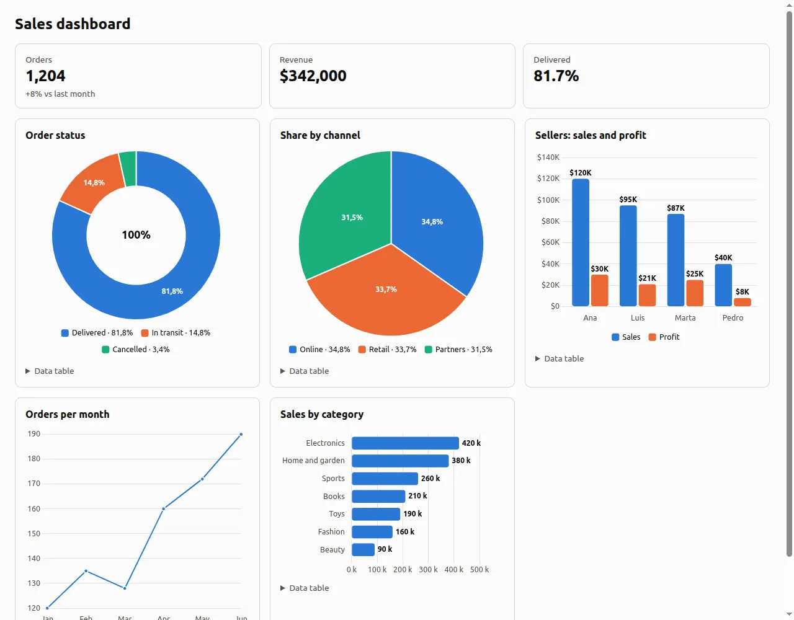

# Python analysis and artifacts

Alisio can write a Python script and run it in a folder it manages, outside your repository.
Every file the script leaves in its output folder becomes a **downloadable artifact**: an HTML
dashboard, a Markdown report, a PDF, a spreadsheet, a chart or any other file. The web UI shows
each artifact as a card in the chat; the terminal announces it with its local path.

::: warning Managed Python is not a sandbox
Managed Python is not a sandbox: the script runs with your user permissions and can read your
files and use the network. Read the script in the approval before allowing it.
:::

## Quick start {#quick-start}

No setup is needed. Alisio discovers Python 3.10 or newer on your machine the first time the model
calls `python_run`:

```sh
alisio                                   # the TUI asks before running Python
alisio run --allow-analysis "Summarize sales.csv into report.md and a bar chart"
alisio analysis status                   # which interpreter was found
```

Ask for an output, for example *"analyze data.csv and give me an HTML dashboard"*. For a dashboard
of a dataset the model calls `dashboard_generate` and no script is needed (see
[Dashboards without code](#smart-dashboard)); for anything else it writes the script, Alisio asks
for approval, runs it and publishes the files.

## Tools {#tools}

| Tool | Effect | What it does |
| --- | --- | --- |
| `python_run` | `process` (capability `analysis.run`) | Writes `script/main.py`, runs it and publishes what it leaves in `$ALISIO_OUTPUT_DIR`. |
| `artifact_create` | `internal` | Publishes text the model already has (Markdown, HTML, CSV, JSON, SVG). Works without Python. |
| `artifact_list` | `read` | Lists the artifacts of the session. |
| `artifact_read` | `read` | Reads a text artifact (at most 64 KiB; longer files are truncated and say so). |
| `artifact_export` | `write` | Copies an artifact into the workspace; confined to it and behind the usual write approval. |
| `dashboard_generate` | `internal` | Builds a dashboard from a dataset with no code and publishes it as an HTML artifact. See [Dashboards without code](#smart-dashboard). |
| `data_inspect` | `read` | Ingests a CSV, TSV, JSON, JSONL or XLSX file into a SQLite dataset and describes it: sheets, columns, type hints, statistics and sample rows. See [Tabular data](#data). |
| `data_query` | `read` | Runs one read-only `SELECT` on a dataset, bounded in rows and time. |

`python_run` takes `code`, an optional `title`, `inputs` (workspace files, or `{ "datasetId": … }`
for a dataset, copied to `$ALISIO_INPUT_DIR`), `timeoutMs` (up to `analysis.limits.timeoutMs`),
`publishOnError`, `extras` (`["analysis"]` or `["science"]`, see [Optional extras](#extras)) and
`rerunOf` (an artifact or execution of the session to run again instead of `code`, see
[Rerun](#rerun)). The data tools work without Python (except for XLSX) and under `--read-only`:
they only read, and ingestion writes under the state folder, never the repository.

The web UI previews artifacts in a side panel and runs HTML dashboards in an isolated viewer (no
cookie, no network, opaque origin); see [Web UI](/web#artifacts). The TUI previews text-like
artifacts and copies artifacts into the workspace from `/artifacts`; see [TUI](/tui#artifacts).
Copying from the web or the TUI is a real `artifact_export` call of the session, so it asks before
writing exactly like a call from the model.

<figure class="doc-shot">
  
  <figcaption>The Trajectory tab: one row per durable event, with an artifact open in the side panel.</figcaption>
</figure>

## How a run works {#execution}

Each call gets its own job folder under the state directory (never the repository):

```text
<state>/analysis/jobs/<workspace>/<session>/<exec_id>/
├── job.json
├── script/main.py          the model's code, plus the alisio_runtime helpers
├── input/                  copies of the requested inputs
├── work/                   current directory and HOME of the script
├── staging/                $ALISIO_OUTPUT_DIR
└── logs/stdout.log, stderr.log
```

| Variable | Value |
| --- | --- |
| `ALISIO_OUTPUT_DIR` | `staging/`: what is published |
| `ALISIO_INPUT_DIR` | `input/` |
| `ALISIO_WORK_DIR` | `work/` (also the current directory, `HOME` and `TMPDIR`) |
| `ALISIO_EXECUTION_ID` | `exec_…` |
| `MPLBACKEND` | `Agg` |

The interpreter runs with `-E -s -B -u -X utf8` and an allow-listed environment: provider keys
and `ALISIO_*` configuration variables are never passed. Only the Python standard library and the
bundled `alisio_runtime` package are available unless you install the optional extras.

- Exit code 0: everything in `staging/` is published.
- Non-zero exit: nothing is published, unless `publishOnError` is set; then the artifacts are
  marked **Partial**.
- Timeout (`analysis.limits.timeoutMs`, default 120 s): the run is `timed_out` and nothing is
  published.
- Stop (web or TUI): the process tree is terminated and nothing is published.

### What gets published {#publishing}

Without `outputs.json`, every top-level file of the output folder is one artifact; a top-level
folder with `index.html` is one multi-file dashboard; any other folder becomes one ZIP archive.
To choose names and titles, write `outputs.json`:

```json
{ "artifacts": [
  { "path": "sales-dashboard", "title": "Sales dashboard", "entry": "index.html" },
  { "path": "summary.pdf", "title": "Executive summary" }
] }
```

Files are copied to `<state>/artifacts/…/files/` next to a public `manifest.json` (no absolute
paths, no code). Publication is all or nothing: symbolic links, hard links, `..`, hidden files,
more than `analysis.limits.maxFiles` files, a file over `maxFileBytes` or a total over
`maxOutputBytes` reject the whole publication with the reason. The script, its logs and `job.json`
are never published.

### alisio_runtime {#alisio-runtime}

A pure-Python helper package copied next to every script:

```python
from alisio_runtime import output_dir, html, svg, charts, outputs

chart = svg.bar(["Q1", "Q2", "Q3"], [12, 18, 9], title="Sales")
html.write("index.html", "Sales", f"<h1>Sales</h1>{chart}")
(output_dir() / "summary.md").write_text("# Summary\n", encoding="utf-8")
outputs.declare("index.html", title="Sales dashboard")
```

HTML will be shown offline: embed data, scripts and styles inline (no CDN, no `fetch`). For charts
use `charts` or `svg` (next section) instead of writing SVG or loading a library by hand.

### Charts {#charts}

Models that draw charts by hand tend to get them wrong: SVG pie arcs with a bad `large-arc-flag` or a
broken 100% slice, fixed-size SVGs that stay tiny inside a big card, or a `<script src>` to a CDN
that the viewer blocks (no network). `alisio_runtime` therefore ships two tested helpers. Chart.js
is the only chart engine.

| Helper | Use it for | Notes |
| --- | --- | --- |
| `charts` | Interactive dashboards in one HTML file | [Chart.js](https://www.chartjs.org/) 4.5.1 (MIT) bundled with Alisio and inlined **once** per page: no CDN, no network, no `eval`, so it works in the viewer, offline and in the downloaded file. Responsive, tooltips, legends, value labels, a screen-reader label and a collapsible data table per chart, light and dark colors that follow the page scheme. |
| `svg` | Static output (an `.svg` file, a report, no script) and a fallback | One `<svg>` with a `viewBox` that scales with its container, `<title>` and `<desc>`, and `currentColor` text. |

```python
from alisio_runtime import charts

body = charts.kpis(("Orders", "1,204", "+8% vs last month")) + charts.grid(
    charts.card("Order status", charts.donut(["Delivered", "In transit", "Cancelled"], [81.7, 14.8, 3.4])),
    charts.card("Sales by seller", charts.bar(
        ["Ana", "Luis", "Marta"], {"Sales": [120000, 95000, 87000], "Profit": [30000, 21000, 25000]},
        fmt="currency:USD", locale="en-US")),
    charts.card("Orders per month", charts.line(["Jan", "Feb", "Mar"], {"Orders": [120, 135, 128]})),
)
charts.write("dashboard.html", "Sales dashboard", body)   # Chart.js is inlined here, once
```

`charts.pie`, `donut`, `bar`, `hbar`, `line`, `area` and `scatter` take the labels and the values (a
list, or `{series name: list}` for several series, grouped or `stacked=True`), and optionally
`title`, `fmt`, `locale`, `unit`, `height`, `note`. `fmt` is `"number"`, `"integer"`, `"percent"`
(values are fractions), `"compact"`, `"currency:USD"` (any ISO code) or a dict of
`Intl.NumberFormat` options; `locale` is a tag such as `"es-CO"` (default: the viewer's locale).
Lay the page out with `charts.card` (one chart per card), `charts.grid` and `charts.kpis`;
`charts.write` (or `charts.page`) adds the library and the drawing script once, however many charts
the page has. Missing, non-numeric or negative pie values are skipped with a note on stderr, empty
data renders a "No data" message instead of failing, and more than 8 series raises an error because
no palette can tell them apart. The `svg` functions (`pie`, `donut`, `bar`, `hbar`, `line`, `area`,
`scatter`) take the same data; `svg.pie_slices` is the pure geometry behind the pies (the last slice
ends exactly at 360 degrees and a single 100% slice is a full circle).

Guidance the model receives: one chart per card with a minimum height, a pie only for 2 to 5 parts
(more categories fold into "Other"; use a donut or `hbar`), always label values, keep the data
table, and format money and numbers with the user's locale. Plotly stays an optional extra
(`alisio analysis setup --extras analysis`, about 75 MB with its dependencies) for the cases Chart.js
does not cover; `html.inline_plotly()` inlines it.

When a published HTML artifact contains hand-written SVG pie arcs, fixed-size SVG charts without a
`viewBox` or a script or stylesheet loaded from the network, the `python_run` result adds a
`warning:` that names the helpers. It never rejects the artifact.

<figure class="doc-shot">
  
  <figcaption>A dashboard generated with <code>alisio_runtime.charts</code> in the isolated viewer.</figcaption>
</figure>

### Artifact types {#types}

The type comes from the extension and the leading bytes; when they disagree the file is a plain
download. Dashboards (`.html`), documents (`.md`, `.pdf`, `.docx`, `.odt`, `.pptx`), spreadsheets
(`.csv`, `.tsv`, `.xlsx`), images (`.png`, `.jpg`, `.gif`, `.webp`, `.svg`), data (`.json`), text
and code, archives (`.zip`) and any other file are published. In the web UI, spreadsheets open in
the [table viewer](/web#tables); a CSV or TSV may be UTF-8, UTF-16 (with a BOM) or windows-1252.

<figure class="doc-shot">
  
  <figcaption>A generated executive dashboard in the artifact panel (Spanish interface).</figcaption>
</figure>

## Dashboards without code {#smart-dashboard}

`dashboard_generate { datasetId }` turns a dataset of the session into a ready-made dashboard (KPIs,
trend, ranking, composition, correlation and a detail table) and publishes it as `dashboard.html`.
The charts are chosen from the dataset's columns by fixed rules, the numbers come from read-only
queries on the dataset, and no code is written or run, so it needs no Python and no approval. Use
`python_run` with [`alisio_runtime.charts`](#charts) for what the catalog does not cover: statistical
tests, custom or unsupported charts, joins and exports. The full guide is
[Smart Dashboard](/smart-dashboard); `analysis.smartDashboard: false` removes the tool and restores
the Python-only guidance.

## Tabular data {#data}

CSV, TSV, JSON, JSONL and XLSX files become **datasets**: one SQLite file per dataset, built with
Node's `node:sqlite` (no database engine and no native dependency is added). The original file is
never changed; the SQLite file is a regenerable copy. The web UI attaches a file from the composer's
`+` button (it shows *Reading sales.csv…*, then a chip that opens the table); in the terminal the
model reads a workspace file with `data_inspect { path }` (paths outside the workspace follow the
usual directory approval). The same content in the same session reuses its dataset.

<figure class="doc-shot">
  
  <figcaption>The table viewer with a 300-row CSV and the attached-data chip in the chat (Spanish interface).</figcaption>
</figure>

```text
CSV/TSV/JSON/JSONL ── data engine process (node:sqlite) ──┐
XLSX ── Python standard library (zipfile + xml + sqlite3) ┤──► <dataset>.sqlite (read-only)
                                                          │        │
         data_inspect / data_query / table viewer ◄───────┘        └──► python_run reads it with sqlite3
```

### Nothing is lost {#data-lossless}

Columns have no declared type, so SQLite converts nothing. The parser stores a cell as a number only
when its text is a plain number (no leading zeros, no thousands separators, safe integer range);
anything else keeps its **exact text**: `007`, `1,234`, `$12`, `N/A`. Empty cells are `NULL`. The only
normalisation is `1.50` → `1.5`. Each column gets a type hint (`integer`, `real`, `date`,
`boolean` or `text`, from the first 1 000 rows) and statistics (rows, nulls, distinct values, min,
max, mean, five most frequent values and `text_fallbacks`, the number of cells kept as text in a
numeric-looking column), all stored in the file. Column names are lower-case ASCII identifiers
(`Año de venta` → `ano_de_venta`); the original header is kept as the label.

| Format | Notes |
| --- | --- |
| CSV, TSV | RFC 4180 (quotes, doubled quotes, line breaks inside quotes, CRLF), UTF-8 with or without BOM, UTF-16 by BOM, windows-1252 when the bytes are not UTF-8, delimiter `,` `;` TAB or `\|` detected. Irregular rows are padded or trimmed. A numeric first row is data, not a header. Table `data`. |
| JSONL | One object per line; keys can appear late. Nested values are stored as JSON text, booleans as `true`/`false`. Table `data`. |
| JSON | An array of objects (up to 50 MiB, else use JSONL). |
| XLSX | Needs Python 3.10+ (the standard-library helper `alisio_runtime/xlsx_to_sqlite.py`: shared and inline strings, numbers, dates by number format, 1900 and 1904 epochs, booleans, formulas as their cached value). One table `s_<sheet>` per worksheet. Without Python the answer is `dataset_unsupported`: *Export the sheet as CSV, or install Python 3.10+.* |

An XLSX and its CSV export produce the same columns, types and statistics.

### Querying {#data-query}

`data_query` takes one `SELECT` or `WITH` statement (SQLite dialect; quote column names) and returns
at most `maxRows` rows (default 200, maximum 1 000, cells cut at 2 KiB), as text for the model and as
a table block for the terminal and the web. It is guarded twice because `node:sqlite` has no
authorizer, no progress handler and no `interrupt()`, and `prepare()` silently ignores text after the
first statement:

- a lexical check rejects more than one statement, anything but `SELECT`/`WITH`, `ATTACH`, `PRAGMA`,
  `INSERT`, `UPDATE`, `DELETE`, `CREATE`, `DROP`, `VACUUM`, transactions and `load_extension` outside
  literals and comments (`replace(…)` as a function is fine);
- the file is opened read-only (`query_only`, `trusted_schema=OFF`, no extensions) in a separate
  process.

A statement that runs longer than `analysis.data.queryTimeoutMs` (5 s) is **killed with its process**
(`query_timeout`) and the next query starts a new one. A dataset of another session answers
`not_found`.

### From Python {#data-python}

`python_run { inputs: [{ "datasetId": "ds_…" }] }` copies the SQLite file to
`$ALISIO_INPUT_DIR/<name>.sqlite` (never a link, so a script cannot alter the original) and lists it
in `input/inputs.json`:

```python
from alisio_runtime import datasets

db = datasets.open("sales")                     # sqlite3, read-only: mode=ro&immutable=1
total = db.execute("SELECT sum(revenue) FROM data").fetchone()[0]
for column in datasets.columns("sales"):        # type hints and statistics
    print(column["name"], column["type"], column["nulls"])
```

With the optional extras installed, `pandas.read_sql_query("SELECT * FROM data", db)` works on the same
connection.

### Limits {#data-limits}

| Key | Default | Meaning |
| --- | --- | --- |
| `analysis.data.maxUploadBytes` | 200 MiB | Largest file ingested |
| `analysis.data.maxRows` | 5 000 000 | Rows per sheet; a larger file leaves no dataset |
| `analysis.data.queryTimeoutMs` | 5 000 | Time limit of one `data_query` statement |
| `analysis.data.maxInteractiveRows` | 1 000 000 | Above it the table viewer disables sorting and filtering |

Also fixed: 1 000 columns and 1 MiB per cell. The files have no indexes (they are read-only), so
sorting and filtering scan the sheet; complex analysis belongs in `python_run`. See
[Limitations](/limitations) for what `node:sqlite` cannot do.

## Permissions {#permissions}

`python_run` declares the `analysis.run` capability inside the `process` effect:

| State | Result |
| --- | --- |
| `--read-only` or `analysis.enabled: false` | No analysis tool is registered. |
| `--allow-process` or `--allow-analysis` | Runs without asking (audited as `flag`). |
| Saved "Allow for this session" | Runs without asking, also after a restart and in `alisio resume`. |
| Otherwise, interactive | Asks: Allow once / Allow for this session / Deny. |
| Otherwise, headless | `python_run` is not offered. |

Allowing Python never allows `shell` or `run_process`. A deny is recorded but not remembered: the
next call asks again. Review and revoke saved permissions with `/permissions` (TUI and web) or the
key button in the web header.

Installing the [optional packages](#extras) is a second capability, `analysis.install`. It **always
asks**, only offers **Allow once** and **Deny** (nothing is saved), and no flag, preset or earlier
permission covers it. In a headless run it does not exist: the call fails and names the optional
command that does the same by hand.

## Container runtime {#oci}

By default the script runs with your own Python (`managed`). If you have Docker or Podman you can
run it in a container instead; it is optional and never required:

```json
{
  "analysis": {
    "runtime": "oci",
    "oci": {
      "engine": "docker",
      "image": "python@sha256:f77ac9e44ae96ef2c90b8053ea08c31f8be030f824196b0ae4db6d462c84e51f",
      "memoryMb": 2048,
      "cpus": 2
    }
  }
}
```

Only your **user** configuration can choose the runtime and the image (a project's
`.alisio/config.json` cannot: it is ignored with a notice). The image has to be pinned by digest
(`name@sha256:…`); a tag such as `python:3.12` is rejected when the configuration loads, so a
moving tag can never change what runs your code. Pull it once, with Alisio never pulling or building
during an analysis:

```sh
alisio analysis setup --oci --image python:3.12-slim   # pulls it and prints the digest-pinned value
alisio analysis setup --oci                            # pulls analysis.oci.image and verifies it
alisio analysis status                                 # engine, version and whether the image is there
```

The image needs `python` on its `PATH`; to use pandas and friends, build or choose an image that has
them (the extras environment is not used in container mode). Each run starts:

```text
<engine> run --rm --name alisio-<exec_id> --network=none --read-only --cap-drop=ALL
  --security-opt=no-new-privileges --pids-limit=256 --memory=<memoryMb>m --cpus=<cpus>
  [--user <uid>:<gid>]  -v …/script:/job/script:ro  -v …/input:/job/input:ro
  -v …/work:/job/work:rw  -v …/staging:/job/out:rw  --tmpfs /tmp:size=256m  <image> python …
```

| Guarantee | `managed` | `oci` |
| --- | --- | --- |
| Reading your files outside the job | Not prevented | Prevented (only the mounts are visible) |
| Writing outside the job | Not prevented | Prevented except `work/` and `staging/` |
| Network | Not prevented | Blocked (`--network=none`) |
| Memory and CPU | Timeout only | Limited |
| Orphan processes | Process group; `setsid` can escape | Contained in the container |
| Escaping the container | n/a | Possible with a kernel or engine vulnerability |

Isolation is partial: a container is not a boundary against hostile code. Cancelling a run (or its
timeout) also runs `<engine> kill alisio-<exec_id>`, because stopping the client does not always
stop the container, and no `alisio-*` container is left behind. Notes by platform:

- **Linux**: files the script writes belong to you (`--user`). Rootless Docker maps your user itself;
  rootless Podman adds `--userns=keep-id`. With SELinux enforcing the mounts are relabeled (`,z`).
- **macOS and Windows (Docker Desktop)**: `--user` is left out because the file sharing maps the
  owner. Paths with spaces or non-ASCII characters are fine (arguments never go through a shell); a
  host path with a `:` (outside a Windows drive prefix) is refused with a message.
- Verified on Linux with Docker (network blocked, writes outside `/job/out` and `/job/work` fail,
  cancel leaves no container). Not verified here: Podman, Docker Desktop on macOS and Windows.

## Without Python {#no-python}

When no Python 3.10+ is found, `python_run` answers with install instructions for your system
(Windows `winget`, macOS Homebrew or python.org, `apt`, `dnf`, `pacman`, `zypper`, `apk`…) and
runs nothing. `alisio doctor` and `alisio analysis status` show the same guidance. Install Python
and ask again; no restart is needed. To pin an interpreter, start Alisio with `--python <path>`.

## Optional extras {#extras}

pandas, numpy, Matplotlib and friends are not needed for the standard library workflow. They are
installed only when you want them, from hash-locked wheels into a private virtual environment
(nothing is compiled, and nothing is installed during a run without your approval):

```sh
alisio analysis setup --extras analysis   # pandas, numpy, matplotlib, openpyxl, python-docx, reportlab, plotly, jinja2
alisio analysis setup --extras science    # analysis + scipy, statsmodels, scikit-learn
```

You can also let the model ask. A call `python_run { extras: ["analysis"] }` with the extras missing
asks for the `analysis.install` permission, showing the packages, an estimate of the download
(about 75 MB for `analysis`, 140 MB for `science`) and that it needs the network; **Allow once**
installs them and the script runs, **Deny** (or a headless run) fails with
`alisio analysis setup --extras analysis` as the optional command.

Every installation uses `--require-hashes` and `--only-binary=:all:` with the lockfiles shipped in
Alisio. Offline (or when the index is unreachable) it fails cleanly: the message says nothing was
installed, no half-built environment is left, the environment that was already active stays, and
`python_run` keeps working with the standard library.

Wheels exist for every package on Linux, macOS and Windows, x64 and arm64, with Python 3.10, 3.12
and 3.13, checked with `pip download --only-binary=:all:` by the `extras-wheels` CI job. Known gaps
(also checked): Windows on Arm has them for `analysis` with Python 3.12 and 3.13 but not 3.10, and
for `science` only with 3.13; Alpine (musl) has no scikit-learn wheel, so `science` is not
available there.

## Retention {#retention}

Analysis data grows, so a janitor cleans it, at most once every 24 hours, in the background a few
seconds after Alisio starts (it never delays the start, and never runs under `--read-only` or with
`analysis.enabled: false`). Run it now with `alisio analysis sweep [--force]`.

| What | Removed after | Setting |
| --- | --- | --- |
| `work/` (scratch) of a job | 7 days | `analysis.retention.intermediateDays` |
| `logs/` and `staging/` of a job | 30 days | `analysis.retention.jobsDays` |
| `script/`, `input/` and `job.json` | 30 days **and** no ready artifact of that execution | `analysis.retention.jobsDays` |
| Artifacts | Never by default; with a number they become **Expired** (files deleted, card kept) | `analysis.retention.artifactsDays` |
| Datasets | 30 days without use, with the uploaded original in `blobs/` | `analysis.retention.jobsDays` |

`0` disables the deletion of that kind of file. Running executions are never touched, only folders
under `analysis/jobs` are ever deleted, and the retention values are global only (one sweep covers
every workspace). Edit them in **Settings → Data analysis** (web) or `/settings` (TUI).

## Rerun and provenance {#rerun}

Every artifact carries its provenance in `manifest.json` and in **Details**: date, model, provider,
runtime (`managed` with the Python version and extras, or `oci` with the engine and image digest),
the inputs with their sha256, the execution id and the hash of the script, never the script itself
or a path.

**Rerun** (web: **Run again** in the panel menu; TUI: `/artifacts` → **Rerun**) runs the same
`script/main.py` on the same inputs as a **new** execution: new artifacts that record
`rerunOf` (the original execution), and the previous execution and artifacts are never overwritten.
It goes through the same permission as the first run. Inputs are the copies kept in the original job,
checked by sha256 (a dataset must still exist with the same content); if the script, an input or a
dataset is missing or changed, nothing runs and every problem is listed. An expired artifact can be
rerun while its script is kept, which is how to recreate it. The model can do the same with
`python_run { rerunOf: "art_…" }`.

## Where things live {#storage}

| Folder | Contents |
| --- | --- |
| `<state>/artifacts/<workspace>/<session>/<slug>--<art_id>/` | `manifest.json` and `files/` |
| `<state>/analysis/jobs/…` | scripts, inputs, logs (not published) |
| `<state>/analysis/datasets/<workspace>/<session>/<ds_id>.sqlite` | one read-only SQLite file per dataset |
| `<state>/analysis/engine/` | the data engine script (a bundled copy, written once) |
| `<state>/blobs/` | files uploaded from the web (the originals of the datasets) |
| `<state>/runtimes/python/` | `discovery.json` and optional extras environments |
| `<state>/analysis/.last-sweep` | when the retention sweep last ran (`.sweep.lock` while it runs) |

`<state>` is `~/.local/state/alisio` (or `ALISIO_STATE_HOME`, or the folder of `--db`).
