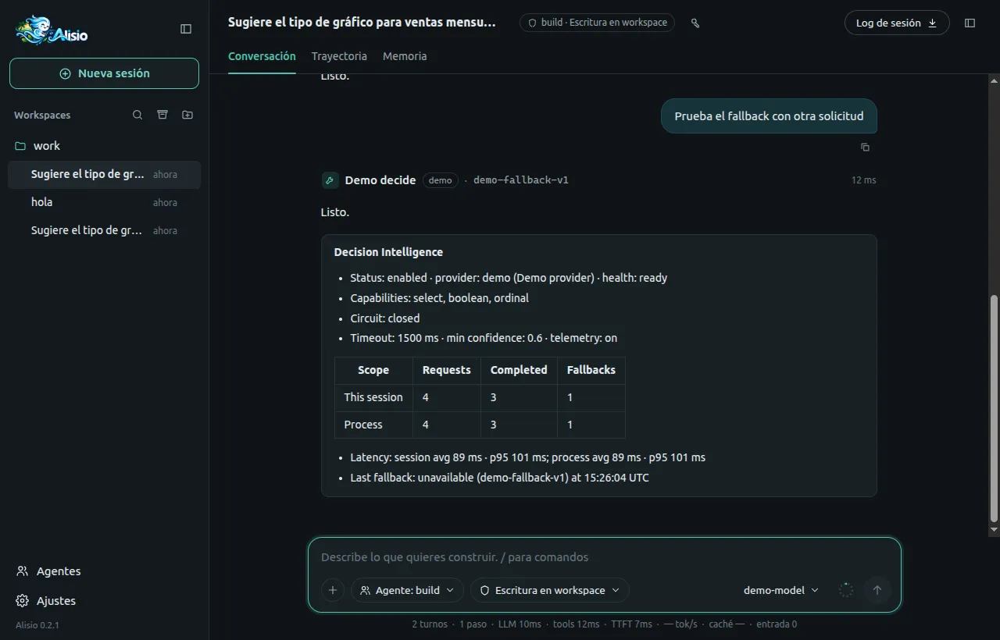

# Decision Intelligence

Un proveedor opcional resuelve selecciones estructuradas (elegir una opción, responder sí o no,
escoger un nivel) sin una generación completa del LLM, y todas las funciones siguen funcionando sin
uno. El modelo de lenguaje escribe y razona; un proveedor de decisiones solo selecciona y clasifica
entre opciones que la función ya conoce; el código determinista hace el resto.

## Qué le aporta {#benefit}

Muchas decisiones pequeñas dentro de una función tienen un conjunto cerrado de respuestas: qué tipo
de gráfico encaja con estos datos, si una serie debe apilarse, qué densidad debe tener un diseño.
Pedirle al modelo que genere texto para cada una cuesta tokens, tiempo y variabilidad. Un proveedor
de decisiones las responde en milisegundos y, cuando no puede, la función usa su propio valor fijo
por defecto y continúa.

Lo que obtiene:

- **Menos espera y menos coste.** Una elección cerrada no necesita una generación.
- **Ninguna forma nueva de fallar.** Un proveedor ausente, lento o equivocado nunca bloquea una
  función: cada decisión recurre a un valor por defecto determinista.
- **Visibilidad.** `/decisions` y `/stats` muestran cuántas decisiones se respondieron, cuántas
  recurrieron al valor por defecto y por qué.

::: tip Esta versión incluye la infraestructura
Decision Intelligence añade el contrato de proveedor, el servicio, la configuración y las métricas.
Alisio no incluye ningún proveedor. La primera función integrada que consume decisiones es
[Smart Dashboard](/es/smart-dashboard#how-it-decides), que funciona igual sin uno. Las herramientas
de plugins también pueden usar decisiones (consulte
[Escribir un plugin de proveedor](#writing-a-provider)).
:::

## Proveedores {#providers}

Un proveedor es un [plugin](/es/plugins) que registra un `DecisionProvider` con
`api.decisions.registerProvider`. **Alisio no incluye ningún proveedor.** Hay previsto un plugin
oficial de Laya en el repositorio [alisio-plugins](https://github.com/GustavoGutierrez/alisio-plugins);
todavía no está publicado y nada de lo descrito aquí depende de él. Cualquier plugin puede aportar
un proveedor.

### Activar un proveedor {#activating}

**Instalar un plugin no activa su proveedor.** Solo la configuración global decide qué proveedor
registrado se usa, por su ID, de modo que ningún proyecto ni ningún plugin puede elegir el motor por
usted:

```json
{ "decisions": { "provider": "my-provider" } }
```

Defínalo en `<config home>/config.json`, o con `/settings` en la [interfaz web](/es/web) (Ajustes →
General); `decisions.provider` se edita como texto y se borra para desactivar el proveedor. El
cambio se aplica a la siguiente decisión, sin reiniciar. Un ID que ningún plugin registró no impide
que Alisio arranque: `/decisions` informa `provider "x" is not registered`.

Editar el archivo a mano siempre funciona. Un plugin proveedor también puede ofrecerse a hacerlo por
usted desde un paso que usted inicia (por ejemplo un comando de configuración), véase
[pedir la activación](#requesting-activation).

### Pedir la activación {#requesting-activation}

Un plugin proveedor puede llamar al miembro opcional y detectable por presencia
`api.decisions.activate(providerId)` desde un paso iniciado por el usuario. Quien decide qué ocurre es
Alisio, no el plugin:

```ts
const result = await api.decisions?.activate?.("my-provider");
// result.status: "activated" | "already_active" | "other_provider_active" | "declined"
//   | "needs_confirmation" | "disabled" | "unavailable"
```

- Solo se acepta un proveedor que registró el propio plugin que llama; cualquier otro da `unavailable`.
- `decisions.enabled: false` da `disabled`. Un proveedor ya configurado da `already_active`, o
  `other_provider_active` (con `active`) si es otro distinto: su elección nunca se sobrescribe.
- Si no hay nada configurado, Alisio le pregunta una sola vez (el texto se muestra en inglés): "Plugin
  my-provider wants to become the decision provider. Dashboards will send your request goal and column
  names, never values, to it. Activate it?" (Yes/No). Sin superficie interactiva (`alisio run`) la
  respuesta es `needs_confirmation` y no cambia nada; responder No da `declined`.
- Con Yes, Alisio guarda `decisions.provider` solo en la configuración global (de forma atómica y
  conservando el resto de ajustes) y lo aplica en vivo. Si el guardado falla, el resultado es
  `unavailable` y no se activa nada.

Esto no añade ninguna frontera de confianza nueva: un plugin que usted instaló ya se ejecuta con sus
permisos, y la confirmación es la salvaguarda. Instalar un plugin sigue sin activarlo nunca por sí
solo.

## Sin proveedor {#without-a-provider}

Alisio se comporta igual. Sin proveedor configurado, o con `decisions.enabled` en `false`, una
llamada de decisión se resuelve a nada de inmediato, no se registra ningún evento y la función que
llama ejecuta su valor determinista por defecto. Nada del resto del producto espera ni cambia por
esa ausencia.

## Alternativa y confianza {#fallback-and-confidence}

- **Por decisión, no por petición.** Una petición puede llevar hasta 16 decisiones. Cada respuesta
  se valida por separado contra las opciones cerradas de su pregunta; las respuestas utilizables se
  devuelven y el resto se informa como rechazadas (`low_confidence`, `invalid`, `unsupported` o
  `missing`). La función completa lo que falta con su propia regla.
- **Tiempo límite.** Cada llamada está limitada por `decisions.timeoutMs`, **1500 ms** por defecto.
  Alisio impone el límite; no se deja al proveedor. Cubre 16 decisiones con un proveedor local que
  solo usa CPU; con GPU la misma llamada es mucho más rápida.
- **Disyuntor.** Tras 3 fallos consecutivos que cuestan tiempo o indican un proveedor roto (un
  tiempo agotado, un error `invalid_response` o `internal`, o un error sin tipo), el circuito se abre
  durante 30 segundos: las llamadas recurren de inmediato al valor por defecto con el motivo
  `circuit_open`. Pasado ese tiempo, una llamada de sondeo decide si se cierra de nuevo. Los rechazos
  rápidos (`not_ready`, `unavailable`), la baja confianza y las respuestas rechazadas no cuentan, así
  que un proveedor que aún está arrancando no abre el circuito.
- **No se asume que la confianza esté calibrada.** `confidence` es la mejor estimación del
  proveedor de que una respuesta es correcta, pero Alisio no la trata como una probabilidad: las
  mediciones con un motor real mostraron que un umbral de confianza no separaba de forma fiable los
  casos claros de los ambiguos. `decisions.minConfidence` es un **filtro heurístico**, no una
  garantía. La calidad de una decisión se mide en la función que la usa, no con este número.

## Configuración {#configuration}

El bloque `decisions` de la [configuración](/es/configuration#decisions). Todas las claves son
opcionales.

| Clave | Por defecto | Rango | Ámbito |
| --- | --- | --- | --- |
| `decisions.enabled` | `true` | booleano | Capa global o de proyecto |
| `decisions.provider` | `null` | ID de plugin (`^[a-z0-9][a-z0-9.-]{0,63}$`) o `null` | **Solo global** |
| `decisions.timeoutMs` | `1500` | 50 a 10000 ms | Capa global o de proyecto |
| `decisions.minConfidence` | `0.6` | 0 a 1 | Capa global o de proyecto |
| `decisions.telemetry` | `true` | booleano | **Solo global** |

`provider` y `telemetry` solo se leen de `<config home>/config.json`. Una capa de proyecto o un
archivo `--config` que las defina no detiene Alisio: los valores se ignoran y `alisio doctor` los
lista entre lo ignorado. Con `telemetry: false` los eventos de decisión no se persisten, así que la
sección de `/stats` no aparece; `/decisions` sigue mostrando las métricas en memoria del proceso.

Las cinco claves pueden cambiarse en vivo desde **Ajustes → General** en la interfaz web y se leen
en la siguiente decisión. El cierre de plugins tiene su propia clave relacionada,
`pluginHooks.disposeTimeoutMs` (consulte [Ciclo de vida](#lifecycle)).

## `/decisions` y `/stats` {#commands}

### `/decisions` {#decisions-command}

Muestra el estado de la función en la [interfaz web](/es/web) y en la [interfaz de terminal](/es/tui),
con el mismo texto: el proveedor configurado y su salud, sus capacidades, el estado del circuito, el
tiempo límite, la confianza mínima y el ajuste de telemetría, seguido de las métricas de esta sesión
y de todo el proceso: peticiones, llamadas completadas, alternativas usadas, latencia (media y
percentil 95), la última alternativa con su motivo y las llamadas por pack de decisiones.

- Sin proveedor dice `no provider configured (set decisions.provider)`; con un ID desconocido,
  `provider "x" is not registered`.
- La comprobación de salud tiene su propio límite de 1 segundo y solo la pide este comando, nunca el
  camino de una decisión. Un fallo se muestra como `unavailable`.
- Un `activate` o `deactivate` fallido del proveedor se muestra aquí como error de ciclo de vida. No
  se muestra en ningún otro sitio.

<figure class="doc-shot">
  
  <figcaption>El informe de <code>/decisions</code> tras unas cuantas decisiones, una de ellas con alternativa (interfaz en español).</figcaption>
</figure>

### `/stats` {#stats-section}

Cuando ha ocurrido al menos una decisión en la sesión, `/stats` añade una sección **Decision
Intelligence** con el proveedor, las peticiones, las llamadas completadas, las alternativas usadas,
la latencia y la última alternativa. La interfaz web añade un resumen corto de decisiones al
tooltip de los totales de la sesión en lugar de a la línea principal. La terminal y la web lo
calculan igual. El `/stats` de la terminal, como antes, cubre solo el proceso de terminal actual.

## Privacidad {#privacy}

Los eventos y las métricas de decisión llevan **solo metadatos**. Guardan la etiqueta del sitio de
llamada, el pack, el ID del proveedor, la latencia, los recuentos, la confianza más baja y el motivo
de la alternativa. **Nunca** guardan el `state` enviado al proveedor, las instrucciones, las
etiquetas de las opciones ni los valores que una función deriva de las respuestas.

Trate lo que una función pone en `state` como datos que pueden salir del proceso: un proveedor puede
ser remoto. Las funciones deben enviar lo mínimo, y Alisio no decide por el adaptador si envía esos
datos a algún sitio. Por ejemplo, una función de dashboards envía el objetivo del usuario y los
metadatos de las columnas, nunca valores de celdas.

## Escribir un plugin de proveedor {#writing-a-provider}

El contrato vive en [`@alisio/sdk`](/es/plugins), es aditivo y es **opcional en el anfitrión**:
`api.decisions`, `api.paths` y `api.options` no existen en un núcleo anterior, así que deben
detectarse por presencia.

```ts
import { definePlugin, DecisionProviderError } from "@alisio/sdk";
import type { DecisionAnswer, DecisionProvider } from "@alisio/sdk";

const provider: DecisionProvider = {
  id: "my-provider",
  name: "My provider",
  capabilities: { select: true, boolean: true, ordinal: false },
  async health() {
    return { status: "ready" };
  },
  async decide(request, { signal }) {
    if (!engineIsUp()) throw new DecisionProviderError("not_ready");
    const decisions: Record<string, DecisionAnswer> = {};
    for (const [key, definition] of Object.entries(request.decisions)) {
      decisions[key] = await classify(definition, request.state, signal);
    }
    return { decisions };
  },
};

export default definePlugin({
  id: "my-provider",
  version: "0.1.0",
  apiVersion: 1,
  categories: ["decisions"],
  setup(api) {
    // Registering does not activate: the user sets `decisions.provider` to this ID.
    api.decisions?.registerProvider(provider);
  },
});
```

Las respuestas usan el vocabulario de Alisio: `select` (`value`), `boolean` (`value`, `probability`)
y `ordinal` (`level`, `index`), cada una con una `confidence` en [0, 1]. Un proveedor que envuelve un
motor con otros nombres los traduce. Alisio valida cada respuesta contra la petición: una opción
desconocida, un nivel que no existe o una confianza fuera de [0, 1] se rechaza solo para esa
decisión.

Una petición tiene de 1 a 16 decisiones, como máximo 20 opciones por `select` y 12 niveles por
`ordinal`, un `state` de como máximo 16 KB y 32 KB en total. El `id` de una petición es una etiqueta
no sensible del sitio de llamada que pasa a ser el `decisionId` de los eventos.

Un plugin también puede leer `api.paths` (los directorios `state`, `config` y `cache` creados para
él, con modo `0700`) y `api.options`, las opciones dadas en `pluginOverrides[id].options`. Consulte
[Escribir plugins](/es/plugins#decision-intelligence).

### Errores y disyuntor {#errors}

Lance `DecisionProviderError` con uno de estos códigos. Alisio compara por `code` y `name`, no por
`instanceof`, así que una copia empaquetada del SDK también funciona.

| Código | Úselo cuando | Cuenta para el disyuntor |
| --- | --- | --- |
| `not_ready` | El motor aún está arrancando (arranque en frío) | No |
| `unavailable` | No se puede llegar al motor ahora mismo | No |
| `timeout` | El motor tardó demasiado por su cuenta | Sí |
| `invalid_response` | El motor respondió algo inutilizable | Sí |
| `internal` | Cualquier otro fallo del proveedor | Sí |

Un error que no sea un `DecisionProviderError` también cuenta. Falle rápido con `not_ready` o
`unavailable` en lugar de esperar: la llamada recurre al valor por defecto de inmediato y el
circuito sigue cerrado.

### Ciclo de vida {#lifecycle}

`activate()` y `deactivate()` son opcionales. Alisio llama a `activate()` cuando el proveedor pasa a
ser el activo (al arrancar, cuando cambia `decisions.provider` o cuando un proveedor configurado se
registra tarde) y a `deactivate()` cuando deja de serlo. Ambos tienen límite de tiempo, nunca son
fatales, se serializan para el mismo proveedor y nunca se esperan en el arranque. Una decisión no
espera a `activate()`: hasta que el motor esté listo, lance `not_ready`. El trabajo del arranque en
frío pertenece a `activate()`.

El `dispose()` de un plugin se ejecuta **solo cuando Alisio se cierra**, no al deshabilitar un
plugin ni con `/reload` (ambos requieren reiniciar). Al cerrar, los plugins se liberan en paralelo,
cada uno limitado por `pluginHooks.disposeTimeoutMs` (2000 ms por defecto, de 100 a 10000), y el
proveedor activo se desactiva primero. Un `dispose()` colgado no retrasa a los demás. Cubierto: salir
de la interfaz de terminal, `SIGINT`, `SIGTERM` y `SIGHUP` en la interfaz de terminal, en
`alisio serve` y en `alisio run`, y el final de una ejecución. Una muerte súbita (`SIGKILL`, una
caída) no está cubierta: un plugin que posee un proceso del sistema operativo debe limpiar por sí
mismo los que queden huérfanos.

## Regla para colaboradores: la regla de admisión {#admission-rule}

El motor de decisiones es para elecciones cerradas que el código determinista no puede tomar bien.
Antes de añadir un pack de decisiones o cualquier uso de `ctx.decisions`, responda en orden:

1. ¿La decisión tiene un conjunto cerrado de resultados? Si no, use el LLM o código normal.
2. ¿Aparece con suficiente frecuencia? Si no, no la añada.
3. ¿Resolverla aquí reduce tokens, coste, latencia o variabilidad? Si no, no la añada.
4. ¿Existe un valor por defecto seguro? Si no, no la automatice.

La pull request también debe responder por escrito ocho preguntas:

1. ¿Qué decisión cerrada resuelve?
2. ¿Qué trabajo del LLM elimina?
3. ¿Qué métrica mejora?
4. ¿Cuál es su alternativa?
5. ¿Qué ocurre sin proveedor?
6. ¿Cómo se valida su salida?
7. ¿Por qué el código determinista no bastaría?
8. ¿Qué va en `state` y por qué un proveedor remoto podría recibirlo?

Si no pueden responderse con claridad, la función no usa el motor de decisiones. El código
determinista va primero: «una columna `date` es candidata a tiempo» no necesita IA. Los packs son
código, una función pura `buildX(input)` más una tabla determinista que convierte respuestas en
valores, y viven junto a su función.
