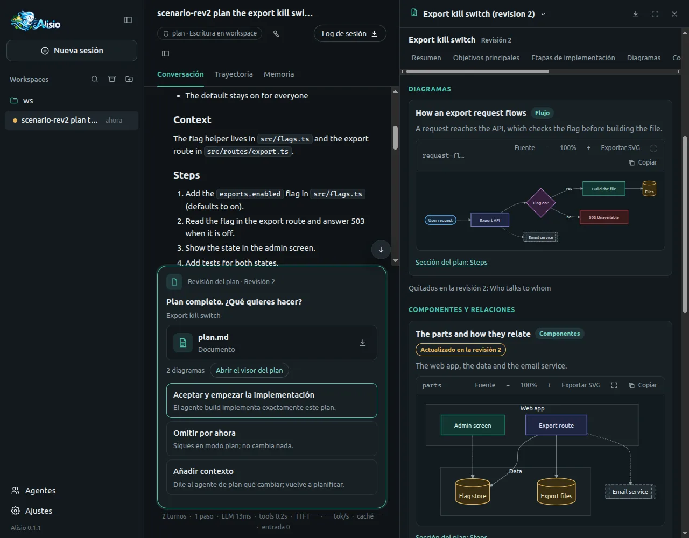

# Modo plan y revisión del plan

El modo plan permite que Alisio piense antes de cambiar nada. Usted describe un objetivo, Alisio
estudia su proyecto sin tocarlo y le entrega un plan por escrito. Usted lo lee, decide, y solo
entonces empieza la implementación.

El modo plan funciona en la [interfaz web](/es/web) y en la [interfaz de terminal](/es/tui). Los
diagramas se dibujan en la web; la terminal muestra su código.

## Qué es el modo plan {#what-is-plan-mode}

El modo plan es el agente integrado **plan**. Puede leer sus archivos y buscar en su proyecto, pero no
puede cambiar nada. Cuando el plan está listo, le pregunta qué hacer.

Cómo funciona:

1. **Planificar.** Usted cambia al agente plan y pide algo. Este investiga el proyecto con herramientas
   de solo lectura y escribe un plan.
2. **Revisar.** Alisio muestra el plan y le pide decidir: aceptar, omitir o añadir contexto.
3. **Construir.** Si acepta, el chat cambia al agente `build`, que implementa exactamente ese plan.

Formas de entrar en modo plan:

- **Mayús+Tab** recorre los agentes principales: `build`, después `plan` y después sus propios agentes
  principales. El plan es la primera parada. En la web funciona con el foco en el cuadro de mensaje
  (véase [Selector de agente y Mayús+Tab](/es/web#agent-cycle)).
- **`/agent:plan`** en el cuadro de mensaje, en la web y en la terminal.
- El **selector de agente** del compositor web (muestra **Agente: build**) permite elegir `plan`.
- En la terminal, `/agents` también lo lista (véase [Alternar agentes con Shift+Tab](/es/tui#cycle-agents)).

### Por qué es de solo lectura {#read-only}

El agente plan es de solo lectura sea cual sea el [modo de permisos](/es/tools#permission-modes). Lo
impone el runner, no el prompt: la política de ejecución del agente plan no permite escrituras,
comandos ni llamadas de red, de modo que elegir **Acceso total** nunca la amplía. La herramienta que
entrega el plan, `exit_plan`, solo registra una decisión; nunca inicia trabajo por sí sola.

## La revisión del plan {#plan-review}

Cuando el plan está completo, Alisio lo muestra en la conversación, lo guarda como el artefacto
`plan.md` y sustituye el cuadro de mensaje por una pantalla de decisión titulada **Plan completo.
¿Qué quieres hacer?** Hay tres opciones:

| Opción | Qué hace |
|---|---|
| **Aceptar y empezar la implementación** | El chat cambia al agente `build` y empieza un turno de implementación. Su mensaje lleva el plan aprobado y el modo de permisos del chat no cambia. |
| **Omitir por ahora** | No pasa nada más. El chat sigue en modo plan. `Esc` hace lo mismo. |
| **Añadir contexto** | Se abre un cuadro de texto. Lo que envíe vuelve al agente plan, que sigue planificando y propone una revisión nueva (véase [Revisiones](#revisions)). |

<figure class="doc-shot">
  
  <figcaption>La revisión del plan: la pantalla de decisión bajo el plan, con plan.md abierto en el panel lateral.</figcaption>
</figure>

Conviene saber:

- **Aceptar es idempotente.** Aceptar dos veces (doble clic, dos pestañas, una recarga) inicia un único
  turno de implementación.
- **Una recarga conserva la revisión.** Si recarga la página con una revisión pendiente, vuelve a
  aparecer la misma decisión. Si cierra el navegador, la revisión queda pendiente 30 segundos y después
  cuenta como **Omitir por ahora**. Lo mismo ocurre al cancelar la ejecución y, en la web, al dejar la
  revisión sin responder durante 60 minutos.
- **Tómese el tiempo que necesite.** El tiempo que dedica a la revisión no cuenta para el límite de la
  ejecución (`limits.timeoutMs` cuenta tiempo activo; ver [configuración](/es/configuration#limits)).
  En la terminal la revisión permanece abierta tanto tiempo como quiera; en la web se retira tras 10
  minutos sin respuesta. Si una ejecución termina con una revisión abierta, el artefacto del plan se
  conserva, la revisión cuenta como **Omitir por ahora** y su siguiente mensaje funciona con
  normalidad (el agente propone una nueva revisión).
- **La pantalla sustituye al compositor.** Mientras está abierta, Mayús+Tab y el selector de agente no
  hacen nada.
- **Esc se comporta como Omitir por ahora.** Mientras escribe el contexto, `Esc` vuelve a las tres
  opciones.
- **Scripts.** Un cliente que no conoce la revisión del plan (un script que use la API) ve una pregunta
  normal con las mismas tres opciones.

## Qué contiene un buen plan {#good-plan}

Las instrucciones del agente plan piden un plan que se entienda por completo como texto, con estas
secciones y en este orden:

| Sección | Qué contiene |
|---|---|
| **Goal** (objetivo) | Qué será cierto cuando el trabajo termine, en una o dos frases. |
| **Context** (contexto) | Lo que el agente encontró en su proyecto y en lo que se apoya el plan: archivos, funciones, convenciones. |
| **Steps** (pasos) | Una lista numerada. Cada paso nombra los archivos y las funciones que cambian y qué cambia. |
| **Decisions** (decisiones) | Solo cuando hubo elecciones reales: cada decisión y su porqué, en una línea. |
| **Risks** (riesgos) | Qué podría salir mal, qué es incierto y qué no se verificó. |
| **Verification** (verificación) | Los comandos y las comprobaciones exactos que demuestran que el trabajo está hecho. |

Las instrucciones están en inglés, así que el modelo suele escribir estos encabezados en inglés, aunque
usted le hable en español. `plan.md` se entiende siempre por sí solo. Los diagramas y el visor son un
añadido: si solo abre `plan.md`, no pierde nada. Para una tarea muy pequeña el modelo puede prescindir
de las secciones; el visor lo tolera (véase [El visor del plan](#plan-viewer)).

## Diagramas {#diagrams}

Un diagrama es una imagen pequeña que explica algo que el texto no explica: un flujo, las partes de un
sistema y cómo se relacionan, una secuencia entre componentes o cómo se mueven los datos.

- El modelo añade uno **solo cuando aporta comprensión**. Un plan puede llevar de **0 a 5** diagramas
  (el máximo es [`plan.maxDiagrams`](#settings)). Un plan sencillo no lleva ninguno.
- Cada diagrama muestra una idea, con unos 40 nodos como máximo y etiquetas cortas. No debe añadir
  información que no esté en el plan.
- Cada diagrama tiene un `id`, un título, una explicación breve y la sección del plan que ilustra.

### Formato y tipos permitidos {#diagram-format}

Los diagramas se escriben como texto [Mermaid](https://mermaid.js.org/). Los tipos permitidos son
`flowchart` (y `graph`), `sequenceDiagram`, `stateDiagram` / `stateDiagram-v2`, `erDiagram`,
`classDiagram`, `gantt`, `mindmap`, `timeline` y `journey`. Al modelo se le indica que prefiera los
diagramas de flujo.

Además del tipo de Mermaid, cada diagrama tiene un propósito: `overview`, `flow`, `components`,
`architecture`, `sequence`, `data`, `state` u `other`. Si el modelo no indica ninguno, Alisio lo deduce
del tipo de Mermaid.

### Guía de estilo y colores {#diagram-style}

Para que los diagramas sean coherentes, al agente plan se le indica que marque los nodos de los
diagramas de flujo con siete clases semánticas (`:::nombre`) en lugar de elegir colores:

| Clase | Significado |
|---|---|
| `input` | Lo que entra |
| `process` | Un paso, o una parte que hace trabajo |
| `data` | Datos almacenados o intercambiados |
| `system` | Una parte principal del producto |
| `external` | Un tercero o un sistema externo |
| `decision` | Una elección o una condición |
| `risk` | Un riesgo o una parte incierta |

La web aplica un color a cada clase, en una variante clara y otra oscura que siguen el tema de la
interfaz, y los tokens de diseño de Alisio para todo lo demás. El modelo no define colores. Las
instrucciones también dan significado a las formas: rectángulos para pasos, formas redondeadas para el
inicio y el fin, cilindros para datos almacenados y rombos para decisiones.

### Qué se rechaza y por qué {#diagram-validation}

Alisio comprueba cada diagrama antes de guardarlo. Rechaza lo que podría ejecutar código, abrir
enlaces, cargar recursos externos o relajar la seguridad de Mermaid:

- Las instrucciones `click`, `link` y `callback`, `href` y las direcciones `javascript:` o `data:`.
- `url()` y `@import`.
- Etiquetas HTML en los textos.
- Una directiva `%%{init}` o un front matter que toque ajustes de seguridad (como `securityLevel` o
  `htmlLabels`).
- Un tipo de diagrama fuera de la lista anterior.
- Límites por diagrama: **8 KB** de código y unos **40 nodos** (una estimación hecha a partir del
  texto).

La web, además, dibuja los diagramas con el modo de seguridad estricto de Mermaid.

### Un diagrama no válido {#diagram-invalid}

Un diagrama que no supera la comprobación se **descarta con un motivo**. El plan se publica y se
revisa igualmente, y el resultado de la herramienta indica al modelo qué diagramas se aceptaron, cuáles
se descartaron y por qué, para que los corrija en la revisión siguiente. Los diagramas que superan el
máximo se descartan de la misma forma.

Un diagrama que supera la comprobación pero tiene un error de sintaxis de Mermaid se conserva. La web
muestra entonces su código y el mensaje de error en lugar de una imagen.

## El visor del plan {#plan-viewer}

Cuando un plan tiene diagramas, la pantalla de decisión muestra una línea como **3 diagramas** con
**Abrir el visor del plan**. La tarjeta del artefacto abre el mismo visor en el panel lateral. El visor
muestra estas secciones, en este orden, y omite las que no tienen nada que mostrar:

- **Resumen**
- **Objetivos principales**
- **Etapas de implementación**, como un recorrido numerado
- **Diagramas**
- **Componentes y relaciones**, para los diagramas de tipo `components` y `architecture`
- **Decisiones y consideraciones**: decisiones, riesgos y comprobaciones de verificación
- **Plan completo**: todo el `plan.md`

<figure class="doc-shot">
  
  <figcaption>El visor del plan en la revisión 2 de un plan: el flujo de la petición y el diagrama de componentes, que cambió en esta revisión (interfaz en español).</figcaption>
</figure>

Detalles:

- **Navegación en ambos sentidos.** Cada diagrama tiene un enlace **Sección del plan: …** que salta a la
  sección que ilustra. Cada sección del plan completo tiene enlaces **Diagramas de esta sección** que
  saltan de vuelta. En ambos casos el foco del teclado también se mueve.
- **Etiqueta de revisión.** Desde la segunda revisión, un diagrama nuevo o modificado lleva **Nuevo en la
  revisión N** o **Actualizado en la revisión N**. Los diagramas que el modelo descartó se listan como
  **Quitados en la revisión N**.
- **Herramientas del diagrama.** Cada diagrama puede cambiarse a su código, copiarse, ampliarse,
  expandirse a pantalla completa y exportarse como SVG.
- **Teclado.** La barra de secciones funciona con las flechas, `Inicio` y `Fin`. Ir a una sección mueve
  también el foco hasta ella, y el movimiento se reduce si su sistema lo pide.
- **Tema.** El visor sigue el tema claro u oscuro de la interfaz, y los diagramas también.
- **Pantallas pequeñas.** La disposición se adapta al ancho de un teléfono.

## Archivos y descargas {#files}

Un plan **con diagramas** se guarda como un artefacto por revisión, en forma de carpeta:

```text
plan/
├── plan.md            el plan, legible por sí solo (la entrada)
├── plan.json          un resumen generado por Alisio
└── diagrams/
    └── <id>.mmd       un archivo Mermaid por diagrama
```

Un plan **sin diagramas** es el único archivo `plan.md`. En ambos casos la tarjeta conserva el nombre
**plan.md**, y la descarga de una carpeta es un ZIP (`plan.zip`) con esos archivos. El artefacto está en
el panel de artefactos (véase [Análisis en Python y artefactos](/es/analysis)).

### `plan.json` {#plan-json}

`plan.json` lo genera Alisio a partir del texto del plan; no lo escribe el modelo. El visor lo lee en
lugar de analizar texto libre.

| Campo | Contenido |
|---|---|
| `version` | Versión del formato (`1`). |
| `planId`, `revision`, `title`, `hash` | Identidad de la propuesta. El hash cubre el texto del plan y sus diagramas. |
| `summary` | Un resumen breve, tomado de la sección Goal. |
| `goals` | Los elementos de la sección Goal. |
| `stages` | Los pasos de la sección Steps, cada uno con un título y un detalle opcional. |
| `considerations` | Decisiones, riesgos y comprobaciones de verificación, cada una con su `kind`. |
| `sections` | Los encabezados del plan (`id`, `title`, `level`). Los diagramas apuntan a ellos. |
| `diagrams` | Por diagrama: `id`, `title`, `explanation`, `section`, `type`, `syntax`, `file`, `hash` y `status` (`new`, `updated` o `unchanged`). |
| `removed` | Diagramas de la revisión anterior que esta ya no tiene. |

Las secciones se reconocen por su encabezado, con algunos alias en inglés y en español (por ejemplo
*Goal* u *Objetivos*). Los demás encabezados solo alimentan la parte **Plan completo**.

### Cuando falta el manifiesto o está roto {#fallback}

Si `plan.json` falta o no se puede leer, el visor muestra una nota, el texto de `plan.md` y los
archivos de diagrama que encuentra en la carpeta. Un archivo de diagrama que no se puede leer muestra su
propio error y el resto del plan aparece igualmente. Si no se puede cargar el propio `plan.md`, el
visor muestra un error con un botón **Reintentar**.

## Revisiones {#revisions}

Cada vez que el agente plan llama a `exit_plan`, el resultado es una nueva **revisión**: el artefacto
se titula **«Título del plan (revision N)»** y la pantalla de revisión muestra el número de revisión
desde la segunda. Solo se puede decidir sobre la última revisión. Ocurre cuando elige **Añadir
contexto**: el agente revisa el plan y lo propone de nuevo.

Al revisar un plan, el modelo reenvía todos los diagramas que siguen vigentes y omite los demás. Alisio
compara cada diagrama con la revisión anterior mediante un hash de su contenido y lo marca como:

- **new**: su `id` no existía antes;
- **updated**: mismo `id`, pero distinto título, explicación, sección, tipo o código;
- **unchanged**: mismo contenido.

Los diagramas de la revisión anterior que no se reenvían se listan como **removed**. Como el hash del
plan cubre los diagramas, un cambio solo en un diagrama es una propuesta distinta.

## En la terminal y sin interfaz {#terminal}

En la [interfaz de terminal](/es/tui#plan-review) la revisión funciona con las mismas tres opciones
(flechas e `Intro`; `Esc` omite). Los textos de la terminal están en inglés. La terminal no dibuja
diagramas. Después del plan, la transcripción muestra de cada diagrama:

- su título, su propósito, la sección del plan que ilustra y su explicación;
- el **código Mermaid, limitado a 8 líneas** (el resto está en `diagrams/<id>.mmd`);
- desde la segunda revisión, si es nuevo o actualizado;
- por último, la **ruta de la carpeta del plan** en el disco.

Abra `/artifacts` para encontrar el plan. **Preview here** muestra `plan.md` como Markdown, y **Open with
default app** o **Reveal in folder** llegan a la carpeta completa.

Con `alisio run`, con `--json` o con `--read-only` no hay nadie que decida, así que no hay revisión. El
modelo da el plan como texto plano en su respuesta final, los archivos del plan se escriben igualmente
y no se abre nada. En ese caso `exit_plan` devuelve `unavailable`.

## Ajustes {#settings}

| Clave | Valor por defecto | Qué hace |
|---|---|---|
| `plan.diagrams` | `true` | Activa o desactiva los diagramas del plan. Desactivado quita el argumento `diagrams` de `exit_plan` y la guía de estilo de las instrucciones del agente plan. |
| `plan.maxDiagrams` | `5` | Máximo de diagramas que conserva un plan (0 a 8). `0` equivale a `plan.diagrams: false`. |

El tamaño de un diagrama (8 KB) y su estimación de nodos (40) son límites fijos, no ajustes.

Dónde cambiarlos:

- La página **Ajustes** de la interfaz web (**Diagramas del plan** y **Máximo de diagramas por plan**).
- `/settings` en la interfaz de terminal.
- El [archivo de configuración](/es/configuration#plan):

```json
{ "plan": { "maxDiagrams": 3 } }
```

Se leen en vivo: la siguiente petición de plan usa los valores nuevos.

## Limitaciones {#limitations}

- Mermaid solo dibuja en la **web**. La terminal muestra el código. Todavía no hay un visor HTML
  independiente.
- La comprobación es **ligera**. No dibuja ni analiza Mermaid por completo, así que un diagrama puede
  pasarla y aun así no dibujarse. La web muestra entonces su código y el error.
- **Nada comprueba que un diagrama sea fiel al plan.** Las instrucciones prohíben añadir información que
  no esté en el plan, pero el modelo puede equivocarse. Lea los diagramas como una ayuda, no como una
  prueba.
- `plan.json` se extrae de las secciones Markdown que se pide escribir al agente. Un plan con otros
  encabezados sigue funcionando, pero las partes de resumen, objetivos y etapas pueden quedar vacías.
- Cada revisión es **su propio artefacto**; las anteriores siguen en el panel de artefactos.
- Alcance de la verificación: el visor web se comprobó solo en Chromium, y la parte de terminal a través
  de su lógica y su panel, no en una terminal real. Véanse los detalles en
  [Limitaciones conocidas](/es/limitations).

## Para desarrolladores {#for-developers}

`exit_plan` se ofrece solo a la ejecución del agente plan (nunca a `build`, a los subagentes ni a Code
Mode). Su efecto es `read`, así que todas las políticas lo permiten.

**Entrada:** `{ plan: string, title?: string, diagrams?: [{ id, title, explanation, section?, type?, mermaid }] }`.
`plan` es Markdown, de hasta 60 000 caracteres; `diagrams` aparece solo mientras `plan.diagrams` está
activo.

**Resultado:** un texto JSON con una `decision` (`approved`, `skipped`, `feedback` o `unavailable`), un
`message` para el modelo, el `artifactId` y, cuando hay diagramas, un informe `diagrams` con
`accepted`, `dropped` (con sus motivos) y `removed`. `feedback` lleva además el contexto que usted
escribió.

La herramienta siempre devuelve un resultado, así que una sesión nunca se queda con una llamada
colgada. El esquema completo y la tabla de decisiones están en
[Entregar un plan: exit_plan](/es/tools#exit-plan).

**Eventos.** Dos eventos durables de la ejecución describen la revisión: `plan_proposed` (llamada, id
del plan, revisión, hash, título, artefacto) y `plan_decided` (llamada, id del plan, hash, decisión). La
pestaña Trajectory de la interfaz web lista los eventos durables de una sesión (véase
[Interfaz web](/es/web)).

Páginas relacionadas: [Agentes](/es/agents), [Herramientas y permisos](/es/tools),
[Interfaz de terminal](/es/tui), [Interfaz web](/es/web), [Configuración](/es/configuration),
[Análisis en Python y artefactos](/es/analysis).
