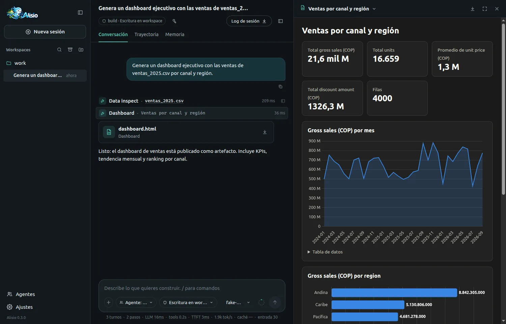
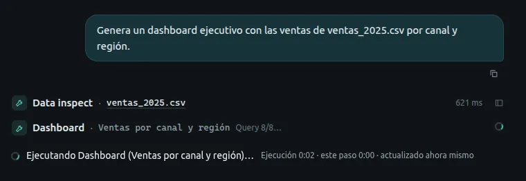
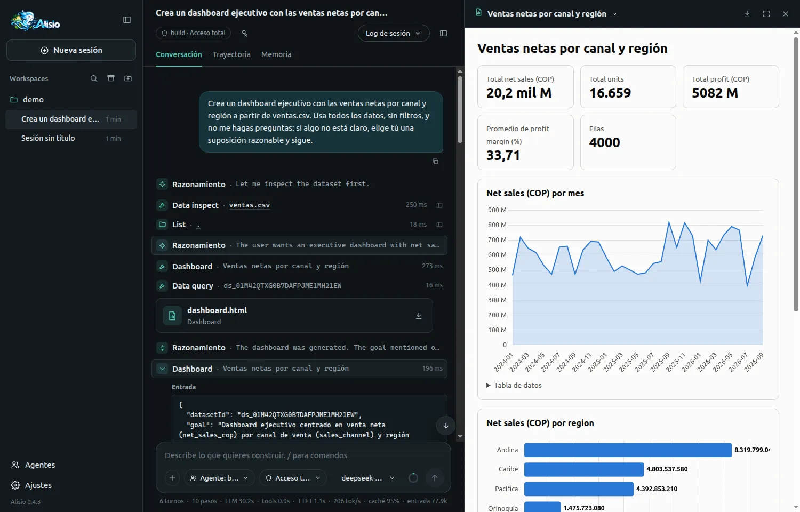

# Smart Dashboard

Attach a dataset, ask for a dashboard and get a consistent, validated one. Alisio plans, queries
and draws it with fixed rules, so the model writes no code for it.

## What it does for you {#benefit}

Building a dashboard by hand asks the model to decide what to analyze, what to query, which chart
fits, how to lay it out and how to write the script, all in one go. That costs time and tokens, and
the result varies from one run to the next. The `dashboard_generate` tool takes only your intent
(the dataset and, optionally, a goal) and builds the dashboard with deterministic code:

- **No generated code.** Nothing to read, approve or debug: the model calls one tool.
- **Consistent.** The same dataset and the same goal give the same dashboard, with readable titles,
  labels and number formats.
- **Validated.** The plan is checked against the dataset's columns before anything is queried, so
  a chart never points at a column that does not exist.
- **Works offline and without a decision provider.** Everything runs inside Alisio.

<figure class="doc-shot">
  
  <figcaption>A dashboard built by <code>dashboard_generate</code> from a sales CSV, open in the isolated viewer.</figcaption>
</figure>

## Using it {#usage}

Ask in plain language, with a file in the workspace or one you attached in the [web UI](/web):

```text
Generate an executive dashboard with the sales of sales_2025.csv by channel and region
```

Alisio ingests the file as a dataset (see [Tabular data](/analysis#data)) and the model calls
`dashboard_generate { datasetId }`. The dashboard is published as an artifact named
`dashboard.html`; the result lists its components. The tool takes these inputs:

| Input | Required | Meaning |
| --- | --- | --- |
| `datasetId` | yes | A dataset of this session. |
| `goal` | no | What the dashboard is for, up to 2000 characters (longer text is cut, with a note). Name the columns you want to see. |
| `title` | no | The dashboard title, up to 120 characters. |
| `locale` | no | `en` (default) or `es`: the language of the generated titles and labels. |
| `sheet` | no | A sheet of a spreadsheet (XLSX), by name; the first sheet by default. |

To regenerate, ask again with another goal (for example *"now an operational view"*). Each call is
independent: it does not edit the previous dashboard, and the same inputs on the same data give the
same result. The goal picks the purpose by words it recognizes: an overview or executive summary
(the default) leads with KPIs, a trend and rankings; a monitoring or status goal puts the detail
table and rankings first; an analysis or comparison goal adds a correlation chart and the table.
The goal also picks the columns. The planner matches it against the names and headers of your
columns (whole words, ignoring case and accents, singular or plural, with simple English and Spanish
synonyms such as *seller* and *vendedor*) and plans for what it finds: a measure you name becomes a
KPI and leads the charts, and every dimension you name gets its own chart, in the order you wrote
them, before the default ones. A dashboard holds at most 12 components, so if you name more than fit
the last ones are left out and listed in the result as "Not shown". Identifiers (such as an order
id) are never charted. Column names in your data are kept as they are; only the generated titles
follow `locale`.

## What it builds {#what-it-builds}

| Widget | Used for |
| --- | --- |
| KPI | A headline number: a sum, average, minimum, maximum, count or distinct count. |
| Line, area | A measure over time. |
| Bar, horizontal bar | A ranking of the categories of a column. |
| Pie, donut | The share of each category in the total. |
| Scatter | The relation between two measures. |
| Table | Detail rows. |

Limits keep the page readable: at most 12 components, 6 KPIs and 8 table columns, and 1 to 20
categories in a ranking (10 by default). Before it plans, Alisio profiles each column and picks
shortlists of up to 8 measures, 8 dimensions and 4 time columns. Details you can rely on:

- **KPIs use compact numbers.** From one million up a tile shows `21.6B` (or `21,6 mil M` with the
  Spanish locale) so it never clips, and the exact value stays in the tile's tooltip. Percentages
  are never compacted, and currency is never inferred from the data: a number is shown as a number.
- **Readable column names.** A header such as `gross_sales_cop` becomes "Gross sales (COP)"; a
  header that already reads like text is kept.
- **Time buckets.** A trend groups days, weeks, months, quarters or years according to the span of
  the data. It picks the coarsest grouping that keeps the chart under 400 points rather than
  cutting off the end. Only ISO 8601 dates are treated as time columns, and zoned timestamps are
  read in UTC.
- **Top N and "Other".** A ranking shows the top categories and says when more exist. A share
  chart folds the rest into an "Other" slice; a pie or donut with more than 6 slices becomes a
  horizontal bar.
- **Notes instead of failures.** If one component cannot be built (for example its query is too
  slow), the others are still published and the result notes what was left out. If none can be
  built, the tool fails with a clear error and publishes nothing.

## How it decides {#how-it-decides}

Rules come first. A rule-based planner always computes a complete plan: it classifies columns
(time, measure, dimension, identifier, boolean), chooses the lead measure and the charts from the columns the goal names and from the
column names, and picks the widgets. The plan is then validated and repaired deterministically (a
line over a non-time column becomes a bar, an unknown column is dropped, limits are clamped). The
model is never called to repair it.

An optional [decision provider](/decision-intelligence) refines one closed choice on top of the
rules: the dashboard purpose (executive, operational or analytical). Everything else (the lead
measure, the ranking and composition dimensions and whether to include the trend, ranking,
composition and scatter charts) is always decided by the rules. This is measured, not assumed: on
375 labelled decisions with the real Laya 0.3.24 (about half in Spanish) the purpose was 90 %
correct, while the column and include/exclude choices were close to chance, and every extra
question makes a CPU answer slower. The answer replaces the rule default only when the provider
answers it. Without a provider the dashboard is just as valid and reproducible. This is
the first feature that uses decisions; see [Decision Intelligence](/decision-intelligence#providers)
for how a provider is installed and activated.

**What is sent to a provider:** only your goal (truncated to 500 characters) and, for each
shortlisted column, a short opaque ID, its label, its role, its inferred type and a cardinality
bucket (binary, low, medium, high or very high). Cell values, frequent values, minimums, maximums
and samples are never sent. See [Privacy](/decision-intelligence#privacy).

## Safety {#safety}

- **The model writes no code.** The planner and renderer are Alisio's own code; the model cannot
  inject HTML, JavaScript, Python or SQL, and neither can a provider.
- **SQL comes from your columns only.** Each component is one `SELECT` built from the dataset's own
  column names, always quoted, with no text from the model or a provider. It runs through the same
  read-only dataset engine as `data_query`, with its time limit.
- **Text is escaped.** Titles and labels are cleaned and escaped before they reach the page.
- **No network, no CDN.** Chart.js is inlined once, so the dashboard works offline, in the
  isolated viewer and in the downloaded file.
- **Small footprint.** The tool reads one dataset of the session and writes one artifact to
  Alisio's artifact store: no process, no network and no workspace file. It has the `internal`
  effect, so it needs no approval, like `artifact_create`.

## Progress {#progress}

While it works the tool reports short steps: `Analyzing dataset…`, `Planning dashboard…`,
`Building N components…`, `Query i/N…` and `Dashboard ready`. The web UI shows the latest line on
the running tool row. The terminal shows the latest line next to the tool's summary and clears it
when the tool finishes.

<figure class="doc-shot">
  
  <figcaption>The running <code>dashboard_generate</code> row, with the latest progress line.</figcaption>
</figure>

## When to use `python_run` instead {#python-run}

The catalog covers the common dashboard. For anything else, such as statistical tests, custom or
unsupported charts, joins between sheets or files, or exports, the model uses
[`python_run`](/analysis#charts) with `alisio_runtime.charts`. When no dashboard can be planned
(the dataset has no usable measure, dimension or time column), the tool says so and points to
`python_run`.

## The switch {#switch}

`analysis.smartDashboard` (default `true`) controls the tool and the guidance that steers the model
to it. Set it to `false` and `dashboard_generate` is not registered (it does not appear in `/tools`)
and the model guidance goes back to the Python flow.

With `true`, the descriptions the model reads steer a dashboard request over a dataset to
`dashboard_generate` (no code) and keep `python_run` for what the catalog does not cover:
statistical analysis, custom or unsupported charts, joins and exports. With `false` those texts are
exactly the ones of 0.3.0.

```json
{ "analysis": { "smartDashboard": false } }
```

It follows the usual [configuration layers](/configuration#analysis), with one rule worth knowing:
a global `false` cannot be undone by a project, while a project can turn it off for itself. You can
change it from **Settings → Data analysis** in the web UI or from `/settings` in the terminal; it
applies the next time Alisio starts. It also needs `analysis.enabled`.

## Limitations {#limitations}

- **Not available with `--read-only`.** The tool publishes an artifact, so it is removed like
  `artifact_create`. Without it the data tools still work.
- **One dataset per call** and no joins. Each call is independent of earlier dashboards.
- **No interactive filters.** The dashboard is a static composition.
- **No cross-tabs.** A chart groups by one dimension; a cut such as channel x region is not in the
  catalog.
- **No row filters.** You cannot exclude rows (for example cancelled orders) from the data the
  dashboard reads.
- **No derived metrics.** Margin, year-over-year change and rates are not computed; only columns
  that exist in the dataset are measured.

For any of these the agent uses `python_run`, after the tool or instead of it. To keep it on the
tool, ask for exact columns or measures that exist (for example "net sales", if the dataset has that
column). If you need a filter or a cut, say so in the prompt: the agent then knows to go to Python.
- **Only ISO 8601 dates** are time columns; other date formats give no trend. Zoned times are
  shown in UTC.
- **No currency.** Money is shown as a number; the column name (such as `COP`) is kept in the label.

## A real run with Laya {#real-run}

These are two real sessions (2026-10-04) in the [web UI](/web), on the 0.4.3 candidate build with
`@alisio/plugin-laya` 0.1.1 and `deepseek-flash` as the model. The dataset is a 4000-row sales CSV
renamed `ventas.csv`. Both runs used the same Spanish prompt, "Crea un dashboard ejecutivo con las
ventas netas por canal y región a partir de ventas.csv. Usa todos los datos, sin filtros, y no me
hagas preguntas…", and the permission mode "Acceso total", so the agent asked no questions and
showed no approval prompts, and nobody waited for the user. One run had Laya active (L) and the
other had no decision provider and memory off (N2).

<figure class="doc-shot">
  
  <figcaption>The run with Laya: 6 turns, 10 steps, LLM 30.2 s, tools 0.9 s, and the dashboard "Ventas netas por canal y región" in the viewer.</figcaption>
</figure>

| Measure | With Laya (L) | Without a provider, memory off (N2) |
| --- | --- | --- |
| Send to first dashboard published | 5.0 s | 4.5 s |
| `dashboard_generate` call itself | 161 ms | 52 ms |
| Model time before calling the tool | 4.9 s (2 turns) | 4.5 s (1+ turns) |
| Decisions | 2 completed (101 ms and 30 ms, confidence 0.99 or higher, none rejected, no fallback) | none |
| Artifact provenance | `rules+decisions`, decision provider `laya` | `rules` |
| Lead measure and charts | net sales leads in both; KPIs net sales, units, profit, margin, rows; net sales over time, by region, by channel | same |
| `python_run` after the dashboard | 0 | 4 calls, and 1 extra Python dashboard ("Complemento ejecutivo: canal × región") 35.7 s later |
| Dashboards published | 2, both from `dashboard_generate` (the model called the tool a second time, 5.7 s later) | 2 (1 generated + 1 Python) |
| Whole run (turns / tool calls / tokens in + out) | 32.3 s (6 / 10 / 77,919 + 6,223) | 45.2 s (8 / 7 / 111,240 + 9,424) |

After the run with Laya, `/decisions` reported 2 requests, 2 completed, 0 fallbacks, latency average
66 ms and 95th percentile 101 ms (see
[Decision Intelligence](/decision-intelligence#decisions-command)).

What to expect:

- Time to a dashboard was about 5 s in both runs. The tool plus Laya's answer took well under a
  quarter of a second; Laya adds roughly 100 ms to the tool call.
- In the run with Laya the model did not rebuild anything in Python. Without a provider it did, but
  one run each cannot show that Laya is the cause.
- The dashboard has channel and region charts but not a channel x region cross-tab (it is not in the
  catalog). When the request needs one, the agent goes to Python. See [Limitations](#limitations).
- Memory notes from earlier sessions can change what the agent does. A third run (memory on, no
  provider) had to be discarded because a note saved by an earlier run steered the agent.

This is one session per configuration, one dataset and one model; it does not show a statistical
difference and it is not a benchmark. For the measured comparison see
[Benchmark results](#benchmark).

For comparison, the first run, on the published 0.4.2, asked the user two questions. It took 672 s
from send to dashboard, and 607 s of that was the agent waiting for the user's answers. The model
also rebuilt the dashboard in Python because "ventas netas" did not match the net sales column; that
is fixed in this release.

## Benchmark results {#benchmark}

The benchmark that compares this tool with the Python flow is run by hand with
`scripts/bench-dashboard.ts`, and its results (including every run) are published in
[`docs/benchmark-dashboard.json`](https://github.com/GustavoGutierrez/alisio/blob/main/docs/benchmark-dashboard.json).
All three variants used `deepseek-flash` (`api.deepseek.com`), an English prompt and Alisio 0.3.0
plus the unpublished Smart Dashboard code: **A** is the Python flow without the tool (45 runs, 15
datasets x 3), **B** has `dashboard_generate` (15 runs, 15 datasets x **1 repetition**), and **C** is B
plus the Laya decision provider (5 runs, small datasets only, informational). B and C ran in parallel,
so time to artifact is not comparable between variants.

| Median per run | A (Python) | B (tool) | C (tool + Laya) |
| --- | --- | --- | --- |
| Runs | 45 | 15 | 5 |
| Output tokens | 46,281 | 33,098 | 28,904 |
| Input tokens (cached) | 672,393 (643,072) | 502,399 (491,904) | 395,118 (383,744) |
| Turns | 23 | 21 | 17 |
| Tool calls | 30 | 29 | 22 |
| Time to artifact | 158.7 s | 12.9 s | 9.7 s |
| Runs that called `dashboard_generate` | n/a | 15 / 15 | 5 / 5 |
| Valid DashboardSpecs | n/a | 15 / 15 | 5 / 5 |
| Chart-lint warnings | 0 | 0 | 0 |
| Failure classes | 25 runs without a clean finish | 3 token budget | none |

- **Gate (spec 11.2), B against A: not met.** Output tokens fell 28.5 % (target 50 %) and turns fell
  8.7 % (target 40 %); specs were 100 % valid and there were no lint warnings. The model still calls
  `python_run` after `dashboard_generate` in nearly every run (15 / 15 B runs used it; in C, 4 of 5
  did), which explains the small saving.
- A's runs are cut off by the 1,000,000-token per-run budget (`Token budget exhausted`), so its token
  and turn numbers are a lower bound and the comparison is conservative against B. The same budget
  stopped 3 B runs after they had published a dashboard.
- C: Laya answered in 4 of 5 runs (`rules+decisions`); one run fell back to rules (all answers
  rejected). Decision latency was 271-561 ms. A cold Laya answers `not_ready` and falls back during
  its first seconds, which happened in an earlier smoke run.
- B used one repetition per dataset, so its medians are less stable than A's.
