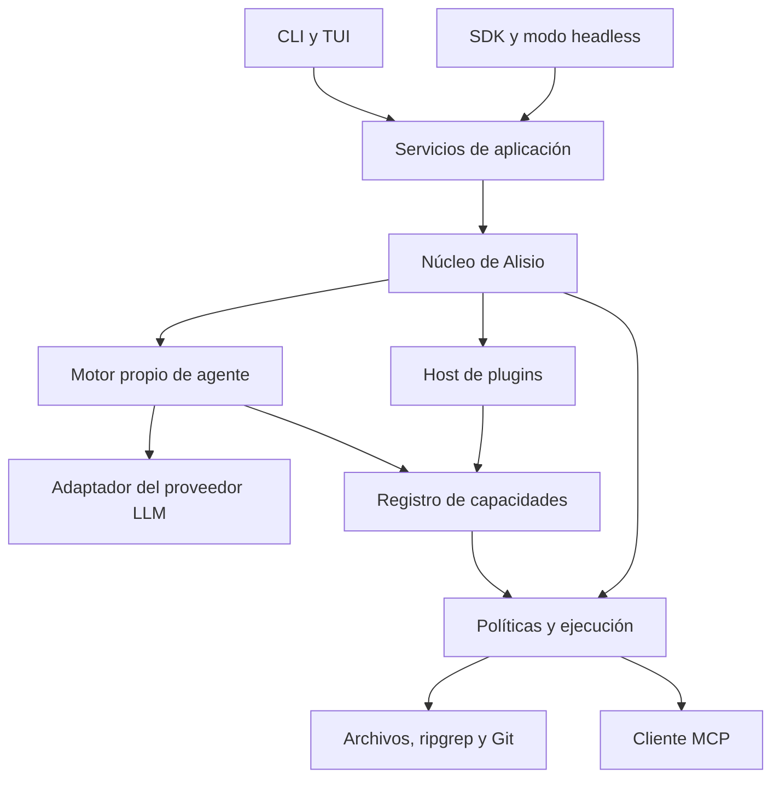
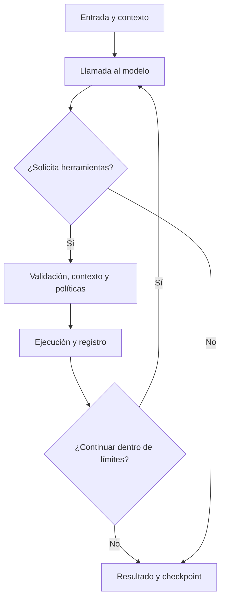

# Alisio

**Velocidad y eficiencia para construir.**

Arquitectura y especificación inicial de un arnés de programación extensible, con SDK propio y alternativa de integración con Pi.

Fecha de diseño: 25 de septiembre de 2026. Estado: propuesta técnica para implementación; este documento no representa un producto ejecutable ni resultados de rendimiento medidos. Los contratos de Alisio, comandos y paquetes con su nombre son propuestos, no APIs publicadas. Se interpreta «vites» como Vitest.

## 1. Producto y decisiones principales

Alisio es un arnés de programación de terminal, escrito en TypeScript, ejecutado y empaquetado con Bun. Ofrece herramientas locales, contexto por proyecto, Agent Skills, MCP y plugins sencillos. También se puede consumir desde TypeScript y mediante un modo headless con eventos JSONL. La propuesta inicial de usar Pi se amplía tras la consulta sobre un SDK propio: se recomienda un núcleo propio acotado si el control del motor es un objetivo del producto. Pi queda como alternativa de integración y referencia de comportamiento, no como dependencia obligatoria del diseño recomendado.

El nombre se inspira en los vientos alisios y su asociación con el Caribe. Es corto, pronunciable en español y apropiado para una identidad colombiana y caribeña sin limitar el producto a una región. Se propone `alisio` como comando. La disponibilidad del nombre en registros, dominios y marcas no se ha comprobado.

Decisiones:

1. Implementar un ciclo de agente, sesiones y planificación propios; reutilizar un SDK de proveedor detrás de una interfaz. Mantener Pi como alternativa si se prioriza reducir tiempo inicial de desarrollo.
2. Mantener un núcleo pequeño con adaptadores reemplazables y un SDK público estable para plugins.
3. Usar Bun para ejecución, bundling y distribución de ejecutables; TypeScript para comprobación de tipos.
4. Tener un único gestor de dependencias: pnpm. No mantener simultáneamente `pnpm-lock.yaml` y `bun.lock`.
5. Utilizar AGENTS.md y Agent Skills; reservar `.alisio/` para configuración propia.
6. Entregar soporte funcional de skills, contexto y MCP en la primera versión, no solo interfaces vacías.
7. Priorizar Bun I/O, ripgrep y Git. Incorporar componentes adicionales en Rust o WASM solo a partir de perfiles y benchmarks.
8. Ejecutar plugins de código confiables en proceso en v0.1. No presentar ese modo como un sandbox.

## 2. Base verificada y límites de la investigación

La documentación oficial consultada permite integrar Pi directamente en Bun o Node.js, configurar recursos y herramientas y controlar sesiones. El repositorio histórico `badlogic/pi-mono` redirige a `earendil-works/pi`; los ejemplos consultados usan `@earendil-works/pi-coding-agent`. Se debe verificar la publicación elegida antes de fijarla en el lockfile; no copiar imports antiguos y actuales en el mismo adaptador. [S1]

Pi ofrece extensiones ejecutables en TypeScript y carga progresiva de skills. Si se escoge esa ruta, Alisio añadirá su contrato de distribución y políticas sobre esas capacidades, evitando cargar dos veces un recurso. En la ruta propia se implementan directamente esos contratos. [S2][S3]

El SDK MCP consultado documenta una línea v2 con `@modelcontextprotocol/client` y `@modelcontextprotocol/server`; `@modelcontextprotocol/sdk` corresponde a la generación anterior. Para un cliente nuevo se elegirá la línea estable validada al comenzar y se fijará su versión. [S6]

Estas comprobaciones son documentales. Antes de declarar compatibilidad de ejecución se necesita el spike de la sección 14 con las versiones instaladas y con el ejecutable compilado.

## 3. Stack elegido

| Área | Elección | Motivo y límite |
| --- | --- | --- |
| Lenguaje | TypeScript estricto | Contratos comprobables, APIs pequeñas, ecosistema de plugins |
| Runtime y build | Bun | Runtime principal, I/O, procesos y ejecutable distribuible |
| Dependencias | pnpm workspaces | Un lockfile y administración del monorepo |
| Motor | Alisio Agent Core propio | Ciclo de agente, sesiones, planificación y eventos; Pi como alternativa |
| Proveedor LLM | SDK del proveedor detrás de ModelProvider | Una integración inicial; no reimplementar transporte HTTP/SSE sin necesidad |
| CLI | Commander | Subcomandos y ejecución no interactiva |
| Onboarding | Clack, carga diferida | Configuración inicial; no es el motor de la TUI |
| TUI | Adaptador de terminal, Ink como candidato | Empezar con streaming CLI; validar peso y compatibilidad antes de incorporar una TUI completa |
| Configuración | Zod | Validación y mensajes de error legibles |
| Esquemas de herramientas | JSON Schema restringido y validado | Frontera interoperable; adaptador al esquema aceptado por cada proveedor |
| MCP | SDK oficial de cliente | Conexiones stdio y Streamable HTTP |
| Procesos | Bun.spawn | Argumentos como arrays, streaming, cancelación |
| Archivos | Bun.file, Bun.write y node:fs cuando haga falta | Evitar capas innecesarias |
| Búsqueda | ripgrep nativo | Búsqueda e inventario respetando reglas de exclusión |
| Control de versiones | Git CLI | Estado y diferencias consistentes con el Git del usuario |
| Sesiones y metadatos | SQLite mediante bun:sqlite | Registro autoritativo de eventos, checkpoints, métricas y estado de plugins |
| Calidad | Biome y tsc --noEmit | Formato, lint y comprobación independiente de tipos |
| Tests | Vitest | Lógica, contratos e integración mediante procesos Bun |
| Distribución | Bun build/compile y Changesets | Binarios por plataforma y versionado de paquetes |
| Telemetría | Eventos locales; exportador OpenTelemetry opcional | Medición sin requerir servicio remoto |

Bun compile empaqueta el programa y el runtime; no convierte toda la aplicación TypeScript en código nativo equivalente a Rust. Bun tampoco sustituye la comprobación estática de TypeScript. [S7][S9]

Node.js se utiliza en desarrollo y CI para ejecutar Vitest conforme a sus requisitos publicados. Las pruebas de integración lanzan Bun o el binario de Alisio para comprobar el runtime real. Vitest no debe importar directamente módulos exclusivos de Bun en su proceso Node: se prueban por adaptadores o subprocesos. [S10]

No incluir LangGraph como segundo orquestador. Vercel AI SDK o pi-ai pueden evaluarse como adaptadores de proveedores cuando haya necesidad real de varios proveedores, sin entregarles también el ciclo del agente. Empezar con un SDK de proveedor y un solo adaptador mantiene pequeña la superficie inicial. La TUI es una capa reemplazable; no usar simultáneamente Ink y otra biblioteca para controlar la misma terminal.

Dejar para plugins: ts-morph, Tree-sitter, ast-grep, Playwright, Promptfoo, Langfuse y herramientas de bases vectoriales. Drizzle se incorpora cuando haya suficientes tablas y migraciones para justificarlo; v0.1 puede usar SQL pequeño, parametrizado y versionado. No introducir Redis, PostgreSQL ni un servicio de embeddings para un arnés local inicial.

## 4. Arquitectura

Estilo: monolito modular con núcleo de plugins y fronteras explícitas. Un único proceso principal, sin microservicios ni contenedor de inyección de dependencias complejo. Inyección por constructores o funciones de fábrica.



El esquema representa relaciones entre módulos; no orden de ejecución ni procesos aislados.

### Responsabilidades

| Módulo | Responsabilidad |
| --- | --- |
| core | Tipos, configuración efectiva, registros, eventos y políticas |
| application | Crear, continuar y cancelar ejecuciones; coordinar recursos |
| agent-core | Ciclo de agente, límites, colas, herramientas y estado de ejecución |
| provider | Traducción entre mensajes propios y el protocolo del proveedor |
| resources | Resolver AGENTS.md, skills y plantillas con procedencia |
| plugin-host | Descubrir, validar, activar, desactivar y liberar plugins |
| tools | Operaciones estándar y wrappers controlados |
| mcp | Ciclo de vida de conexiones y conversión de resultados |
| persistence | Metadatos y acceso encapsulado a sesiones |
| cli | Comandos, TUI y presentación de eventos |

Reglas de dependencia: `core` no importa CLI, SDKs de proveedores, Pi ni MCP. Los adaptadores implementan contratos del núcleo. Los plugins normales importan únicamente el SDK público. Si se desarrolla una integración alternativa con Pi, sus tipos quedan dentro de ese adaptador. No implementar dos motores de producción en v0.1: elegir una ruta en el spike.

No encapsular cada función en una interfaz. Las fronteras que merecen contratos son `AgentEngine`, `ResourceResolver`, `ToolExecutor`, `PluginHost`, `SessionStore`, `ProcessRunner` y `TelemetrySink`.

### Organización propuesta

| Ruta | Contenido |
| --- | --- |
| apps/cli | Entrada de terminal y presentación |
| packages/core | Políticas, registros y contratos internos |
| packages/sdk | API pública de plugins y consumo programático |
| packages/agent-core | Motor propio del agente |
| packages/provider | Adaptador inicial del proveedor; otros a demanda |
| packages/runtime-bun | Archivos, procesos y SQLite |
| packages/resources | Contexto, skills y plantillas |
| packages/tools | Herramientas incluidas |
| packages/mcp | Cliente MCP y registro de capacidades remotas |
| plugins/example | Plugin mínimo usado como prueba del SDK |
| fixtures | Repositorios sintéticos, skills y servidor MCP de prueba |
| benchmarks | Casos reproducibles y resultados sin secretos |
| docs | Decisiones, guía de plugins y compatibilidad |

Estos límites pueden comenzar como módulos dentro de menos paquetes físicos. Extraer un paquete cuando se publique, se reutilice o necesite dependencias separadas; no publicar diez paquetes obligatorios en la primera entrega.

## 5. Modelo de extensibilidad

Hay tres mecanismos complementarios:

| Mecanismo | Qué aporta | Cuándo elegirlo |
| --- | --- | --- |
| Skill | Instrucciones y recursos bajo SKILL.md | Una metodología o conocimiento especializado |
| Plugin | Herramientas, comandos, eventos y proveedores de contexto | Comportamiento ejecutable integrado con el arnés |
| MCP | Capacidades expuestas por otro proceso o servicio | Integración externa, posiblemente en otro lenguaje |

Un plugin puede distribuir skills, prompts y configuraciones MCP. Instalar un plugin no debe iniciar automáticamente todos los servidores MCP que contiene.

### Plugin mínimo

Objetivo: un desarrollador pueda crear una herramienta en un archivo TypeScript. Ejemplo de API propuesta, todavía no implementada:

```ts
import { definePlugin } from "@alisio/sdk";

export default definePlugin({
  id: "example.hello",
  version: "0.1.0",
  apiVersion: 1,
  setup(api) {
    api.tools.register({
      name: "hello",
      description: "Devuelve un saludo breve.",
      inputSchema: {
        type: "object",
        properties: {},
        additionalProperties: false,
      },
      async execute(_input, context) {
        context.signal.throwIfAborted();
        return { content: [{ type: "text", text: "¡Ajá! Listo para construir." }] };
      },
    });
  },
});
```

El SDK verificará las entradas en ejecución. La primera versión soportará un subconjunto documentado de JSON Schema: objetos, propiedades, requeridos, arrays, tipos escalares y enums, sin referencias remotas. Los esquemas no representables en un proveedor se rechazan al registrar, nunca se degradan silenciosamente. Si se incorpora el adaptador alternativo Pi, su versión determinará la conversión a sus tipos de esquema.

### Contrato público

- Identidad: `id`, versión SemVer y `apiVersion`.
- Activación: `setup(api)` para registros rápidos y `dispose()` idempotente para liberar recursos.
- Herramientas: nombre, descripción, esquema, ejecución cancelable y resultado tipado.
- Comandos: invocación explícita desde la terminal.
- Eventos: suscripción que devuelve función de desuscripción.
- Contexto: proveedor de fragmentos con origen, alcance y presupuesto.
- Recursos: rutas de skills y plantillas.
- Estado: almacenamiento con namespace por plugin.
- Servicios: acceso mediado a procesos, archivos, reloj y registro de eventos.

Cada registro debe devolver un mecanismo de liberación. La activación será transaccional: si falla, se retiran registros parciales. Los recursos de larga duración se abren al activar la sesión o al primer uso, no durante la mera inspección del catálogo.

### Descubrimiento y distribución

- Global: `~/.config/alisio/plugins/` o equivalente de la plataforma.
- Proyecto: `.alisio/plugins/`.
- Explícito: `alisio --plugin ./plugin.ts`.
- Paquete: paquete npm versionado, instalado mediante un comando explícito.

Para paquetes, un manifiesto JSON legible sin ejecutar código declara entrypoint, versión de API, recursos y capacidades solicitadas. Un archivo suelto requiere confianza explícita antes de importarlo: su objeto exportado solo puede inspeccionarse después de ejecutar el módulo.

El descubrimiento no ejecuta plugins de proyecto desconocidos. La confianza se asocia al origen y a una identidad de contenido/versiones; una actualización material puede requerir renovar esa confianza. No descargar dependencias o ejecutar scripts de instalación durante el arranque de una sesión.

Orden de resolución: ruta explícita, configuración del proyecto, configuración global. Un conflicto de ID en igual prioridad es un error con ambas rutas; una sustitución entre niveles se muestra en el diagnóstico. Herramientas se identifican internamente como `pluginId/toolName`; el adaptador produce nombres legales para cada proveedor y conserva el mapa reversible.

La v0.1 acepta archivo local y directorio con dependencias ya instaladas. La distribución npm puede agregarse en v0.2; un archivo local debe funcionar desde la primera entrega.

### Compatibilidad y fallos

`apiVersion` controla cambios mayores; SemVer del SDK documenta cambios compatibles. Un plugin declara rango de versiones soportado. Los comandos `plugins list` y `plugins doctor` explican incompatibilidades y fallos.

Observadores reciben eventos inmutables y no bloquean indefinidamente. Interceptores que influyen en ejecución son secuenciales, con orden explícito, timeout y reglas de conflicto. Un fallo del guardián de políticas bloquea la operación; un fallo de telemetría no debe perder una edición ya realizada.

En v0.1 la recarga se realiza con sesión inactiva y recreación controlada del runtime. No prometer hot reload arbitrario ni descarga completa de módulos ESM.

Los plugins en proceso poseen los permisos del proceso y pueden llamar directamente al sistema. Un manifiesto de permisos mejora la experiencia y la auditoría, pero no crea aislamiento. Un proceso hijo o worker tampoco es un sandbox por sí mismo. El aislamiento real para código no confiable requeriría restricciones del sistema operativo o un host WASM con importaciones limitadas, como trabajo posterior. [S2]

## 6. Contexto AGENTS.md y carpeta .agents

El nombre interoperable es **AGENTS.md**. Se pueden aceptar `AGENT.md` o `Agente.md` como alias explícitos de migración, pero el archivo generado por Alisio será AGENTS.md. Las instrucciones más cercanas al archivo tienen precedencia en su ámbito sobre las generales del repositorio. [S4]

### Resolución propuesta de Alisio

1. Resolver el workspace y su raíz Git o raíz explícita.
2. Leer instrucciones globales personales configuradas.
3. Incorporar AGENTS.md desde la raíz hasta el directorio de trabajo.
4. Antes de operar sobre una ruta, buscar instrucciones anidadas hasta su directorio.
5. Aplicar esas instrucciones solo al subárbol correspondiente.
6. Mostrar orden, procedencia y alcance en `alisio context explain <path>`.

No recorrer todos los archivos del repositorio al arrancar. No subir fuera de la raíz acordada por defecto. Si se permite contexto de un directorio superior, debe estar declarado como raíz adicional.

La política del host fija las capacidades disponibles. El usuario establece el objetivo y puede modificar convenciones de proyecto dentro de esas capacidades. Un AGENTS.md no puede concederse permisos del sistema ni instalar un plugin por sí mismo.

Si una herramienta intenta editar una ruta cuyas instrucciones no estaban activas, el resolver aporta el contexto antes de continuar. Si esas instrucciones pueden cambiar la decisión, se devuelve control al modelo para reformular la operación; no ejecutar primero y cargar contexto después.

Para operaciones multipath se resuelve cada ruta. Si hay reglas incompatibles, separar operaciones o señalar el conflicto. La shell no permite inferir todas las rutas que tocará: debe advertirse esta limitación del alcance de contexto y de las políticas cuando se habilite ejecución arbitraria.

Guardar huella de los archivos de instrucciones y revalidar cambios. Si una operación modifica AGENTS.md, invalidar su caché antes del siguiente turno. No truncar instrucciones obligatorias silenciosamente: si exceden presupuesto, mostrar el problema y resolver el alcance.

### Qué significa leer .agents

Soportar `.agents/skills/<nombre>/SKILL.md` y `~/.agents/skills/` como ubicaciones de skills. La carpeta `.agents` no se interpreta como un conjunto universal de archivos ejecutables o configuración; no hay que asumir que cada archivo dentro de ella es un agente o una instrucción. [S3]

Compatibilidad opcional con `.pi/skills/`, `~/.pi/agent/skills/` y recursos de Pi, desactivable y deduplicada. En la ruta propia, el resolver entrega un único conjunto efectivo al motor. En la alternativa Pi, el ResourceLoader recibe ese resultado para evitar duplicados.

## 7. Carga de skills

Usar el formato Agent Skills: carpeta con SKILL.md, metadatos YAML y cuerpo Markdown; `scripts/`, `references/` y `assets/` son recursos opcionales. Cargar inicialmente nombre y descripción, y el cuerpo cuando se active la skill. [S5]

Algoritmo de Alisio:

1. Descubrir únicamente ubicaciones admitidas, con límite de profundidad y detección de ciclos de enlaces.
2. Validar metadatos y conservar errores por recurso.
3. Resolver duplicados por precedencia explícita: selección del usuario, proyecto, global y recursos de plugins de respaldo.
4. Deduplicar por ruta canónica y registrar procedencia.
5. Publicar un catálogo compacto al modelo.
6. Permitir selección por el modelo y activación forzada mediante `/skill:nombre`.
7. Cargar referencias solo cuando sean necesarias y resolverlas desde la raíz de la skill.
8. Aplicar a scripts las mismas políticas que a otras ejecuciones.

Si el catálogo excede el presupuesto, el arnés debe ofrecer búsqueda del catálogo y selección explícita; no insertar miles de descripciones. Cuando cambia una skill activa, registrar la nueva huella y cargarla en el siguiente límite seguro de turno.

Una skill inválida no impide iniciar todas las demás. Una skill solicitada explícitamente que no puede cargarse debe producir un error claro. El campo experimental `allowed-tools` no puede ampliar por sí mismo las capacidades otorgadas por el usuario o el host.

## 8. MCP desde la primera versión

Implementar Alisio como cliente MCP con el SDK oficial, encapsulado en `McpConnector`. MCP aporta protocolo y capacidades; el formato local de configuración que sigue es propio de Alisio, no un estándar MCP universal. [S6]

```json
{
  "schemaVersion": 1,
  "mcp": {
    "servers": {
      "local-tools": {
        "transport": "stdio",
        "command": "bun",
        "args": ["./tools/mcp-server.ts"],
        "envAllow": ["EXAMPLE_API_TOKEN"],
        "activation": "on-demand"
      }
    }
  }
}
```

El valor secreto se obtiene del entorno o almacén de credenciales, nunca del JSON versionado. Las rutas se resuelven respecto al archivo de configuración. Iniciar servidores de proyecto ejecuta código y pasa por el mismo modelo de confianza.

La versión inicial incluye:

- stdio local y Streamable HTTP remoto, con negociación de capacidades.
- Descubrimiento y llamada de herramientas con validación de esquemas.
- Listado y lectura de resources y listado/obtención de prompts, cuando el servidor lo soporte.
- Namespaces por servidor y errores que conservan origen y `isError`.
- Timeout, cancelación y cierre de conexiones y procesos.
- Reconexión acotada y estado visible; no bucles infinitos de reintento.
- Credenciales estáticas desde el entorno para endpoints remotos. OAuth interactivo queda para una entrega posterior y debe indicarse como no soportado inicialmente.

Para carga diferida, el arnés necesita conocer primero el servidor y su catálogo. Puede conectar al habilitar un servidor, cachear metadatos y volver a validar en la siguiente conexión. Un servidor nunca conectado solo aparece como integración disponible; no se inventan sus herramientas.

Las herramientas MCP seleccionadas se registran con su esquema antes de enviarlas al modelo. Si el servidor cambia su lista, invalidar el catálogo. No anunciar todas las herramientas de todos los servidores indiscriminadamente.

Una desconexión tras enviar una operación puede dejar su resultado incierto. No reintentar automáticamente llamadas con efectos secundarios. Los resultados MCP son datos externos, no instrucciones con autoridad sobre el host.

## 9. Herramientas estándar incluidas

Estas herramientas deben funcionar en v0.1 mediante wrappers propios pequeños sobre Bun, ripgrep y Git. Si se escoge la alternativa Pi, reutilizar sus herramientas cuando cumplan el contrato y garantizar que ningún conjunto predeterminado quede activo por otra ruta que evada las políticas y el contexto.

| Herramienta | Comportamiento mínimo |
| --- | --- |
| read_file | Lectura por líneas/rangos, límite de bytes, detección de binarios y resultado truncado explícito |
| list_files | Inventario paginado, rutas relativas y exclusiones consistentes |
| search_text | ripgrep con salida estructurada, contexto acotado y cancelación |
| write_file | Crear o reemplazar archivo con precondición y escritura temporal seguida de reemplazo |
| edit_file | Reemplazo exacto o parche; rechazar coincidencias ambiguas y cambios concurrentes |
| run_process | Ejecutable y argumentos, directorio de trabajo, entorno filtrado, streaming y timeout |
| shell | Ejecución arbitraria explícita y configurable; no se presenta como operación confinada al workspace |
| git_status | Estado sin mutaciones |
| git_diff | Cambios con salida acotada |
| skill_load | Activación y recursos de una skill |
| context_explain | Contexto vigente y motivos de selección |
| mcp_call / recursos MCP registrados | Ejecución a través del conector y políticas |

`run_process` usa argumentos en array. `shell` es una capacidad distinta que interpreta comandos con un shell: no convertir entradas de herramientas estructuradas a cadenas de shell.

Reglas operativas:

- Propagar AbortSignal y liberar procesos descendientes; validar por sistema operativo.
- Para ripgrep, distinguir exit code 1 (sin coincidencias) de error real.
- Mantener límites de tiempo, bytes y resultados, y permitir continuación cuando aplique.
- Serializar escrituras sobre una misma ruta; paralelizar lecturas independientes con un límite.
- Comparar contenido/huella esperada antes de editar y preservar permisos y finales de línea cuando corresponda.
- Hacer reemplazo por temporal en el mismo filesystem; verificar semántica en Windows. Una operación multifichero no es atómica por el hecho de usar rename por archivo.
- Rechazar escapes de ruta por enlaces y normalización en herramientas mediadas; reconocer que una shell libre puede saltarse esas restricciones.
- No hacer commits, resets ni limpiezas de cambios del usuario como efecto colateral de una edición.
- Tratar stdout/stderr como datos, nunca como instrucciones del sistema.

En un modo de solo lectura, desactivar shell, procesos arbitrarios y plugins con efectos no controlables; no basta con quitar `write_file` del catálogo.

## 10. Estrategia de velocidad y eficiencia

El rendimiento del producto depende de llamadas al modelo, cantidad de contexto, tamaño de resultados, procesos y trabajo de disco. Cambiar el lenguaje de una operación no garantiza acelerar una tarea completa.

### Medidas iniciales

- Arranque sin indexado total ni apertura de todos los MCP.
- Importaciones diferidas para módulos opcionales.
- Bun.file para lectura bajo demanda y streams para salidas extensas; Bun.write para operaciones adecuadas. Bun documenta implementaciones optimizadas y selección de llamadas al sistema según plataforma. [S8]
- ripgrep para búsqueda y enumeración, respetando exclusiones. Ya aporta una implementación nativa en Rust. [S11]
- Cachés acotadas de metadatos y recursos; no guardar todo el repositorio como strings.
- Evitar convertir repetidamente bytes a texto y volver a parsear los mismos documentos.
- No ejecutar ts-morph ni cargar todos los tsconfig al inicio.
- Cancelar trabajo obsoleto y aplicar backpressure a salida de procesos y eventos.
- Mantener prefijos de contexto estables cuando el proveedor pueda beneficiarse de ello, sin omitir instrucciones cambiantes.
- Registrar consumo de tokens disponible, latencias y tamaño del contexto por ejecución.

Estas prácticas son decisiones del diseño. No se afirma que copien detalles internos concretos de Bun o Zig. Reutilizar sus APIs y herramientas probadas evita tener que reproducir sus optimizaciones de bajo nivel.

### Rust, Go y WebAssembly

| Trabajo | Elección inicial | Cuándo considerar otra implementación |
| --- | --- | --- |
| Lectura y escritura local | Bun I/O | Si un perfil demuestra un cuello de botella no resuelto por streaming |
| Búsqueda textual | ripgrep nativo | Solo ante una capacidad o benchmark que lo justifique |
| Git | Git CLI | Cuando se necesite evitar dependencia externa con semántica equivalente comprobada |
| Búsqueda estructural | Plugin ast-grep/Tree-sitter | Cuando sea requisito real de navegación/refactor |
| Análisis semántico TypeScript | Plugin ts-morph/Compiler API | Cuando se necesiten tipos y referencias, cargado por proyecto |
| Transformación CPU intensiva | TypeScript primero; Rust/WASM evaluable | Si el coste total, incluyendo transferencia de datos, mejora |

WASM no acelera automáticamente acceso al disco: depende del host, de las importaciones disponibles y del coste de copiar datos. Para CPU intensiva y portabilidad puede ser una buena opción. Para búsqueda local, un binario nativo existente es un punto de partida más simple.

Rust sería la primera opción a evaluar para un módulo compacto intensivo en CPU. Go es viable para un servicio/proceso auxiliar, pero conviene medir runtime, tamaño y modelo de integración; no asumir que compilar Go a WASM produce un componente pequeño. No crear un demonio persistente solo para evitar el coste de lanzar procesos antes de medirlo.

### Presupuestos iniciales, no promesas

Medir con versiones fijadas, máquina y repositorio documentados, muestras suficientes y caché caliente/fría separadas. Medir por plataforma.

| Métrica | Objetivo inicial a validar |
| --- | --- |
| `--help` con binario y caché caliente | p95 menor de 150 ms |
| Listo para aceptar entrada, sin red ni MCP externo | p95 menor de 500 ms |
| Wrapper sobre búsqueda ripgrep directa | Sobrecoste p95 menor de 25 ms en el corpus de referencia |
| Memoria RSS en reposo sin plugins extras | Objetivo provisional menor de 150 MiB |
| Plugins deshabilitados | Sin importación ni procesos propios |
| Herramientas canceladas | Sin procesos persistentes tras el cierre verificado |

No prometer un binario de pocos megabytes: incorpora Bun. El primer benchmark determinará límites realistas. Registrar por separado primera ejecución, arranque caliente, primer token del proveedor y tiempo total de la tarea. Ante una regresión repetible superior al 15% en escenario fijo, investigar antes de publicar; evitar gates frágiles sobre runners compartidos sin control de ruido.

## 11. Sesiones, memoria y observabilidad

En el núcleo propio, SQLite guarda la conversación y el registro de ejecución autoritativos. Un log JSONL exportado es una vista, no otra fuente de verdad. En la alternativa Pi, su SessionManager conserva la autoridad y SQLite se limita a índices y metadatos reconstruibles. No usar ambos como fuentes autoritativas simultáneas. [S1]

Tablas propuestas del núcleo propio: `sessions`, `session_events`, `runs`, `tool_calls`, `checkpoints`, `plugin_state` y `schema_migrations`. Cada estado de plugin se identifica por `plugin_id` y clave. Escribir por lotes pequeños y acotados para no bloquear la interacción con largas transacciones síncronas. El protocolo de recuperación de herramientas se precisa en la sección 17.

Cada ejecución registra `run_id`, `session_id`, timestamps, estado, herramientas invocadas, duración, origen del recurso y consumo reportado por el proveedor. Si no hay información de costo o tokens, el campo queda desconocido; no inventar números. La exportación remota es opt-in y debe excluir secretos y código por defecto.

Memoria inicial significa continuidad de sesión y notas explícitas del proyecto. No se requiere memoria vectorial. Un plugin futuro puede ofrecer búsqueda semántica a través de un `ContextProvider`, con evidencia de procedencia y límites de contexto.

## 12. Interfaz y uso propuestos

```sh
alisio
alisio run "Explica la estructura de este proyecto"
alisio run --json "Implementa esta especificación"
alisio resume SESSION_ID
alisio doctor
alisio context explain src/main.ts
alisio skills list
alisio skills validate .agents/skills
alisio plugins list
alisio plugins doctor
alisio --plugin ./plugins/example.ts
alisio mcp list
alisio mcp doctor local-tools
```

Son comandos objetivo, no comandos ejecutables en una distribución existente.

El modo JSONL publica eventos versionados (`schemaVersion`, `runId`, `seq`, `type`, `timestamp`, `data`); stdout contiene solo eventos y stderr diagnósticos humanos. Distinguir estados `running`, `waiting_for_input`, `completed`, `failed` y `cancelled`.

No declarar completada la tarea al recibir simplemente el fin de una respuesta si el motor aún tiene reintentos o trabajo en cola. El núcleo propio determina ese límite explícitamente; si se usa Pi, el adaptador respeta su estado final real. Cancelar por SIGINT cierra la sesión de forma controlada y conserva la información ya persistida.

La API TypeScript del arnés ofrecerá creación de sesión, suscripción de eventos, ejecución, cancelación y cierre. CLI y SDK utilizan los mismos servicios de aplicación; no se implementan dos motores.

## 13. Construcción y distribución

Scripts objetivo: `dev`, `typecheck`, `lint`, `test`, `test:integration`, `build` y `bench`.

```sh
pnpm install --frozen-lockfile
pnpm exec tsc --noEmit
pnpm exec biome check .
pnpm exec vitest run
bun build apps/cli/src/main.ts --compile --outfile dist/alisio
```

Los comandos ilustran el flujo una vez creado el repositorio. Fijar versiones en `packageManager`, configuración de CI y lockfile. Publicar binarios por plataforma y arquitectura; compilar cruzado no sustituye ejecutar pruebas en el destino.

El ejecutable integra los módulos propios. Los plugins externos son entradas runtime, no rutas que el bundler deba resolver como imports estáticos. El spike debe demostrar carga de un plugin instalado después de compilar, con dependencia propia y recursos Markdown externos. No dar por resuelto el empaquetado de loaders, assets, imports dinámicos o dependencias nativas solo porque `bun build` termina.

En v0.1, Git y ripgrep son requisitos externos detectados por `doctor`. Su ausencia produce un diagnóstico con instrucciones; no una descarga silenciosa. Para una distribución autocontenida posterior, incluir binarios por plataforma, checksums y licencias. Distinguir siempre «ejecutable con Bun incorporado» de «sin dependencias externas».

## 14. Desarrollo inicial y criterios de aceptación

### Etapa 0 — Compatibilidad real

Fijar versiones y comprobar el adaptador de proveedor + Bun + streaming + tool calling + abort + persistencia del núcleo propio. Si se decide priorizar la ruta Pi, ejecutar el mismo contrato con Pi antes de congelar el SDK; no construir ambas rutas completas. Compilar el CLI mínimo y cargar desde él un plugin externo con dependencia, una skill y recursos Markdown. Ejecutar tests mediante Vitest y subprocesos Bun. Validar al menos Linux x64 y Windows x64; documentar los destinos todavía no probados.

Aceptación: una conversación con proveedor configurado, una herramienta, cancelación y reapertura funcionan tanto en fuente como en el ejecutable. Esta prueba puede descubrir ajustes antes de congelar el SDK público.

### Etapa 1 — Núcleo y herramientas

Implementar configuración, contratos, registro, runtime Bun, wrappers de herramientas y CLI headless. Entregar lectura, búsqueda, listado, edición, escritura, procesos y Git. No sustituirlos por stubs.

Aceptación: trabajar sobre un repositorio temporal, preservar cambios ajenos, cancelar un proceso y detectar una edición concurrente.

### Etapa 2 — Contexto y skills

Implementar AGENTS.md jerárquico, `.agents/skills`, carga progresiva, precedencia, invalidación y comandos de diagnóstico.

Aceptación: dos subcarpetas con reglas diferentes reciben contexto distinto; el arranque no inyecta todos los cuerpos de skills; la activación forzada funciona; una skill inválida se diagnostica sin bloquear las válidas.

### Etapa 3 — Plugins

Implementar archivo local, directorio con manifiesto, activación transaccional, registro de comandos y herramientas, estado y cierre. Entregar al menos el plugin de ejemplo y una guía con un caso funcional.

Aceptación: añadir una herramienta desde un archivo externo sin editar ni recompilar Alisio; el plugin no depende de imports internos de Pi; un fallo deja intactos los registros de otros plugins.

### Etapa 4 — MCP

Implementar stdio y HTTP, herramientas, resources y prompts, credenciales por entorno, límites y cierre. Usar un servidor determinista de pruebas y una integración real configurada explícitamente.

Aceptación: descubrimiento, ejecución, desconexión, cancelación y errores funcionan; una conexión rota no duplica una operación con efectos secundarios.

### Etapa 5 — TUI, empaquetado y medición

Conectar TUI y CLI a los servicios comunes, añadir reanudación, doctor, ejecutables y benchmarks. Integrar Biome, typecheck, tests y generación de versiones en CI.

Aceptación: distribución verificada en los destinos publicados, extensiones cargadas desde el binario, resultados reproducibles de rendimiento y guía de instalación con requisitos reales.

Estas etapas componen v0.1: skills, contexto, plugins y MCP no se posponen a un futuro indefinido. No se fija una estimación horaria precisa antes del spike, porque loader de plugins, TUI y distribución multiplataforma concentran la incertidumbre.

### Pruebas de mayor valor

| Caso | Riesgo que cubre |
| --- | --- |
| AGENTS.md raíz y anidado con reglas distintas | Aplicar instrucciones a rutas equivocadas |
| Editar ruta no inspeccionada | Ejecutar sin contexto relevante |
| Skill inválida y skills duplicadas | Arranque roto o selección silenciosa |
| Plugin incompatible o activación a medias | Corrupción del registro de herramientas |
| Plugin externo desde ejecutable compilado | Distribución aparentemente correcta pero inutilizable |
| Abort de shell con proceso hijo | Procesos huérfanos |
| Parche ambiguo, CRLF y archivo cambiado | Pérdida de trabajo o corrupción |
| Symlink fuera del workspace | Escape de rutas en herramientas mediadas |
| MCP desconectado tras recibir petición | Duplicar efectos al reintentar |
| Sesión reanudada con metadatos atrasados | Dos historias divergentes |
| Proveedor simulado con tool calls y streaming | Contrato entre motor y host |
| Prueba real mínima de proveedor, opt-in | Detectar incompatibilidades que el simulado no revela |

No buscar 100% de cobertura artificial. Las evaluaciones de calidad del agente son diferentes de los tests deterministas del arnés: usar un conjunto pequeño de tareas reales, medir éxito, tokens, duración, correcciones y cambios indebidos, y repetir para apreciar variabilidad.

## 15. Extensiones posteriores

Una vez estable v0.1, añadir plugins por necesidad: navegación AST, pruebas de navegador, evaluación, exportación de trazas, flujos de especificación y revisión, o ejecución de múltiples agentes. Cada uno debe usar el SDK público.

Un flujo PRP → especificación → implementación → validación puede ser un plugin de workflow. No es necesario convertirlo en el comportamiento obligatorio del núcleo. Del mismo modo, un agente que propone mejoras al arnés debe generar cambios versionados y evaluables; no modificar en caliente el código que está ejecutándose sin control de versiones ni evaluación.

La prioridad de Alisio es que una integración pequeña siga siendo pequeña: un archivo cuando basta, un paquete cuando hace falta, y un servicio MCP cuando la integración necesita otro proceso o entorno.

## 16. Fuentes primarias

Documentación consultada durante la preparación; las ramas main pueden cambiar. Confirmar versiones publicadas en el spike y conservar lockfiles y registro de compatibilidad.

- [S1 — Pi SDK](https://github.com/earendil-works/pi/blob/main/packages/coding-agent/docs/sdk.md)
- [S2 — Extensiones de Pi](https://github.com/earendil-works/pi/blob/main/packages/coding-agent/docs/extensions.md)
- [S3 — Skills de Pi](https://github.com/earendil-works/pi/blob/main/packages/coding-agent/docs/skills.md)
- [S4 — AGENTS.md](https://agents.md/)
- [S5 — Agent Skills Specification](https://agentskills.io/specification)
- [S6 — SDK TypeScript oficial de MCP](https://github.com/modelcontextprotocol/typescript-sdk)
- [S7 — Ejecutables con Bun](https://bun.sh/docs/bundler/executables)
- [S8 — Bun File I/O](https://bun.sh/docs/runtime/file-io)
- [S9 — TypeScript en Bun](https://bun.sh/docs/runtime/typescript)
- [S10 — Vitest](https://vitest.dev/guide/)
- [S11 — ripgrep](https://github.com/BurntSushi/ripgrep)
- [S12 — Pi Agent Core](https://github.com/earendil-works/pi/blob/main/packages/agent/README.md)
- [S13 — Pi AI](https://github.com/earendil-works/pi/blob/main/packages/ai/README.md)

## 17. SDK propio: alcance, control y eficiencia

Esta sección desarrolla la alternativa planteada durante la conversación. Sí es viable construir un SDK propio pequeño. La recomendación depende del objetivo: si importa publicar pronto, Pi reduce trabajo inicial; si el producto se diferencia por planificación, contexto, plugins y medición, un núcleo propio acotado permite controlar esas decisiones directamente. Ninguna opción demuestra por sí sola superioridad de rendimiento.

### 17.1. Opciones reales

| Ruta | Qué se escribe | Control | Coste de mantenimiento |
| --- | --- | --- | --- |
| Pi coding-agent SDK | Arnés, políticas y plugins | Amplio a través de sus puntos de extensión | Menor al inicio; dependencia de evolución del SDK |
| Pi agent-core + recursos propios | Arnés, contexto, skills y persistencia específica | Más control del producto; ciclo aún dependiente de Pi | Intermedio |
| Núcleo propio + pi-ai o adaptador multiproveedor | Ciclo, sesiones, herramientas y recursos | Control del arnés y del ciclo; abstracción LLM externa | Intermedio-alto |
| Núcleo propio + SDK de un proveedor | Ciclo, recursos y traducción a un proveedor | Control directo de la semántica del arnés | Alto; sube al agregar proveedores |

Pi ya separa un paquete de agente y una capa de acceso a modelos. Su núcleo documenta transformación de contexto, eventos y control de herramientas. Por tanto, usar Pi no implica carecer de control; la decisión consiste en qué comportamiento se quiere poseer y mantener. [S12][S13]

Para el objetivo expresado, recomiendo la última ruta con alcance inicial limitado a un proveedor, seguida de una segunda integración solo cuando haya una necesidad concreta. Reutilizar el SDK del proveedor no impide tener un motor propio.

### 17.2. Tres productos diferentes

- **Alisio Agent Core:** máquina de estados y ciclo de agente, sin terminal, sin búsqueda de archivos y sin SDK de proveedor incrustado en su lógica.
- **Alisio Harness:** contexto, skills, herramientas, plugins, MCP, configuración y experiencia de uso.
- **Adaptadores y herramientas nativas:** integración con el proveedor, Bun, SQLite, ripgrep, Git y futuros módulos Rust/WASM.

El SDK público expone estos servicios mediante contratos estables. Ser «propio» significa controlar esos contratos y su comportamiento, no implementar otra biblioteca HTTP, otro parser JSON o un motor de búsqueda textual desde cero.

### 17.3. Lo mínimo que debe hacer el núcleo

1. Construir la solicitud con instrucciones, historial, herramientas y presupuesto de contexto.
2. Consumir streaming y conservar el mensaje final con metadatos del proveedor.
3. Detectar llamadas de herramientas completas; no ejecutar argumentos parciales del stream.
4. Validar entradas, resolver contexto por ruta y aplicar políticas.
5. Programar herramientas según dependencias y posibles efectos secundarios.
6. Incorporar resultados asociados al identificador correcto de llamada.
7. Continuar con el modelo o detenerse por finalización, límite, error o cancelación.
8. Registrar eventos y checkpoints para reanudar de forma coherente.
9. Aplicar límites de turnos, tiempo, tokens disponibles y volumen de salida.

La v0.1 puede reanudar en límites de turno y ofrecer una cola de mensajes del usuario. No necesita reanudar exactamente desde un byte intermedio del streaming ni tener todas las funciones de Claude Code.

### 17.4. Ciclo propuesto



Los errores de validación recuperables vuelven al modelo como resultados de herramienta; errores del proveedor, agotamiento de presupuesto y cancelaciones tienen estados distintos. La finalización solo ocurre cuando no queda trabajo aceptado pendiente. No añadir una llamada extra al modelo si ya existe una respuesta final adecuada.

### 17.5. Contratos internos

| Contrato | Función |
| --- | --- |
| ModelProvider | Traducir una solicitud propia y emitir eventos normalizados |
| AgentRunner | Dirigir ciclo, límites y estado |
| ContextAssembler | Componer instrucciones y contexto bajo presupuesto |
| ToolRegistry | Resolver herramientas y sus esquemas |
| ToolScheduler | Ordenar llamadas, limitar concurrencia y evitar conflictos |
| SessionStore | Persistir eventos, resultados y checkpoints |
| PluginHost | Registrar capacidades y controlar su ciclo de vida |

El modelo de mensajes conserva identificadores de tool calls, finish reasons, bloques no textuales y metadatos opacos necesarios para continuar con el mismo proveedor. No aplanar todo a `{role, text}`: puede perder información exigida por APIs de razonamiento o herramientas. Cambiar de proveedor en una sesión exige una conversión explícita; se puede posponer en v0.1.

El adaptador de proveedor no ejecuta herramientas automáticamente: esa responsabilidad pertenece al motor propio. Esto evita dos ciclos de agente superpuestos y hace medibles sus decisiones.

### 17.6. Planificación de herramientas

Clasificar operaciones como lectura, escritura con rutas conocidas y efectos desconocidos. Paralelizar solo operaciones independientes. Una edición sobre el mismo archivo requiere exclusión mutua; comandos de shell se consideran de efectos desconocidos y se serializan por defecto.

No inferir independencia únicamente por el nombre de la herramienta. La herramienta declara recursos afectados y el scheduler aplica la política. Las declaraciones de un plugin confiable ayudan a coordinar, pero no prueban que su código sea inocuo.

Conservar orden lógico de tool results para el proveedor aunque su ejecución termine en diferente orden. Emitir progreso de forma independiente del orden del historial. Un consumidor lento de telemetría no debe bloquear la cancelación.

### 17.7. Persistencia y recuperación

Registrar una llamada antes de ejecutarla y guardar su resultado después. Tras una caída puede existir una llamada registrada cuyo efecto ocurrió pero cuyo resultado no alcanzó a persistirse. Ese estado se representa como **resultado incierto**; no se reejecuta ciegamente.

Para herramientas idempotentes, permitir recuperación documentada. Para escrituras, contrastar precondiciones y contenido esperado. Para servicios externos, utilizar claves de idempotencia cuando estén disponibles. Si no se puede determinar el resultado, exigir resolución explícita. Un log local no garantiza ejecución exactamente una vez sobre sistemas externos.

La compactación de contexto produce un checkpoint versionado y conserva el historial recuperable. No cortar a la mitad pares de llamada/resultado, no resumir fuera las instrucciones vigentes y no sustituir el historial autoritativo por una cadena sin procedencia. Empezar con una política simple y probarla antes de diseñar memoria sofisticada.

### 17.8. Dónde se puede superar a una base genérica

Hipótesis a comprobar, no ventajas ya demostradas:

- Arrancar con menos módulos porque el producto solo necesita un subconjunto de capacidades.
- Resolver contexto específico sin recorrer ni inyectar contenido innecesario.
- Mantener estables partes reutilizables de solicitudes cuando el proveedor lo admita.
- Agrupar lecturas independientes y evitar rondas de modelo que no aportan decisión.
- Devolver extractos útiles en vez de miles de líneas de una herramienta.
- Cachear análisis estructural y actualizarlo al cambiar archivos.
- Especializar herramientas para los workflows que efectivamente utiliza el producto.
- Optimizar componentes CPU intensivos con Rust cuando su coste tenga peso medido.

Ejemplo hipotético: si una tarea tarda 60 segundos, 54 corresponden al proveedor y 6 al trabajo local, duplicar la velocidad local baja el total a 57 segundos: un 5% menos de tiempo. Reducir llamadas y contexto innecesarios puede tener más impacto, pero exige comprobar que la calidad no empeora.

Las métricas deben comparar misma tarea, modelo, configuración, máquina y herramientas. Medir tiempo, tokens, memoria, éxito, cambios indebidos y número de correcciones. Repetir tareas con modelo real porque su variación puede ocultar o simular mejoras. Comparar por separado el overhead determinista mediante respuestas grabadas o un proveedor simulado.

### 17.9. Riesgos de construirlo propio

Los principales costes no están en el bucle básico: están en streams incompletos, cancelaciones, recuperación tras caída, esquemas heterogéneos, compactación, edición segura y distribución. Un prototipo de pocas líneas no equivale a un SDK robusto.

La API puede ser pequeña mientras su comportamiento está bien probado. Mantener ese tamaño mediante un alcance claro: un proveedor inicial, herramientas esenciales, plugins locales, AGENTS.md, skills, MCP y persistencia. Añadir análisis semántico avanzado, workflows multiagente y aceleradores nativos como extensiones posteriores.

La decisión recomendada es construir **Alisio Agent Core** en TypeScript/Bun y conservar una frontera reemplazable con el proveedor. Utilizar Pi como referencia y posible alternativa, sin prometer que Alisio será más rápido hasta tener las comparaciones.
