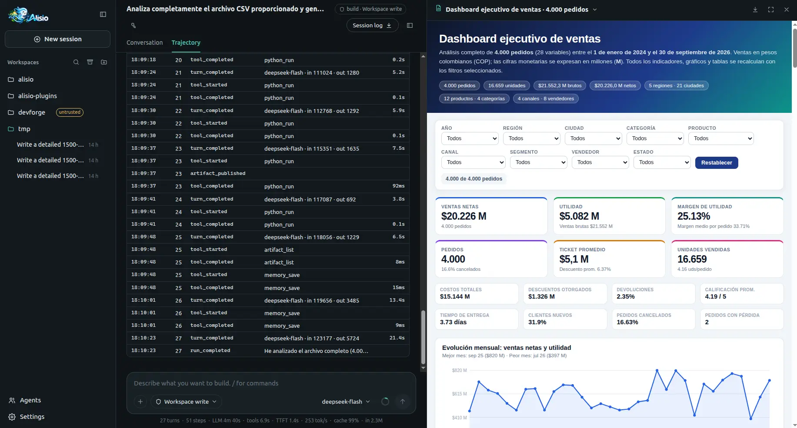
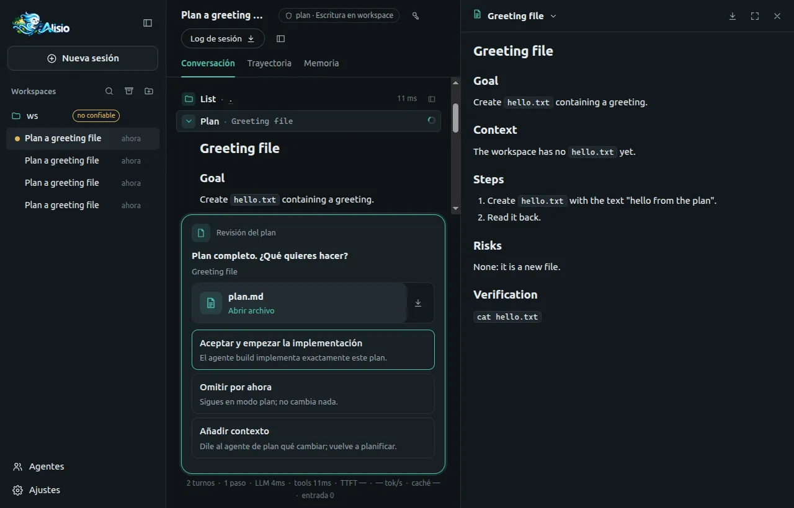
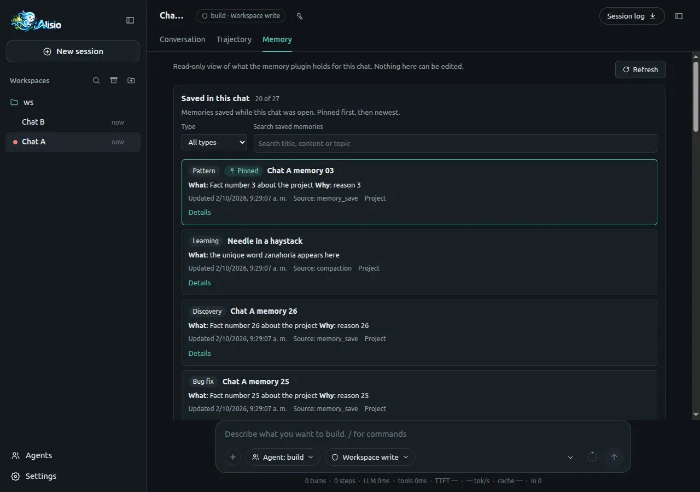
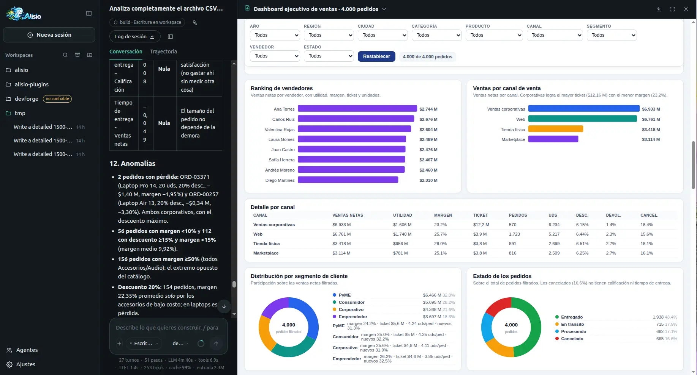
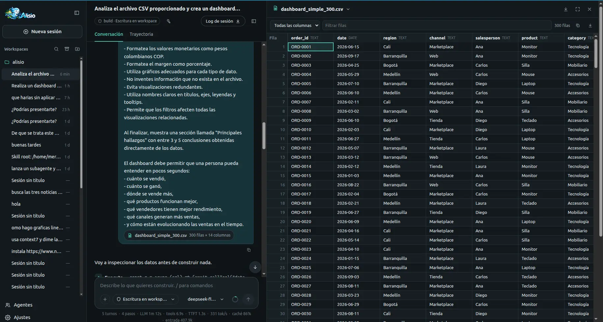

# Web UI (`alisio serve`)

`alisio serve` starts a local HTTP server that gives a browser access to several workspaces and
sessions at once. It drives the same agent core as the terminal: sessions, runs, approvals and the
session database are shared with the TUI and `alisio run`.

::: warning Status
The server, its API and the browser interface are available, including image attachments, the
files panel, the trajectory view, developer renderers (diff, terminal, JSON, test results),
Mermaid diagrams, TeX formulas and the Settings pages for models, plugins, skills, MCP servers and
agent presets. See [Known limitations](/limitations).
:::

## Start the server

```sh
alisio serve                      # http://127.0.0.1:4317, opens the browser
alisio serve --no-open --port 0   # any free port, print the URL only
alisio serve --allow-write        # web sessions may write files without asking
```

The command prints a launch URL with a one-time token, for example
`http://127.0.0.1:4317/?token=…`. Opening it exchanges the token for a session cookie and redirects
to `/`. Keep the URL private: whoever opens it first in a browser can drive the agent with your
permissions. Press `Ctrl+C` (or send `SIGTERM`) to stop the server; a second `Ctrl+C` forces exit.

`alisio`, `alisio run` and the TUI never load the server: it is imported only by `alisio serve`.

## Flags

| Flag | Default | Description |
| --- | --- | --- |
| `--port <port>` | `4317` | Port to listen on; `0` picks a free one |
| `--host <address>` | `127.0.0.1` | Address to bind; anything but loopback requires `--allow-remote` |
| `--allow-remote` | off | Allow a non-loopback `--host` (no TLS; prefer an SSH tunnel) |
| `--no-open` | opens | Do not open the browser |
| `--max-workspaces <n>` | `4` | Workspaces with an open application at once |
| `--max-runs <n>` | `4` | Runs executing at once across all sessions; more wait in a queue |

The global flags apply too. The permission flags (`--allow-write`, `--allow-process`,
`--allow-analysis`, `--allow-external`, `--allow-mcp`, `--read-only`) are the **ceiling** of every web session: the
browser can narrow them per session but never go beyond them. `--trust-project` and `--config`
apply to every workspace the server opens, like in the terminal. `--db` selects the shared session
database. Set `ALISIO_LOG_LEVEL` (`debug`, `info`, `warn`, `error`, `silent`) to control the JSON
log lines the server writes to stderr.

## Using the web UI

The page has a sidebar on the left and the open session on the right.

**Sidebar.** **New session** starts a session in the workspace you are looking at. Under
**Workspaces**, each folder lists its sessions, pinned first and then the most recently used, with a
relative time ("4 min"). A dot before a title shows a session that is running, waiting for you, in
use by another process or whose last run failed. The icons next to the heading search sessions
(also `Ctrl+K` / `Cmd+K`), show archived sessions and workspaces, and open another workspace
(see [Opening a workspace](#opening-a-workspace)). Hover a session for **Pin** and **Archive**, or a
folder for a new session inside it and its actions menu (**Pin**, **Archive** / **Unarchive**). **Settings**
sits at the bottom; the panel icon collapses the sidebar to a narrow rail. Below 900 px the sidebar
becomes a drawer opened from the header.

**Header.** Click the title to rename the session (untitled sessions show their first prompt). The
badge shows the agent and the permission preset. **Session log** downloads the session as JSON
Lines: every durable event in the `alisio run --json` format, then one `{"type":"message"}` line per
stored message. The panel icon at the right opens the files panel (below). The **Conversation**,
**Trajectory** and, while the memory plugin is enabled, **Memory** tabs switch the main view.

**Conversation.** Your messages appear on the right with a copy button. The agent's work appears as
one-line rows: `Think · …` for reasoning, `Context injection · AGENTS.md`, and one row per tool call
such as `Read · README.md` or `Shell · npm test`. Click a row to see its input and output. The answer
streams as Markdown; code blocks have a language label, **Wrap lines** and **Copy**, and are
highlighted once they scroll into view. Links to workspace paths open the file in the files panel.
` ```mermaid ` blocks become diagrams and ` ```math `, `$$ … $$` paragraphs and inline `\( … \)`
become formulas (a lone `$` stays text, so prices are safe). The page loads Mermaid only when a
diagram scrolls into view and KaTeX with the first formula. Diagrams have **Source**, zoom,
**Export SVG**, full screen and **Copy**; formulas have a copy button for their TeX. An invalid
diagram or formula shows its source and the error instead, without breaking the message.
Reasoning is display-only: after a reload, earlier `Think`
rows are gone because reasoning is never stored. When you scroll up, a button jumps back to the
latest message; long sessions show the last 30 turns and load older messages on demand.

**Run status.** While a run is live, one line at the end of the conversation says what it is really
doing, taken only from the events and streamed output the page has received: *Waiting for the
model…*, *Thinking…*, *Writing the answer…*, *Reading your data (sales.csv)…*, *Running Python
(analysis.py)…*, *Publishing the artifact (dashboard.html)…*, *Running* `<tool>`*…*, *Compacting
context…*, *The model did not respond; retrying (1/1)…* (while a silent request is being sent
again, see `limits.firstTokenRetries`), *The response was cut off; retrying in smaller steps (1/2)…* (the output-token limit cut the response and the turn is requested again, see `limits.truncationRecoveries`), or *Waiting for your approval / your answer* (those two never count as a stall). Next
to it are the run's elapsed time, the time in the current step and when something last arrived
(*last update 3 s ago*). If nothing arrives for 15 s the line says how long the run has been quiet
and shows **Stop**; after 60 s it says plainly *No response from the model for 60 s* (or *No output
from `<tool>` …* when a tool is the one running) and suggests waiting or stopping. A sub-agent wait
is never reported as a stall because its events belong to another session. The line only reads
frames, it never invents activity. It announces itself to screen readers only when the step or the
quiet level changes (not every second) and its spinner stops with *reduce motion*. After a reload
the elapsed time continues from the server's start time; the *last update* time restarts at the
reload because the page cannot know when the previous frame arrived.

If a run is stopped by its time limit, the conversation shows a message that names the model and
the provider, the number of seconds and how to proceed (retry, switch model, raise
`limits.timeoutMs`, see [configuration](/configuration#limits)).

**Tool output.** Tools that return structured blocks get a native view, each loaded the first time
it is needed: file writes and edits show a diff (unified by default, **Side by side** on demand,
foldable hunks, a file list when a patch touches several files); shell commands show their output
with ANSI colors, the exit code and the duration, streaming while they run and keeping the last
2 000 lines behind **Show earlier lines**; JSON shows a foldable tree with copy of values and of
their JSONPath; test results show passed, failed and skipped counts with a **Only failures**
filter; progress blocks show their steps. The tool's raw text, which is what the model received,
stays under **Raw output**. A block the page does not know shows its text and the folded JSON. The
panel icon on a tool row with a path opens that file. Tools contributed by plugins show their own
name followed by the plugin's name as a tag (for example `Test report` · `Smoke tools`).

**Trajectory.** The **Trajectory** tab lists the session's durable events grouped by run: status,
start time, turns and duration per run, and one row per event with its time, turn, type, a short
summary and its duration when it has one. It updates as events arrive; older runs sit behind
**Show earlier runs**.

<figure class="doc-shot">
  
  <figcaption>The Trajectory tab: one row per durable event, with an artifact open in the side panel.</figcaption>
</figure>

**Files panel.** The panel icon in the header opens a panel on the right (a bottom sheet below
900 px) with three tabs. **Files** browses the workspace lazily, 1 000 entries at a time, hiding
`.git` and, in git repositories, what `.gitignore` excludes. **Changes** lists the files this
session (and its subagents) wrote, most recent first, with their `git status` code; picking one
shows its diff against `HEAD` and the file. **Preview** shows text and code with highlighting,
Markdown, JSON as a tree and images; files over 2 MB are cut with a **Download** link, binary files
are only downloadable, and HTML or SVG shows as source, never as a page. From the preview you can
copy the path, download the file or mention it (`@path`) in the composer.

**Composer.** `Enter` sends, `Shift+Enter` inserts a new line, and `↑`/`↓` on the first line walk
through the prompts you sent. Typing `/` opens the command palette (arrows to move, `Enter` or `Tab`
to pick, `Esc` to close): commands run on the server and their output appears in the conversation;
prompt templates, skills and `/ask` become a prompt. `/` anywhere outside a text field focuses the
composer.

**Side questions (`/btw`).** `/btw question` asks something about the current session without adding
it to the conversation, also while a run is working. A floating panel shows the pending question
(with **Cancel**), then the Markdown answer, the model and the tokens it used, a copy button, and
`‹ 2/5 ›` to browse earlier side answers (`←`/`→` when the focus is not in a text field; `Esc`
closes it and cancels a pending question). `/btw` alone opens the panel on your most recent side
answer, or shows `Usage: /btw <question>` when there is none. Side questions are never written to
the transcript, events, runs or session tokens; the last 20 per session are kept and shared with the
TUI.

Below the text box:

| Control | What it does |
| --- | --- |
| `+` | Attach PNG, JPEG, GIF or WebP images, up to 10 MB each and 8 per message (paste and drag and drop work too) |
| Permission preset | `Read only`, `Ask`, `Workspace write` or `Full access` for this session |
| Model and effort | Model of the workspace's provider and the reasoning effort the model supports |
| Context ring | Estimated context of the next request against the model window |
| Send / Stop | Stop replaces Send while a run is active and the box is empty |

While a run is active you can keep typing: text is queued for the session's next turn. Images
upload as soon as you add them and show as thumbnails you can remove; they can only be sent when no
run is active.

**Stats line.** Under the composer, one line sums up the latest run: turns, steps (tool calls), time
spent in the model and in tools, the average time to first token, output tokens per second, the
share of input served from the provider's prompt cache and the input tokens. Hover it for the
totals of the whole session. Cache shows `—` when the provider does not report cached input.

**Approvals and questions.** When a tool needs approval, a panel takes the composer's place and
receives focus: it names the tool, the effect and its input. Answer with **Deny** (`D`), **Allow
once** (`O`) or **Allow for session** (`S`); keys pressed in the first 300 ms are ignored so a stray
`Enter` cannot approve. Plugin questions (for example `ask_user_question`) appear the same way.

**Settings.** The gear at the bottom of the sidebar opens Settings. Pages that manage agent
resources act on the workspace of the open session (or the first workspace when none is open):

| Page | What it does |
| --- | --- |
| **General** | UI language (this browser), then the agent settings: compaction, context, limits, plugin hook timeout and web search provider, saved to your user `config.json` |
| **Models** | Provider profiles with their non-secret values, credentials and **Activate in this workspace** with a model of that profile; **Add a profile** creates one |
| **Plugins** | **Plugin configuration** (not sandboxed, how plugins are installed, the project file) and **Plugin list**: search, count and cards with an **Enabled**, **Disabled**, **Failed** or **Restart required** pill; the chevron shows version, categories, source, tools, commands, diagnostics and the switch |
| **Skills** | Discovered skills with scope, size and a switch; disabled skills leave the `/` palette |
| **MCP servers** | Status, transport and counts of each configured server, enable switch and **Connect**; **Grant MCP access** asks for an explicit confirmation first |
| **Agent presets** | `build`, `plan` and main-capable user or plugin agents, with instructions and suggested model; **Use in this session** switches the open session |
| **Appearance** | Theme (dark, light or system) and whether tool rows start collapsed or expanded, stored in this browser |

**Open configuration file** (top right) shows the effective configuration file of the workspace,
your user settings file and the provider profiles file, each with a copy button. The server never
opens an editor.

Credentials are write-only. A credential field is a password input: after **Save** it is cleared
and the page only shows whether a value is stored, whether it comes from an environment variable,
and, for stored values of 16 characters or more, the last three characters (`Stored · ends in …71B`).
No API response contains a secret.

Enabling or disabling a plugin writes a project override (`.alisio/config.json`) and needs the
workspace to be trusted. Plugins are loaded when the workspace application starts, so the server
reloads that application as soon as it has no runs: immediately when it is idle, otherwise when its
last run finishes (the card shows **Restart required** meanwhile). Sessions keep their history, and
every open command palette refreshes. Skill switches apply at once. Plugins cannot be installed
from the web.

## Security model

The server is designed for one user on one machine:

- It binds `127.0.0.1` by default. Exposing it on a network requires `--host <address>
  --allow-remote` and prints a warning; there is no TLS, so use an SSH tunnel instead.
- A 256-bit launch token is generated per process and never written to disk. The browser exchanges
  it once for an `HttpOnly; SameSite=Strict` cookie that holds a separate secret.
- Every request must name this server in `Host` (DNS-rebinding defense), and requests with side
  effects need a matching `Origin` and `Content-Type: application/json` (CSRF defense).
- Responses carry a strict Content-Security-Policy, `X-Frame-Options: DENY`, `nosniff`,
  `Referrer-Policy: no-referrer` and same-origin opener/resource policies; API responses are not
  cached.
- Approvals are fail-closed: when no browser tab watches the session for 30 seconds, when the run is
  cancelled or after 10 minutes, the answer is **deny**.
- Plugins are not sandboxed: a trusted project's plugins run inside the server process with its
  operating-system permissions, exactly as in the terminal.
- The native folder dialog and the in-app folder browser exist only on loopback. The browser lists
  directory names (never files or contents) that the server's user can read, the same trust as
  that user's terminal; with `--allow-remote` both are off and only a typed path is accepted.

## Workspaces and trust

A workspace is a directory (its git root when inside a repository). The server lists the
workspaces of existing sessions plus the directory where `alisio serve` started, and opens an
application for a workspace only when it is used. At most `--max-workspaces` are open at once: the
least recently used idle one is closed to make room, and when all of them are busy the request
fails with `workspace_limit`. Idle workspaces close after 10 minutes.

A workspace whose folder was deleted or moved stays in the sidebar, dimmed and marked "folder not
found": its sessions remain readable, but you cannot start new sessions or send prompts there (the
server answers `404 workspace_missing`). **New session** uses the current session's workspace, or
the most recently used one that still exists; with none, it asks you to open a workspace. Folders
with the same name show a short parent path next to it, and the full path on hover.

Archive a workspace from its actions menu to hide it and its sessions from the sidebar; **Show
archived** brings both back (archived workspaces are listed last). Archiving keeps every session,
which stays readable, closes the workspace's idle application and is refused with
`409 runs_active` while a run is active. New sessions in an archived workspace are refused with
`409 workspace_archived`; **Unarchive** it, or open the same folder again, to use it. This is also
the way to hide a workspace whose folder no longer exists.

### Opening a workspace

The folder button next to **Workspaces** (and **New session** when no workspace exists yet) asks
for a folder in the best way the server supports:

1. **Native folder dialog.** Browsers never give a page the absolute path of a folder, so the
   server opens the operating system's own dialog on its desktop and uses the folder you pick
   (a note in the sidebar says so while it is open; only one dialog at a time).
   - **Linux** (and BSD): `zenity`, else `kdialog`, else `yad`, found on `PATH`; it needs a
     desktop session (`DISPLAY` or `WAYLAND_DISPLAY`).
   - **macOS**: `osascript` with AppleScript `choose folder`.
   - **Windows**: Windows PowerShell (or `pwsh`) with the WinForms folder dialog, and the Shell
     folder browser as a fallback.
2. **In-app folder browser** when there is no dialog tool (headless machine, SSH session,
   `ALISIO_NATIVE_PICKER=0`): a window that lists folder names only, starting at your home folder,
   with breadcrumbs, a parent-folder button and **Show hidden folders**. On Windows its top level
   lists the drives.
3. **Type a path** is always available as a link, and is the only option when the server is bound
   for remote access (`--allow-remote`), because a dialog or folder listing would show the server
   machine rather than yours.

A directory you have not trusted opens without its project resources (configuration, plugins,
agents, skills, prompts) and is marked untrusted. Trust it from its **⋯** menu in the sidebar
(**Trust this workspace…**) or from the [Agents](/agents) editor, after a confirmation that explains
what trust unlocks; or run `alisio` in that directory to answer the terminal prompt. Both store the
same decision, bound to the content of `.alisio/config.json`: if that file changes, the workspace
is untrusted again until you confirm. The workspace reopens so the change applies at once (it is
refused while its runs are active, under `--read-only`, and when `--trust-project`/`--config` fix
trust for the server). **Stop trusting this workspace…** withdraws it.

## Sessions, runs and permissions

Several sessions can run at the same time, in one or more workspaces. A session runs one prompt at
a time: text sent while it is running is queued for its next turn, while attachments must wait
until it is idle. Runs beyond `--max-runs` wait in a first-in, first-out queue. Retrying a prompt
with the same request id never starts a second run.

A session that another Alisio process is using (for example the TUI) is reported as locked and is
read-only in the web until that process releases it.

Each session has a permission preset, which is also its permission mode (`ask`, `auto` or `full`,
see [Permission modes](#permission-modes)). Effects the launch flags do not allow keep asking,
whatever the preset:

| Preset | Mode | Allowed without asking | Other effects |
| --- | --- | --- | --- |
| `read-only` | none | reads | denied |
| `ask` | `ask` | reads | ask for approval |
| `workspace-write` (default) | `auto` | reads, writes | ask for approval |
| `full-access` | `full` | reads, writes, processes, network | ask for approval |

"Allow for session" in an approval widens only that session, never the other sessions of the same
workspace.

### Agent selector and Shift+Tab {#agent-cycle}

The composer toolbar shows the active agent (**Agent: build**) next to the permissions menu. Open
it to pick any main agent; the choice is stored on the session and applies from the next prompt.
**Shift+Tab** with the focus in the message box cycles the same list: `build`, `plan`, then your
own primary agents by name, wrapping around. The shortcut is ignored while the `/` palette is open,
during an IME composition and with any other modifier, and a screen reader announces the new agent.

Accessibility trade-off: Shift+Tab normally moves the focus backwards, so intercepting it in the
message box changes what keyboard users expect there. The agent selector is the accessible path
(reach it with Tab) and is always available; the shortcut only acts while the focus is in the
message box, and everywhere else Shift+Tab keeps its usual meaning. Cycling is allowed during a
turn because it only stores the next agent.

### Permission modes {#permission-modes}

`/permission` (also `/permissions`) opens the permissions popover from the header: three radio
options, **Ask**, **Auto** and **Full access**, the status of the session and **Manage saved
permissions…**, which shows the saved grants (for example Python analysis allowed for this session)
with **Revoke**. Choosing **Full access** asks for a confirmation that says it is not a sandbox. A
mode the server cannot offer (its launch flags are the ceiling, or it runs with `--read-only`) is
listed as unavailable with the reason. `/permission ask`, `/permission auto`, `/permission full`
and `/permission status` run without opening the popover and answer in the conversation; the
permissions menu of the composer keeps the four presets.

### Plan mode and plan review {#plan-review}

Switch a chat to the **plan** agent (the selector, **Shift+Tab** or `/agent:plan`) and it
investigates with read-only tools, then finishes by calling the `exit_plan` tool with the whole plan
in Markdown. The plan appears open in the conversation (a **Plan** row), is saved as a `plan.md`
artifact (one per revision, listed in the artifacts panel and openable in the side panel from its
card) and the composer is replaced by the decision screen **Plan complete. What would you like to
do?**:

- **Agree and start implementation**: the chat switches to the `build` agent and one implementation
  turn starts. Its message carries the approved plan as a snapshot (the chat shows a short
  *Implement the approved plan* line instead of repeating it) and uses the chat's permission mode
  unchanged.
- **Skip for now**: nothing else happens; the chat stays in plan mode. Esc does the same.
- **Add context**: a text box opens; what you send goes back to the model as the tool result and it
  keeps planning, then proposes a new revision.

<figure class="doc-shot">
  
  <figcaption>The plan review: the decision screen under the plan, with plan.md open in the side panel (Spanish interface).</figcaption>
</figure>

The plan run is read-only whatever the permission mode: the runner denies writes, commands and
network calls to the plan agent, so choosing **Full access** never widens it. Approving twice (a
double click, two tabs, a reload) starts a single implementation turn. Reloading the page with a
review pending shows the same decision again; closing the browser leaves it pending for 30 seconds
and then counts as **Skip for now**, as does cancelling the run or letting the run time out. The
screen replaces the composer, so Shift+Tab and the agent selector do nothing while it is open.
Clients that do not know the plan review (a script using the API) see a normal question with the
same three options.

### `/reload` and `/changelog` {#reload-and-changelog}

`/reload` re-reads the configuration, agents, skills, prompt templates and MCP servers of the
session's workspace. It is refused (`409`) while the workspace has runs. The server validates the
configuration and builds the new application next to the current one before swapping, so a broken
file changes nothing and the error says why. The conversation shows the report (what changed per
area and what needs a restart, such as already imported plugin code), a toast confirms it and open
palettes and settings pages refresh through `catalog_changed`. `/changelog [version]` opens a
dialog with the shipped changelog, which works offline. After an upgrade one discreet toast says so;
the last seen version is kept in the browser's `localStorage` and nothing breaks when storage is
blocked. Both commands are interactive only: `alisio run` is unchanged.

### Memory tab {#memory-tab}

While the built-in [memory plugin](/memory#web-tab) is enabled, a **Memory** tab appears next to
**Conversation** and **Trajectory**. It shows what the plugin holds for the **open chat**, read-only,
in three sections:

- **Saved in this chat**: the memories saved while this chat was open (by the model, by compaction
  or by the end-of-session summary), pinned first and then newest. Filter by type, search title,
  content and topic, and press **Load more** to read 20 at a time. Each entry shows its type and
  title, a summary of its content (**Show more** / **Show less**), when it was updated, where it
  came from and the raw record under **Details**.
- **Session summary**: the summary the plugin stored for this chat (one per session; compaction
  and the end-of-session summary overwrite it).
- **Context loaded**: the memory context the plugin added when this chat started, which is what the
  model saw first.

<figure class="doc-shot">
  
  <figcaption>The Memory tab: the memories saved in this chat, pinned first, with filter, search and Load more.</figcaption>
</figure>

Each section loads, fails and retries on its own. Nothing updates live: **Refresh** reloads the
three sections and keeps your filters, and memories saved while you browse appear after a refresh
(the list never repeats or skips an entry while you page). Switching chats reloads the tab and never
shows another chat's data. The tab exists only while the plugin is enabled: turning it off in
**Settings → Plugins** removes the tab and returns you to **Conversation**. An empty chat shows
**No memory stored for this chat yet**.

Memory can hold sensitive project data. The tab is served by the same authenticated session routes as the conversation
(`GET /api/sessions/:sid/views/memory/…`, see [plugin data views](/plugins#data-views)) and shows it
to whoever has this server's session cookie. It is a view: pinning and forgetting stay in the TUI
(`/memory`) and the model's tools. How each section is sourced, and its limits, are in
[Memory](/memory#web-tab).

### Python analysis and artifacts {#artifacts}

Files published by [Python analysis](/analysis) appear as cards under the tool rows of the turn
that produced them: kind icon, file name, kind label and an always-visible download button. On
hover or keyboard focus a previewable card says **Open file** instead of its kind; a card that
cannot be previewed (DOCX, ZIP, unknown files, files over the preview limit) never says it,
and clicking it downloads. Cards survive reloads (they come from the stored tool results) and show
**Deleted** or **Expired** when the artifact is gone, or **Unavailable** with **Retry** when
opening it failed.

Opening a card shows the **artifact panel** on the right of the chat, in the same slot as the files
panel (opening one closes the other):

- **Title menu**: switches between the session's artifacts (newest first, a filter above eight,
  arrows, Enter, Esc and type-to-jump; artifacts published meanwhile get a dot and never steal the
  view), then **Open in new tab** (dashboards and PDFs), **Expand panel**, **Download analysis
  sources** (for `python_run` outputs), **Copy to workspace…**, **Details**, **Run again** (for
  `python_run` outputs) and **Delete**. An expired artifact stays in the list marked **Expired**; opening
  it offers only **Details** and **Run again**.
- **Download**, **Full screen** and **Close** on the right; Close returns the focus to the card.
- **Resize** with the handle between the chat and the panel (shared with the files panel): drag,
  double click to reset, or focus it and use ←/→ (16 px, 64 px with Shift), Home/End and Enter. The
  width is remembered per browser; the chat keeps at least 360 px.
- **Previews**: Markdown with the chat renderer (relative images resolve inside the artifact),
  HTML dashboards in the isolated viewer, images with Fit/100 %, PDFs in the browser's own viewer,
  JSON with the JSON renderer, CSV, TSV and XLSX in the [table viewer](#tables), and code and text
  with the code renderer. Anything else,
  or anything larger than its limit, shows the reason and a **Download** button.
- Below 900 px the panel is a full-screen dialog. **Esc** closes the open menu first, then the
  panel. Settings and Agents open over the panel, which stays loaded behind them.
- **Copy to workspace…** asks for a folder and runs the `artifact_export` tool in the session: the
  usual write approval applies, and the copied files appear in **Changes**. `/artifacts [filter]`
  opens the panel with its menu.

<figure class="doc-shot">
  
  <figcaption>A generated executive dashboard in the artifact panel (Spanish interface).</figcaption>
</figure>

Dashboards run in an iframe with `sandbox="allow-scripts allow-downloads"` (never
`allow-same-origin`), served from `/artifact-view/<token>/…` with a signed link that expires after
10 minutes. Its Content-Security-Policy forbids every connection (`connect-src 'none'`) and adds the
`sandbox` directive, so the page has an opaque origin: it cannot read the cookie, the Alisio page,
`localStorage` or the network, also when opened in a new tab. Data must be embedded in the HTML.

Running Python asks in the approval panel with the title **Run Python analysis?**, the warning that
managed Python is not a sandbox and the first 40 lines of the script; **S** (**Allow for this
session**) saves the permission for the session. The key button in the header opens **Session
permissions**, which lists saved permissions with **Revoke**; `/permissions` opens it too. Other
tabs refresh when a permission is saved or revoked. `alisio serve --allow-analysis` allows Python
without asking in sessions whose preset allows processes (`full-access`); elsewhere it asks.

**Run again** repeats the analysis as a new execution with new artifacts (the old ones stay). It is a
`python_run { rerunOf }` call of the session, so the permission above applies and the approval shows
the saved script; **Details** names the execution a rerun repeats. Installing the optional Python
packages asks with **Install Python packages?**, the package list, the download estimate and that it
needs the network, and offers only **Allow once** and **Deny** (`S` does nothing: it is never saved).

### Settings → Data analysis {#analysis-settings}

The **Data analysis** page of Settings shows the runtime read only (mode, the Python found or how to
install it for your system, the optional packages, the container engine and image, and the reminder
that managed Python is not a sandbox) and edits the switch (`analysis.enabled`), the execution
timeout and the three retention values. Changes are validated by the server, written to the global
configuration file and shown with when the last cleanup ran. `runtime` and `oci.*` are not editable
here. See [Configuration](/configuration#analysis).

### Tables and attached data {#tables}

The composer's `+` button (and drag and drop) accepts data files next to images: CSV, TSV, JSON,
JSONL and XLSX. A file is uploaded as the raw body of `POST /api/sessions/:sid/datasets`, kept in the
content-addressed blob store and ingested in the background into a SQLite dataset (see
[Tabular data](/analysis#data)). The chip says **Reading sales.csv…** while the server works; the
server keeps answering (health, heartbeat) while it does, because ingestion runs in a separate
process. When the `dataset_ready` frame arrives the chip shows the size of the table; a
`dataset_failed` frame (unsupported file, over `analysis.data.maxUploadBytes` or `maxRows`, XLSX
without Python) turns it into an error with the reason. Sending the message adds a bounded summary
(schema, five rows, statistics; at most 4 KB) to what the model reads, while the conversation shows
what you typed with the chips; a chip opens the table in the right panel. Data alone sends a default
request to look at it.

<figure class="doc-shot">
  
  <figcaption>The table viewer with a 300-row CSV and the attached-data chip in the chat (Spanish interface).</figcaption>
</figure>

The **table viewer** (`SpreadsheetView`) also opens spreadsheet artifacts (CSV, TSV, XLSX), which are
ingested the first time they are previewed:

- Fixed 28 px rows and a window of rows and columns, so a million-row sheet scrolls smoothly. Pages
  of 200 rows come from the keyset-paginated rows API (`rowid` cursors) through a cache of 20 pages:
  scrolling or sorting never repeats or skips a row. Jumping to a row works at any position without
  sorting; while sorted or filtered it reaches the first 100 000 rows, and farther rows load by
  scrolling.
- Click a header to sort (ascending, descending, none; `aria-sort`), type in the filter box (a
  column, or every column up to 100 000 rows; a substring match), pick a sheet in a workbook, and
  resize columns by dragging the handle on a header's edge, or with **Alt**+←/→ (Shift for larger
  steps) on a focused header. Sorting and filtering are off above
  `analysis.data.maxInteractiveRows` (1 000 000) with a notice: the file has no indexes.
- `role="grid"` with row and column counts and indexes, one tab stop (arrows, Home/End,
  PgUp/PgDn, Ctrl+Home/End move between cells; ↑ from the first row reaches the header).
  **Ctrl/Cmd+C** copies the cell and **Ctrl/Cmd+Shift+C** the row (also a toolbar button); **Download
  original** is in the toolbar.

## API and events

The browser talks to JSON routes under `/api` and to one Server-Sent Events stream per tab:

```text
GET  /api/health                       unauthenticated: name, version, protocolVersion, capabilities
GET  /api/workspaces?archived=false|true|all   POST /api/workspaces {path}
PATCH /api/workspaces/:wid {label?, pinned?, archived?}
POST /api/workspaces/pick {start?}     native folder dialog → {path} | {cancelled: true} (loopback)
GET  /api/fs/dirs?path=&hidden=        folder names for the in-app browser (loopback)
GET  /api/sessions                     POST /api/sessions            GET|PATCH /api/sessions/:sid
GET  /api/sessions/:sid/messages       GET /api/sessions/:sid/events GET /api/sessions/:sid/runs
POST /api/sessions/:sid/prompts        POST /api/sessions/:sid/cancel  POST /api/sessions/:sid/compact
GET  /api/sessions/:sid/models         GET /api/sessions/:sid/context GET /api/sessions/:sid/export
GET  /api/sessions/:sid/views/:plugin/:view?<params>   read-only data view of an enabled plugin
GET  /api/commands?session=<sid>       POST /api/sessions/:sid/commands {requestId, name, args?}
GET  /api/sessions/:sid/btw            POST /api/sessions/:sid/btw {question}  POST /api/sessions/:sid/btw/cancel
GET  /api/approvals                    POST /api/approvals/:aid      POST /api/interactions/:iid
GET  /api/sessions/:sid/artifacts      GET /api/artifacts/:aid       GET /api/artifacts/:aid/download
GET  /api/artifacts/:aid/files/*       POST /api/artifacts/:aid/view  POST /api/artifacts/:aid/export {target, overwrite?}
GET  /api/artifacts/:aid/sources?logs=1   DELETE /api/artifacts/:aid
GET  /artifact-view/:token/*           isolated viewer (signed link, no cookie)
GET  /api/sessions/:sid/capabilities   DELETE /api/sessions/:sid/capabilities/:gid
GET  /api/workspaces/:wid/tree?path=&cursor=   GET /api/workspaces/:wid/file?path=&maxBytes=&download=1
GET  /api/workspaces/:wid/diff?path=   GET /api/sessions/:sid/changes
POST /api/blobs                        raw image body (not JSON) → BlobRef   GET /api/blobs/:hash
POST /api/sessions/:sid/datasets       raw data file, X-File-Name header → 202 {pending} | 200 {dataset}
GET  /api/sessions/:sid/datasets       GET /api/datasets/:did        GET /api/datasets/:did/download
GET  /api/datasets/:did/rows?sheet=&after=&offset=&limit=&sort=&dir=&filter=&column=
POST /api/artifacts/:aid/dataset       ingest a spreadsheet artifact on first preview
GET  /api/events?session=<sid>         the event stream (snapshot, then live frames)
GET  /api/plugins?workspace=<wid>      PATCH /api/plugins/:id {workspace, enabled}
GET  /api/skills?workspace=<wid>       PATCH /api/skills/:id {workspace, enabled}
GET  /api/mcp?workspace=<wid>          PATCH /api/mcp/:name {workspace, enabled, connect?}
POST /api/mcp/consent {workspace, confirmed: true, remember?}
GET  /api/agents?workspace=<wid>       GET /api/settings?workspace=<wid>  PATCH /api/settings {workspace, key, value}
GET  /api/changelog?version=&lastSeen= POST /api/workspaces/:wid/reload   409 runs_active while it has runs
GET  /api/providers?workspace=<wid>    PUT /api/providers/:profile {workspace, provider, values, model}
PUT|DELETE /api/providers/:profile/credentials {apiKey?, bearerToken?}   write-only
POST /api/providers/:profile/activate {workspace, model}   GET /api/models?workspace=<wid>
```

Plugin data views answer `404` for an unknown session, plugin or view or a disabled plugin, `400`
for invalid parameters and `view_failed` (502), `view_too_large` (502) or `view_timeout` (504) when
the view fails, answers more than 1 MiB or takes longer than 5 seconds.

Dataset uploads end with a `dataset_ready` or `dataset_failed` frame to the session's stream. Data
errors use the codes `dataset_unsupported` (415), `query_rejected` (400) and `query_timeout` (408).

Management changes send a `catalog_changed` frame (`commands`, `plugins`, `skills`, `mcp`,
`models` or `agents`) to every stream, so other tabs refresh. Activating a profile answers
`409 runs_active` while the workspace has runs, and granting MCP access from the web is recorded
with the `interactive-web` source.

On every (re)connection the stream sends a snapshot of each subscribed session (recent messages,
text still streaming, the run's start time, pending approvals) followed by live frames; durable events carry their
`eventId` as the SSE `id`, and streamed text arrives coalesced about 30 times per second. The
protocol version is reported by `/api/health` and in the stream's first frame.

## Limitations

- Single host: session locks rely on process ids, and the web does not see live changes a TUI makes
  to a session until the session is reopened.
- No TLS; remote access is opt-in and meant for SSH tunnels.
- The provider is per workspace: **Activate in this workspace** switches that workspace's
  application (and saves the profile as the default for new starts); other open workspaces keep
  their provider until they reopen. Saved credentials apply the next time the profile is activated.
- MCP access granted from the web lasts until `alisio serve` stops and covers one workspace, unless
  you choose to remember it for the user.
- The standalone binary serves the API only; the web UI assets ship with the npm package.
- The web UI keeps command output, notices and reasoning only while the page is open; a reload
  rebuilds the conversation from stored messages.
- Shift+Tab cycles agents only from the message box (see [Agent selector](#agent-cycle)); the
  changelog is English-only and `/reload` cannot reload plugin code that was already imported.
- The files panel shows the workspace only: directories added with `--add-dir` are not browsable,
  symbolic links are listed but never followed (even when they point inside the workspace), and
  `.gitignore` filtering needs `git` on `PATH`. **Changes** only knows files written through
  `write_file` and `edit_file`; files a shell command changed appear in `git status`, not there.
- Artifact previews: **Esc** pressed inside a dashboard never reaches Alisio (use **Close**);
  dashboards cannot use the network, `localStorage`, module scripts or web fonts from files (fonts
  must be inline `data:` URLs); a view link expires after 10 minutes (reopening renews it); PDFs use
  the browser's viewer without `sandbox` and fall back to a download where there is none.
  Downloads of multi-file artifacts are ZIP archives.
- Tables: sorting and filtering scan the sheet (the dataset file has no indexes), so they are off
  above `analysis.data.maxInteractiveRows`; cells longer than 4 096 characters are cut in the grid
  (the dataset keeps them whole); an XLSX needs Python 3.10+ to be read.
- Uploaded images are stored once per content hash next to the session database and are not
  deleted automatically.
- Rich renderers need JavaScript chunks the page loads on demand: Mermaid is large (a few hundred
  KB compressed across its chunks) and only loads when a diagram is shown.
