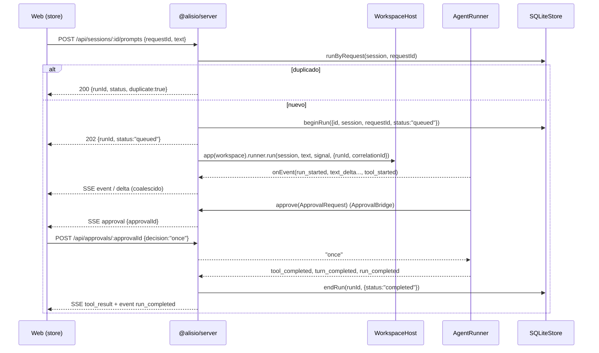

# Especificación Técnica: Alisio Serve y Web UI multisesión

| Campo | Valor |
|---|---|
| Versión | 4.0 |
| Estado | Propuesta ejecutable (lista para implementar por fases) |
| Fecha | 2026-09-30 |
| Paquetes afectados | `@alisio/sdk`, `@alisio/core`, `@alisio/alisio-code` (CLI) |
| Paquetes nuevos | `@alisio/server` (`packages/server`), `@alisio/web` (`packages/web`, privado) |
| Relación con v3.0 | Reescritura completa. La v3.0 original se conserva en `alisio-ui.v3-original.md`. Se mantienen todas sus ambiciones funcionales, pero se corrigen los supuestos que contradicen el código real, se elimina la sobreingeniería y se re-secuencian las piezas costosas. El Apéndice A mapea cada sección de la v3 a su destino. |
| Referencias visuales | `references-ui/Selección_027.png` (layout general), `references-ui/image.png` (vista de sesión), `references-ui/image2.png` (modal de Settings) |

## 0. Cómo usar este documento (para agentes de código)

1. **Lee primero** `AGENTS.md` y `CONTRIBUTING.md`. Sus reglas prevalecen sobre este documento.
2. **Trabaja por fases y unidades de trabajo** (§14). Cada unidad es del tamaño de un PR, deja el repositorio verde y no rompe la CLI/TUI/headless.
3. **Rutas**: una ruta sin marca existe hoy en el repositorio. Una ruta marcada **(nuevo)** debe crearse. Una afirmación marcada **(verificar)** no se pudo confirmar al redactar: compruébala en el código antes de apoyarte en ella.
4. **Nombres**: los identificadores de código, rutas, eventos, rutas HTTP y tipos TypeScript van en inglés; la prosa, en español.
5. **Nunca** cambies la semántica de una columna, un evento o un tipo existentes. Todo cambio de contrato es **aditivo** (§3.3).
6. Antes de entregar cada unidad ejecuta: `pnpm typecheck`, `pnpm lint`, `pnpm test`, `pnpm build`, `pnpm test:cli`, `pnpm test:compiled`, `pnpm pack:check`, `pnpm docs:check`, `pnpm docs:build`.
7. Documenta limitaciones y el alcance de la verificación en `docs/implementation-status.md` y mantén la paridad EN/ES de la documentación (`docs/<page>.md` y `docs/es/<page>.md`, comprobada por `scripts/docs-check.ts`).

---

## 1. Visión y alcance

### 1.1 Visión

Añadir a Alisio un **modo servidor local** (`alisio serve`) y una **interfaz web** que permitan trabajar con varias sesiones y varios workspaces a la vez, con streaming, aprobaciones, renderizadores nativos para desarrollo (código, diff, terminal, JSON, tests, Mermaid, fórmulas) y gestión de plugins, skills, modelos y proveedores. Todo ello **como extensión aditiva**: el núcleo (`@alisio/core`) sigue siendo el único motor, y la CLI/TUI/headless no cambian de comportamiento ni de tiempo de arranque.

### 1.2 Dentro del alcance

| Área | Contenido |
|---|---|
| Servidor | `alisio serve`, HTTP local (`node:http`), SSE, autenticación por token de lanzamiento, servidor de estáticos, `WorkspaceHost`, `ApprovalBridge`, `InteractionBridge`. |
| Multisesión | Varias sesiones concurrentes por workspace y varios workspaces por proceso. |
| Web UI | Sidebar de workspaces y sesiones, transcript con streaming, compositor multimodal, paleta `/`, aprobaciones, presets de permisos, selector de modelo y esfuerzo, vista de trayectoria, exportación del log, explorador de archivos, modal de Settings. |
| Renderizadores nativos | `code`, `diff`, `terminal`, `json`, `test-results`, `progress`, `mermaid`, `math` (más los existentes `table`, `key-value`, `tree`, `markdown`). |
| Contratos | Tipos aditivos en `@alisio/sdk`; migración v4 aditiva del store; `CommandCatalog` compartido entre TUI y web. |
| Seguridad | Loopback por defecto, token → cookie, comprobación de `Host`/`Origin`, CSP estricta, secretos de solo escritura, confinamiento de rutas. |
| Opcional (fase 6) | MCP Apps, plugin de automatización programada, WebSocket, incrustación de assets en el binario Bun, terminal PTY interactiva. |

### 1.3 Fuera del alcance (no-objetivos)

- Convertir el servidor web en un plugin. Los plugins solo dependen de `@alisio/sdk` (regla de `AGENTS.md`, comprobada por `tests/plugin-boundaries.test.ts`); servir la aplicación exige `@alisio/core`.
- Alisio como **servidor MCP**. Alisio es **cliente MCP** (`packages/core/src/mcp/connector.ts`) y, en la fase 6, **host de MCP Apps**. No se expone un servidor MCP.
- Acceso remoto multiusuario, cuentas, roles o despliegue en la nube.
- Electron o aplicación de escritorio, addons nativos, SDK de Python, OpenTelemetry, editores enriquecidos (Lexical), visores de Office/PDF.
- Ejecutar JavaScript de plugins dentro de la web. Los plugins aportan UI **solo** mediante `UiBlock` declarativos.
- Rediseñar las tablas existentes (`messages`, `events`, `plugin_state`) o introducir un segundo driver SQLite.
- Pausar/reanudar un run a mitad de ejecución. Se ofrece cancelar y volver a preguntar; "steer" (inyectar instrucciones durante un run) queda como mejora futura sobre `runner.enqueue`.
- Instalar o desinstalar plugins desde la web (se sigue usando `alisio install` / `alisio plugins`). La web solo habilita, deshabilita e inspecciona.

---

## 2. Estado actual frente a la especificación v3

| Capacidad (v3) | Existe hoy (ruta) | Brecha | Decisión v4 |
|---|---|---|---|
| `@alisio-core` | `@alisio/core` (`packages/core`) | Nombre incorrecto en v3 | Usar `@alisio/core`. |
| `@alisio/plugin-ui` como backend web | — | Un plugin no puede importar core | Paquetes `@alisio/server` y `@alisio/web` (ADR-02). |
| `packages/protocol`, `packages/mcp` | Tipos en `packages/sdk/src/index.ts`; MCP en `packages/core/src/mcp/` | Paquetes innecesarios | Tipos de protocolo aditivos en `@alisio/sdk`; validación zod en `@alisio/server`. |
| Host de herramientas MCP | Cliente MCP stdio + Streamable HTTP (`mcp/connector.ts`), resultados ricos (`mcp/rich.ts`) | Alisio no es servidor MCP | Se elimina. MCP Apps (host de UI) en fase 6. |
| Estado en `~/.config/alisio/state.db` | `$ALISIO_STATE_HOME` o `$XDG_STATE_HOME/alisio` o `~/.local/state/alisio/sessions.sqlite` (`config.ts` `stateHome()`, `application.ts`) | Ruta incorrecta en v3 | Se reutiliza `sessions.sqlite`. |
| `AlisioDatabaseService` | `SQLiteStore` (`runtime/store.ts`) sobre `openDatabase` (`runtime/sqlite.ts`), WAL, `busy_timeout=5000`, migraciones solo hacia delante hasta v3 | — | Migración v4 aditiva en el mismo `SQLiteStore`. |
| Tablas `sessions`/`messages`/`events` rediseñadas | Existen con otro esquema | Rediseño rompería datos y CLI | Se conservan; se añaden columnas nulables y tablas nuevas (`runs`, `workspaces`, `blobs`). |
| Tabla `tool_executions` | `tool_calls(session, call_id, status, result)` | Falta effect/tiempos | Columnas nulables en `tool_calls`. |
| Tabla `plugin_states` | `plugin_state(plugin,key,value)` y catálogo en `application.ts` (`pluginCatalog`, `setPluginEnabled`) | Duplicaría estado | Se elimina; se reutiliza lo existente. |
| Tabla `attachments`/`artifacts` | `Attachment` SDK con base64 inline en el JSON del mensaje | Blobs grandes en SQLite | Almacén de blobs direccionado por contenido + tabla `blobs`; lectura del base64 legado. |
| Estados de sesión `idle/running/waiting_approval/paused/error` | `SessionStatus` SDK: `queued, running, completed, failed, cancelled, interrupted` (solo lo actualizan las sesiones hijas, `sessions/children.ts`) | Valores inventados | Estado de sesión raíz **derivado** en el servidor (§6.2); no se escribe un nuevo estado en `sessions.status`. |
| Estados de run `queued/thinking/executing/...` | No hay tabla de runs; `runner.run` devuelve `completed` o `turns-exceeded` y emite `run_cancelled`/`run_failed` | Sin persistencia de runs | Tabla `runs` (§9) con estados alineados al runner. |
| Múltiples sesiones concurrentes | `AgentRunner` admite runs concurrentes de sesiones distintas; uno por sesión (`"Session is busy"`) | Una app por workspace | `WorkspaceHost` + semáforo `maxConcurrentRuns` (ADR-06). |
| Workspaces independientes | `createApplication` enlaza **un** workspace (`findWorkspace(cwd)`) y un proveedor activo | Un solo workspace por proceso | Una `Application` por workspace, creada perezosamente, con desalojo LRU. |
| `CommandRegistry` compartido | `COMMANDS` en `cli/src/tui/state.ts`, `switch` en `cli/src/tui/app.ts`; comandos de plugin en `PluginHost`; plantillas en `resources/prompts.ts` | No hay catálogo compartido | `CommandCatalog` en core (ADR-07). |
| Registro de renderizadores + payload `{component, version, props}` | `UiBlock` SDK (`table`, `key-value`, `tree`, `code`, `markdown`) y `ToolResult` `{type:"ui", block}` | Formato paralelo innecesario | Se amplía `UiBlock` de forma aditiva (ADR-04). |
| `ApprovalRequestView` como componente UI | `ApprovalHandler` (`core/contracts.ts`), eventos `approval_requested`/`approval_resolved` | Aprobación no es un bloque de UI | Aprobación = evento + `ApprovalBridge`. |
| Presets de permisos | `Policy {write, process, external}` desde flags CLI; sin presets | Sin nombres | Presets mapeados a `Policy` + aprobación (§7 RF-08). |
| `SecretStore` | `ProviderSettingsStore` (`providers/settings.ts`): `providers.json` + `credentials.json`, 0600, escrituras atómicas, refs `apiKeyEnv`/`bearerTokenEnv` | Abstracción duplicada | Se reutiliza; endpoints de solo escritura. |
| `correlationId`, `eventId` | `RunEvent {schemaVersion:1, runId, sessionId, seq, type, timestamp, data}` | Faltan | Campos opcionales aditivos (ADR-05). |
| Eventos `run.started`, `assistant.delta`, `tool.stdout`… | `run_started`, `text_delta`, `reasoning_delta`, `tool_started`, `tool_progress`, `tool_completed`, etc. | Nombres inventados | Se usan los nombres reales; se tipan como unión (§8.4). |
| Eventos `ui.render/ui.update` | Bloques UI viajan en `ToolResult` persistido | Canal paralelo | Se elimina; el servidor envía el `ToolResult` completo tras `tool_completed`. |
| WebSocket preferente + SSE fallback | No hay servidor HTTP | Dependencia `ws` y complejidad | SSE + HTTP como único transporte en v1; WebSocket opcional en fase 6 (ADR-01). |
| Reconexión con `events.resume` | `alisio run --json` emite JSONL de `RunEvent` | — | Snapshot-then-deltas sobre SSE (§8.5). |
| Idempotencia `idempotencyKey` | — | — | `requestId` con `UNIQUE(session, request_id)` en `runs`. |
| Cancelación | `runner.abort(sessionId)`; `AbortSignal.any([controller, timeout, caller])` | — | Se reutiliza. |
| Explorador de artifacts | Herramientas `read_file`, `list_files`, `PathAccess` (`runtime/access.ts`) | Sin API | Endpoints confinados al workspace (§8.2). |
| Plugins Manager | `pluginCatalog()`, `setPluginEnabled()` en `application.ts`; TUI `/plugins` | Sin API | Endpoints sobre los métodos existentes. |
| Skills Manager | `Skills` (`resources/skills.ts`): `catalogEntries`, `setEnabled`; `skillCatalog()`, `setSkillEnabled()` | Sin API | Ídem. |
| Settings, Providers, Models | `updateSetting`, `configuredProviderCatalogs`, `listAvailableModels`, `resolveModel`, `activateProviderProfile` | Sin API | Ídem. |
| "Agent presets" (`image2.png`) | `ActiveAgent` y catálogo en `cli/src/tui/agents.ts` (lógica pura, `build`/`plan` y agentes de usuario/plugin) | Vive en la CLI | Se mueve la lógica pura a core (fase 1). |
| MCP Apps | — | — | Fase 6, opcional. |
| Observabilidad por run | `turn_completed` con `usage`, `tool_completed.durationMs`, `Usage.cachedInput` | Falta TTFT y duración por turno | Campos aditivos en `turn_completed`; métricas derivadas (§7 RF-16). |
| Zero overhead CLI/TUI | Imports dinámicos en `cli/src/main.ts`; `tests/startup.test.ts`, `tests/exit-speed.test.ts`, `scripts/bench.ts` | Sin garantía para el servidor | Test que prohíbe cargar `@alisio/server` fuera de `serve`. |

---

## 3. Principios y restricciones

### 3.1 Reglas heredadas de `AGENTS.md` (obligatorias)

| Regla | Consecuencia en esta especificación |
|---|---|
| pnpm como único gestor; solo `pnpm-lock.yaml` | Dependencias nuevas de `@alisio/web` y `@alisio/server` vía pnpm. |
| Node >= 22.16 primero, debe funcionar en Bun | `node:http`, `node:fs`, `node:crypto`, `node:sqlite`; sin globales de Bun. |
| APIs portables en paquetes | Sin `Bun.serve`, sin `ws` en v1. |
| SDK sin dependencias ni imports de runtime | Tipos de protocolo en `@alisio/sdk` solo como `type`/`interface`. |
| Plugins dependen solo de `@alisio/sdk` (peer) | El servidor no es plugin. El plugin de automatización (fase 6) sí es plugin normal. |
| Un manifiesto o subproceso no es un sandbox | Los plugins no están aislados; la web lo dice explícitamente. |
| Preservar IDs de tool calls, datos de continuación y consistencia de sesión | El servidor nunca reescribe mensajes; solo usa `SessionStore` y `AgentRunner`. |
| Tests de comportamiento en fronteras de módulo; sin snapshots | §13. |
| Documentar limitaciones en `docs/implementation-status.md` | Cada fase actualiza ese archivo. |
| Paridad EN/ES de la documentación | Página nueva `docs/web.md` + `docs/es/web.md` **(nuevo)**. |

### 3.2 Arquitectura hexagonal y dirección de dependencias

- **Puertos** (contratos): `@alisio/sdk` (tipos públicos) y `packages/core/src/core/contracts.ts` (`SessionStore`, `ApprovalHandler`, `Policy`, `RunnerExtensions`).
- **Núcleo**: `AgentRunner`, `SQLiteStore`, `PluginHost`, `Skills`, `ProviderRegistry`, `CommandCatalog` **(nuevo)**.
- **Adaptadores de entrada**: TUI (`packages/cli/src/tui/`), headless (`alisio run`), servidor HTTP/SSE (`packages/server`).
- **Adaptador de presentación**: `packages/web` (navegador), que solo conoce **tipos** del SDK.

```text
@alisio/sdk   (tipos, cero dependencias)
    ▲
    │ depende de
@alisio/core  (runner, store, plugins, MCP client, CommandCatalog)
    ▲
    │
@alisio/server  (node:http, SSE, auth, WorkspaceHost, bridges)   ← solo vía import() dinámico
    ▲
    │
@alisio/alisio-code (CLI: `alisio serve` inyecta builtins y prompts)

@alisio/web  ──(import type únicamente)──▶ @alisio/sdk
   └─ su build se copia en @alisio/server/dist/web
plugins/*    ──(peer)──▶ @alisio/sdk
```

Reglas:

1. `@alisio/core` nunca importa `@alisio/server` ni `@alisio/web`.
2. `@alisio/server` recibe de la CLI los builtins (`packages/cli/src/builtin.ts`) y las plantillas (`packages/cli/src/prompts`) mediante `AppOptions` (`builtins`, `builtinPrompts`, `reservedPromptNames`), igual que hoy hace la TUI. Así el servidor no depende de la CLI.
3. `@alisio/web` no importa código de runtime de ningún paquete Alisio: solo `import type` desde `@alisio/sdk`.

### 3.3 Regla de compatibilidad de contratos

- Un campo nuevo en un tipo existente es **opcional**.
- Un valor nuevo en una unión de strings existente solo se añade si todos los consumidores internos tienen `default`/fallback (p. ej. el `switch` de `UiBlock` en `packages/cli/src/tui/components.ts` debe ganar el caso nuevo en el mismo PR).
- `RunEvent.schemaVersion` **permanece en `1`** mientras los cambios sean aditivos (campos opcionales, tipos de evento nuevos). Solo un cambio incompatible (renombrar/eliminar campo o cambiar su tipo) incrementaría la versión, y está prohibido en este trabajo.
- Las migraciones del store son solo hacia delante, idempotentes, sin cambiar la semántica de columnas existentes.
- El protocolo web tiene su propio `protocolVersion` (entero, empieza en `1`), independiente de `schemaVersion`.

### 3.4 Zero overhead

- `alisio`, `alisio run`, `alisio resume` y la TUI no cargan `@alisio/server`, `node:http` ni assets web.
- `alisio serve` carga el servidor con `await import("@alisio/server")` dentro de la acción del comando.
- Un test lo garantiza (§13, T-12).

---

## 4. Decisiones de arquitectura (ADR-lite)

### ADR-01 — Transporte: SSE + HTTP JSON

- **Contexto**: la web necesita recibir streaming del servidor y enviar prompts, aprobaciones y comandos. Las interacciones cliente→servidor son discretas (no hay streaming de subida).
- **Decisión**: un único stream SSE multiplexado por pestaña (`GET /api/events`) para servidor→cliente; `POST`/`GET`/`PATCH` JSON para cliente→servidor. Implementado con `node:http` sin dependencias nuevas.
- **Alternativas descartadas**: WebSocket (requiere la dependencia `ws` en Node o `Bun.serve` no portable, y un protocolo de reconexión propio; su ventaja bidireccional no se necesita). Long-polling (más latencia y complejidad).
- **Consecuencias**: reconexión nativa de `EventSource` con `Last-Event-ID`; los proxies y el navegador limitan a ~6 conexiones HTTP/1.1 por origen, por lo que se usa **un** stream por pestaña. WebSocket queda como opción de la fase 6 si aparece una necesidad real (p. ej. terminal PTY interactiva).

### ADR-02 — El servidor no es un plugin

- **Contexto**: v3 proponía `@alisio/plugin-ui`. Los plugins solo pueden depender de `@alisio/sdk` y no tienen acceso a `createApplication`, `SQLiteStore` ni `AgentRunner`.
- **Decisión**: `@alisio/server` (publicado, depende de `@alisio/core`) y `@alisio/web` (privado; su build se empaqueta dentro de `@alisio/server/dist/web`).
- **Alternativas descartadas**: ampliar la `PluginAPI` para servir HTTP (rompería la frontera SDK/core y convertiría un plugin no aislado en un servidor de red); meter el servidor en `@alisio/core` (penalizaría a todos los consumidores del core).
- **Consecuencias**: la categoría de plugin `"ui"` sigue significando presentación en la TUI. La CLI añade `@alisio/server` como dependencia y lo carga solo en `alisio serve`.

### ADR-03 — Frontend: Preact + signals, sin librería de componentes

- **Contexto**: presupuesto de arranque muy bajo, streaming intenso, sin necesidad de ecosistema React.
- **Decisión**: Preact 10 + `@preact/signals`, Vite, CSS custom properties + CSS Modules, `<textarea>` con popovers de disparadores. Store sin dependencia del framework (módulos TS puros con signals).
- **Alternativas descartadas**: React 18 (≈40 KB gzip frente a ≈5 KB); Tailwind/librerías de componentes (tamaño y dependencia de diseño); Lexical (peso y complejidad para un compositor de texto).
- **Consecuencias**: la lógica de estado es testeable en Node sin DOM. Las librerías pesadas (shiki, KaTeX, Mermaid) se cargan de forma diferida.

### ADR-04 — UI declarativa mediante `UiBlock` ampliado

- **Contexto**: el SDK ya define `UiBlock` y `ToolResult` con partes `{type:"ui", block}`; el runner conserva siempre una proyección de texto, de modo que proveedores, compactación y headless solo ven texto.
- **Decisión**: añadir kinds nuevos a `UiBlock` (§8.6). Cada kind nuevo **debe** tener fallback de texto en la TUI en el mismo PR. La web usa un registro `kind → componente diferido`; un kind desconocido se muestra como JSON/texto.
- **Alternativas descartadas**: payload paralelo `{component, version, props}` y eventos `ui.render/ui.update` (duplican un contrato existente y no se persisten con el resultado).
- **Consecuencias**: los plugins aportan UI solo con datos. La aprobación **no** es un `UiBlock` sino un evento.

### ADR-05 — Persistencia v4 aditiva y trazabilidad opcional

- **Contexto**: el store está en v3 y la CLI depende de su esquema. `RunEvent.seq` es un contador por emisor que se reinicia en cada run; `events.seq` es global y monótono.
- **Decisión**: migración v4 solo aditiva (§9). `RunEvent` gana dos campos opcionales: `eventId?: string` (= `String(events.seq)` del evento persistido; ausente en deltas efímeros) y `correlationId?: string` (propagado desde `X-Request-Id`/`requestId`). Se corrige así la propuesta `${sessionId}:${seq}`, que colisionaría entre runs de la misma sesión.
- **Alternativas descartadas**: nueva tabla `messages` con ids de texto; persistir cada token.
- **Consecuencias**: el JSONL de `alisio run --json` sigue siendo válido; los consumidores que ignoran campos desconocidos no cambian.

### ADR-06 — `WorkspaceHost`: una `Application` por workspace

- **Contexto**: `createApplication` enlaza un workspace, un proveedor activo, un `PluginHost`, un `McpConnector` y un `SQLiteStore`. Reescribirlo para multi-workspace sería invasivo.
- **Decisión**: `WorkspaceHost` en `@alisio/server` crea perezosamente una `Application` por workspace llamando a `createApplication({ ...baseOptions, cwd })`, con LRU y `close()` al desalojar. Todas abren el mismo `sessions.sqlite` (WAL admite varias conexiones).
- **Alternativas descartadas**: un `WorkspaceManager` en core que reimplemente el arranque; un proceso por workspace (coste de memoria y coordinación).
- **Consecuencias**: el coste por workspace abierto es el de una app (plugins + MCP); por eso hay `maxOpenWorkspaces` y desalojo por inactividad. Una sesión pertenece a exactamente una app (su `sessions.workspace`).

### ADR-07 — `CommandCatalog` en core

- **Contexto**: los comandos de la TUI están codificados en `COMMANDS` y en un `switch` de ~2300 líneas; los de plugins viven en `PluginHost`; las plantillas en `resources/prompts.ts`.
- **Decisión**: extraer un catálogo de descriptores y manejadores de acciones puras de core, reutilizado por TUI, web y API. La migración de la TUI es incremental y con test de paridad: la salida de la TUI no cambia.
- **Consecuencias**: la paleta `/` web y la TUI listan exactamente las mismas fuentes.

### ADR-08 — Modelo de seguridad local

- **Contexto**: un servidor en `localhost` es alcanzable por cualquier página web del navegador (CSRF, DNS rebinding) y por otros usuarios locales.
- **Decisión**: bind `127.0.0.1`, token de lanzamiento por proceso canjeado por cookie `HttpOnly; SameSite=Strict`, validación de `Host` y `Origin` en cada petición, CSP estricta, secretos de solo escritura, confinamiento de rutas con `realpath`, techo de permisos = flags de la CLI. Detalle en §11.
- **Consecuencias**: exponer en red exige `--host <addr> --allow-remote` y muestra una advertencia.

---

## 5. Arquitectura

### 5.1 Vista de componentes

```text
┌──────────────────────── Navegador (@alisio/web) ────────────────────────┐
│ Sidebar (workspaces→sesiones) │ Session view (Conversation|Trajectory)  │
│ Settings modal                │ Composer · SlashPalette · ApprovalPanel │
│ Right dock (Files · Preview)  │ Renderer registry (kind → lazy view)    │
│ store/ (signals, reducers puros) · net/ (fetch + EventSource)           │
└──────────────┬──────────────────────────────────────────▲───────────────┘
      HTTP JSON │ POST/GET/PATCH /api/*        SSE /api/events (id: cursor)
┌──────────────▼──────────────────────────────────────────┴───────────────┐
│                    @alisio/server (packages/server)                      │
│ http/router · auth (token→cookie, Host/Origin) · static (dist/web, CSP)  │
│ sse/hub (subscriptores, cola acotada, coalescencia, heartbeat)           │
│ host/WorkspaceHost (LRU de Application) · runs/RunScheduler (semáforo)   │
│ bridges/ApprovalBridge · bridges/InteractionBridge                       │
│ routes/{sessions,prompts,approvals,commands,files,blobs,settings,...}    │
└──────────────┬───────────────────────────────────────────────────────────┘
               │ createApplication(...) por workspace
┌──────────────▼───────────────────────────────────────────────────────────┐
│                     @alisio/core (packages/core)                          │
│ application.ts · core/runner.ts (AgentRunner) · runtime/store.ts          │
│ plugins/host.ts (PluginHost) · resources/{skills,prompts}.ts              │
│ providers/{registry,settings}.ts · mcp/{connector,rich}.ts                │
│ runtime/access.ts (PathAccess) · trust.ts · sessions/children.ts          │
│ commands/catalog.ts (nuevo) · agents/active.ts (nuevo) · runtime/blobs.ts │
└──────────────┬───────────────────────────────────────────────────────────┘
               │ node:sqlite / node:fs
   $STATE_HOME/alisio/sessions.sqlite  ·  $STATE_HOME/alisio/blobs/sha256/  (nuevo)
   $CONFIG_HOME/alisio/{config.json, providers.json, credentials.json}
```

### 5.2 Estructura de paquetes

```text
packages/
├── sdk/src/index.ts                      # + KnownRunEvent, UiBlock kinds, tipos de protocolo web
├── core/src/
│   ├── application.ts                    # + opciones aditivas (p. ej. runId/requestId por run)
│   ├── core/runner.ts                    # + RunOptions.runId, correlationId; turn_completed.durationMs/ttftMs
│   ├── core/contracts.ts                 # + métodos opcionales de runs en SessionStore
│   ├── runtime/store.ts                  # + migración v4, runs, workspaces, blobs, páginas de mensajes
│   ├── runtime/blobs.ts                  # (nuevo) BlobStore direccionado por contenido
│   ├── commands/catalog.ts               # (nuevo) CommandCatalog
│   ├── commands/builtins.ts              # (nuevo) manejadores core de comandos puros
│   └── agents/active.ts                  # (nuevo) lógica pura movida desde cli/src/tui/agents.ts
├── server/                               # (nuevo) @alisio/server
│   ├── package.json · tsconfig.build.json
│   └── src/
│       ├── index.ts                      # startServer(options): Promise<RunningServer>
│       ├── http/{router,errors,body,static}.ts
│       ├── auth/{token,guard}.ts
│       ├── sse/{hub,snapshot,coalesce}.ts
│       ├── host/{workspace-host,run-scheduler}.ts
│       ├── bridges/{approval-bridge,interaction-bridge}.ts
│       ├── routes/{health,workspaces,sessions,prompts,approvals,commands,files,blobs,management}.ts
│       ├── schemas.ts                    # zod de peticiones
│       └── log.ts                        # logs estructurados JSON con correlationId
├── web/                                  # (nuevo) @alisio/web, "private": true
│   ├── package.json · vite.config.ts · tsconfig.json · index.html
│   └── src/
│       ├── main.tsx · app.tsx · theme-bootstrap.ts
│       ├── net/{api,events}.ts
│       ├── store/{sessions,transcript,composer,approvals,ui}.ts   # TS puro + signals
│       ├── markdown/{incremental,fences}.ts
│       ├── renderers/{registry.ts, code/, diff/, terminal/, json/, tests/, progress/, mermaid/, math/, fallback/}
│       ├── components/{sidebar,header,transcript,tool-row,composer,slash-palette,approval-panel,settings,dock}/
│       ├── i18n/{en,es}.ts
│       └── styles/{tokens.css, base.css}
└── cli/src/main.ts                       # + comando `serve` (import dinámico)
```

### 5.3 Flujo principal (prompt con aprobación)



---

## 6. Modelo de dominio

### 6.1 Entidades

| Entidad | Fuente de verdad | Identidad | Notas |
|---|---|---|---|
| Workspace | `DISTINCT sessions.workspace` ∪ tabla `workspaces` **(nuevo, v4)** | ruta absoluta (realpath) | `label`, `pinned`, `last_opened_at`. La confianza viene de `trust.ts` (`resolveTrust`). |
| Session | tabla `sessions` | UUID | Raíz si `parent_id IS NULL` (`SQLiteStore.list()` solo devuelve raíces). `provider`, `model`, `title`, `options` JSON. |
| Run | tabla `runs` **(nuevo, v4)** | UUID (= `RunEvent.runId`) | Una ejecución de `runner.run`. Estados en §6.3. |
| Message | tabla `messages` | `seq` global | `body` = `Message` SDK serializado; `compacted` marca filas retiradas por compactación (se conservan para auditoría). |
| ToolCall | tabla `tool_calls` | `(session, call_id)` | `status` hoy `pending`/`completed`; v4 añade `failed`/`cancelled` como valores **solo escritos por código nuevo** y columnas nulables (`effect`, `name`, `run_id`, `started_at`, `ended_at`). |
| Event | tabla `events` | `seq` global | Solo eventos durables (todos menos `text_delta`, `reasoning_delta`, `tool_progress`). v4 añade `created_at`. |
| Blob | tabla `blobs` **(nuevo)** + archivo `blobs/sha256/<aa>/<hash>` | sha256 | Contenido de adjuntos subidos por la web. |
| Attachment | `Attachment` SDK dentro del mensaje | — | Legado: `data` base64. v4: variante con referencia a blob (§9.3). |
| Artifact | **derivado**, no tabla | ruta relativa al workspace | Archivo del workspace tocado por una tool con efecto `write` en la sesión (`tool_calls` + argumentos `path`) ∪ `git status --porcelain` si el workspace es un repo git. |
| Approval | memoria del `ApprovalBridge` | `approvalId = <sessionId>:<callId>` | Nunca se persiste como entidad; los eventos `approval_requested`/`approval_resolved` sí. |
| Interaction | memoria del `InteractionBridge` | UUID | `select`, `askQuestions` del `PluginHost`. |

### 6.2 Estado de sesión (derivado, no persistido)

El servidor **no** escribe estados nuevos en `sessions.status` (que hoy solo usan las sesiones hijas con `SessionStatus` del SDK: `queued | running | completed | failed | cancelled | interrupted`). Para sesiones raíz calcula:

| Estado UI | Regla de derivación |
|---|---|
| `idle` | Sin run activo en este proceso y sin bloqueo vivo de otro proceso. |
| `queued` | Run en `RunScheduler` esperando semáforo. |
| `running` | `runner.isRunning(sessionId)` es `true`. |
| `awaiting_input` | `running` y hay una aprobación o interacción pendiente para la sesión (o una hija). |
| `locked` | `sessions.locked_pid` apunta a otro proceso vivo (p. ej. la TUI). |
| `error` | Último run en `failed` o `interrupted` y no hubo run posterior. |

Las sesiones hijas muestran su `status` persistido tal cual.

### 6.3 Máquina de estados del run (`runs.status`)

```text
queued ──► running ──► completed
   │          ├──────► turns_exceeded     (runner devuelve "turns-exceeded")
   │          ├──────► failed             (evento run_failed)
   │          ├──────► cancelled          (evento run_cancelled)
   │          └──────► interrupted        (proceso murió; reconciliado al arrancar)
   └────────► cancelled                   (cancelado antes de empezar)
```

`queued` y `running` son los únicos estados no terminales. Al arrancar, `SQLiteStore.interruptRuns()` **(nuevo)** marca como `interrupted` los runs no terminales cuyo proceso dueño no está vivo, del mismo modo que `interruptStale()` hace con las sesiones hijas.

---

## 7. Requerimientos funcionales

Formato: **Descripción** · **Reutiliza** · **Nuevo** · **Criterios** (Given/When/Then) · **Fase**.

### RF-01 — Servidor local `alisio serve`

- **Descripción**: comando que arranca el servidor HTTP/SSE, imprime la URL con token y sirve la web.
- **Reutiliza**: `commander` en `packages/cli/src/main.ts`; `AppOptions` y flags existentes (`--allow-write`, `--allow-process`, `--allow-external`, `--allow-mcp`, `--read-only`, `--add-dir`, `--plugin`, `--config`, `--trust-project`).
- **Nuevo**: `alisio serve [--port 4317] [--host 127.0.0.1] [--allow-remote] [--no-open] [--max-workspaces 4] [--max-runs 4]`; `startServer()` en `@alisio/server`.
- **Criterios**:
  - Given un entorno sin servidor, When se ejecuta `alisio serve --no-open`, Then se imprime `http://127.0.0.1:<port>/?token=<token>` y `GET /api/health` responde 200 con `protocolVersion: 1`.
  - Given `--host 0.0.0.0` sin `--allow-remote`, When se ejecuta, Then el proceso termina con error explicativo y código distinto de 0.
  - Given el puerto ocupado, When se ejecuta, Then se informa el error `EADDRINUSE` y se sugiere `--port`.
- **Fase**: 2.

### RF-02 — Múltiples sesiones concurrentes

- **Descripción**: varias sesiones pueden ejecutar runs a la vez; una sesión solo tiene un run activo.
- **Reutiliza**: `AgentRunner` (mapa `active` por sesión; error `"Session is busy"`), `runner.enqueue`.
- **Nuevo**: `RunScheduler` con semáforo global `maxConcurrentRuns` (por defecto 4); cola FIFO de runs `queued`.
- **Criterios**:
  - Given dos sesiones A y B, When se envían prompts a ambas, Then ambas pasan a `running` sin esperar la otra (con `maxConcurrentRuns >= 2`).
  - Given `maxConcurrentRuns = 1` y A en ejecución, When se envía un prompt a B, Then B queda `queued` y arranca al terminar A.
  - Given A en ejecución, When se envía otro prompt de texto a A, Then se encola con `runner.enqueue` y la respuesta es `{status:"enqueued"}`.
  - Given A en ejecución, When se envía un prompt con adjuntos a A, Then responde 409 `session_busy` (`enqueue` solo admite texto).
- **Fase**: 2.

### RF-03 — Workspaces independientes

- **Descripción**: la web lista y abre varios workspaces; cada uno con sus sesiones.
- **Reutiliza**: `createApplication`, `findWorkspace` (`runtime/paths.ts`), `resolveTrust` (`trust.ts`).
- **Nuevo**: `WorkspaceHost` (LRU, `maxOpenWorkspaces`, desalojo tras `idleEvictMs` = 10 min sin runs ni suscriptores), tabla `workspaces`.
- **Criterios**:
  - Given un directorio no confiable, When se abre desde la web, Then se abre en modo sin recursos de proyecto (`trustProject:false`), con insignia "untrusted"; la web **no** concede confianza (se hace desde la terminal con el flujo existente de `alisio`).
  - Given `maxOpenWorkspaces` alcanzado y un workspace sin runs ni suscriptores, When se abre otro, Then se cierra (`app.close()`) el menos usado.
  - Given todos los workspaces ocupados, When se abre otro, Then responde 503 `workspace_limit`.
  - Given dos sesiones del mismo workspace que escriben el mismo archivo, When la segunda escritura usa un `expectedHash` obsoleto, Then la tool falla (comportamiento existente de `write_file`), y la UI lo muestra como error de tool.
- **Fase**: 2.

### RF-04 — Bloqueo entre procesos

- **Descripción**: la TUI y el servidor no pueden conducir la misma sesión a la vez.
- **Reutiliza**: `SQLiteStore.acquire/release` (`locked_pid` + `process.kill(pid, 0)`; lanza `"Session is already in use"`).
- **Nuevo**: el servidor traduce ese error a 409 `session_locked` y la sesión se muestra `locked` (solo lectura) en la web.
- **Criterios**: Given una sesión abierta en la TUI con run activo, When la web envía un prompt, Then recibe 409 `session_locked` y el historial sigue visible.
- **Limitación documentada**: bloqueo de un solo host; no hay notificación en vivo de cambios hechos por la TUI (la web refresca al abrir la sesión o con el botón de recarga).
- **Fase**: 2.

### RF-05 — Transcript con streaming

- **Descripción**: vista de conversación según `references-ui/image.png`.
- **Reutiliza**: `text_delta`, `reasoning_delta`, `tool_started`, `tool_progress`, `tool_completed`, `turn_completed`, `session_context_injected`, `store.callResult`.
- **Nuevo**:
  - Mensaje de usuario como burbuja alineada a la derecha, con botón "copiar" debajo.
  - Proceso del asistente como **filas compactas de una línea**: icono + nombre + `·` + resumen monoespaciado. Ejemplos: `Context injection · <source>` (de `session_context_injected`), `Think · <primera línea del razonamiento>` (de `reasoning_delta`), `Read · README.md`, `Shell · <descripción o comando>`. Las rutas de archivo son enlaces que abren el archivo en el dock derecho (Files). Cada fila se expande con un chevron para ver entrada/salida.
  - Respuesta final en Markdown incremental; bloques de código con cabecera y acción "Copy".
  - Botón flotante "ir al final" cuando el usuario no sigue el stream.
  - Eco local inmediato del prompt enviado, reemplazado por el mensaje durable cuando llega.
- **Criterios**:
  - Given un run en curso, When llegan 500 `text_delta` en 1 s, Then la UI renderiza como máximo una actualización por `requestAnimationFrame`.
  - Given un run terminado, When se recarga la página, Then el transcript se reconstruye desde el store y las filas de razonamiento muestran solo `Think` sin contenido (el razonamiento **no se persiste**, contrato existente del SDK: "Display only; never persisted or replayed").
  - Given `tool_completed` de una tool con parte `ui`, When llega, Then el servidor envía el `ToolResult` completo (`store.callResult`) y la fila expandida lo renderiza con el renderer de su `kind`.
- **Fase**: 3.

### RF-06 — Compositor multimodal

- **Descripción**: caja redondeada con anillo de foco, placeholder, botón `+` (adjuntar), selector de preset de permisos ("Workspace Write"), selector de modelo + esfuerzo ("<modelo> High"), indicador anular de uso de contexto y botón enviar que pasa a "detener" durante un run (`references-ui/image.png`, `Selección_027.png`).
- **Reutiliza**: `Attachment` SDK (imágenes PNG/JPEG/GIF/WebP, como la TUI en `cli/src/tui/attachments.ts`); `RunOptions.attachments`, `RunOptions.reasoningEffort`; `runner.contextBudget(model)` y `runner.estimateContext(sessionId)`.
- **Nuevo**: pegar, arrastrar y seleccionar archivos; miniaturas antes de enviar; subida a `POST /api/blobs`; `Enter` envía, `Shift+Enter` salto de línea; historial de prompts con ↑/↓ cuando el cursor está en la primera línea.
- **Criterios**:
  - Given una imagen de 25 MB, When se adjunta, Then se rechaza en cliente y servidor (413 `payload_too_large`; límite por defecto 10 MB por imagen).
  - Given un archivo con extensión `.png` cuyo contenido no es PNG, When se sube, Then 415 `unsupported_media_type` (detección por bytes mágicos).
  - Given un run activo, When se pulsa "detener", Then se llama `POST /api/sessions/:id/cancel` y el run termina en `cancelled`.
- **Fase**: 3 (texto y aprobaciones), 4 (adjuntos).

### RF-07 — Paleta de comandos `/` y menciones `@`

- **Descripción**: al escribir `/` al inicio se abre un popover con comandos del `CommandCatalog` (built-in, plugin, plantilla de prompt, skill). Búsqueda difusa, alias, navegación por teclado, `argumentHint`. `@` abre menciones de archivos del workspace (inserta la ruta como texto).
- **Reutiliza**: `COMMANDS` (con `aliases` y `argumentHint`), `PluginHost.commands/commandInfo`, `loadPromptTemplates`/`expandSlashPrompt` (`resources/prompts.ts`), `Skills.catalogEntries`.
- **Nuevo**: `GET /api/commands`, `POST /api/sessions/:id/commands`.
- **Criterios**:
  - Given un plugin que registra `wayfinder:explore`, When se escribe `/expl`, Then aparece con `source: "plugin"` y el id del plugin.
  - Given un comando `surface` exclusivo de TUI (`copy`, `exit`), When se lista para la web, Then no aparece (su descriptor no incluye `web`).
  - Given la misma configuración, When se compara el conjunto de comandos de la TUI antes y después de la migración, Then es idéntico (test de paridad).
- **Fase**: 1 (catálogo), 3 (paleta web).

### RF-08 — Aprobaciones y presets de permisos

- **Descripción**: las solicitudes de aprobación toman el lugar del compositor (panel con foco) mostrando tool, efecto, argumentos (truncados), etiqueta del agente, sesión y workspace; decisiones: *Deny*, *Allow once*, *Allow for session*.
- **Reutiliza**: `ApprovalHandler`/`ApprovalRequest`/`ApprovalDecision` (`core/contracts.ts`), `ExternalDirectoryHandler` (`runtime/access.ts`), eventos `approval_requested`/`approval_resolved`, `Policy`.
- **Nuevo**: `ApprovalBridge` (§8.7) y presets:

| Preset | `Policy` efectiva | Aprobación interactiva | Notas |
|---|---|---|---|
| `read-only` | `{write:false, process:false, external:false}` | desactivada (`RunOptions.approvals=false`) | Equivale a `--read-only` para el run. |
| `ask` | `{write:false, process:false, external:false}` | activada | Todo efecto no-read pregunta. |
| `workspace-write` (por defecto) | `{write:true, process:false, external:false}` | activada | Escribe en el workspace; procesos y red preguntan. |
| `full-access` | `{write:true, process:true, external:true}` | activada (solo rutas externas preguntan) | Requiere que el servidor se lanzara con los flags correspondientes. |

  - El preset se guarda por sesión en `sessions.options.preset` y se aplica como `RunOptions.policy` (el runner solo permite **estrechar**).
  - **Techo**: la `Policy` del servidor (flags de `alisio serve`) es el máximo. Un preset que exceda el techo se degrada a "preguntar" para ese efecto; si el servidor corre con `--read-only`, solo existe `read-only`. `GET /api/sessions/:id` devuelve `presets[]` con `available` y `reason`.
  - Los efectos que requieren flag para existir (`--allow-mcp`) no se habilitan desde la web.
- **Criterios**:
  - Given ningún cliente conectado para la sesión, When el runner pide aprobación, Then el bridge espera `approvalGraceMs` (por defecto 30 s) y, si nadie se conecta, responde `deny` (fail-closed).
  - Given dos pestañas, When ambas responden, Then gana la primera y la segunda recibe 409 `approval_resolved`.
  - Given un run cancelado con aprobación pendiente, When el `signal` aborta, Then la aprobación se retira y se emite `approval_withdrawn` a los clientes.
  - Given el servidor lanzado sin `--allow-process`, When la sesión usa `full-access`, Then `process` sigue preguntando.
- **Fase**: 2 (bridge), 3 (UI).

### RF-09 — Modelo y esfuerzo por sesión

- **Descripción**: selector de modelo + nivel de esfuerzo en el compositor.
- **Reutiliza**: `runner.setModel(sessionId, model)` (por sesión, emite `model_changed`), `ModelInfo.effort.supportedLevels`, `RunOptions.reasoningEffort`, `listAvailableModels`, `configuredProviderCatalogs`.
- **Nuevo**: `PATCH /api/sessions/:id {model?, effort?}`; `effort` se guarda en `sessions.options.effort`.
- **Restricción v1**: el **proveedor** es por aplicación (`activateProviderProfile` cambia el proveedor activo de toda la app del workspace y `switchModel` crea una sesión nueva). La web solo ofrece, por sesión, modelos del perfil de proveedor activo; cambiar de perfil se hace desde Settings → Models y afecta al workspace. Ver §16 (P-01).
- **Criterios**: Given una sesión, When se elige otro modelo del mismo perfil, Then el siguiente run lo usa y aparece un evento `model_changed` en la trayectoria.
- **Fase**: 3.

### RF-10 — Cabecera de sesión, trayectoria y log

- **Descripción** (`references-ui/image.png`): título de sesión + insignia de modo (agente activo, p. ej. `build`/`plan`, y preset); pestañas **Conversation** | **Trajectory**; botón **Session log** arriba a la derecha.
- **Reutiliza**: tabla `events`; formato JSONL de `RunEvent` de `alisio run --json`; `ActiveAgent`.
- **Nuevo**:
  - *Trajectory*: tabla/línea de tiempo plana de eventos durables de la sesión (tipo, hora, run, resumen, duración), paginada (`GET /api/sessions/:id/events`), con `ProgressTimelineView` para agrupar por run y turno.
  - *Session log*: `GET /api/sessions/:id/export` descarga `alisio-<sessionId>.jsonl` con una línea por evento durable reconstruido como `RunEvent` (`schemaVersion:1`, `seq` = orden dentro del run, `eventId` = `events.seq`) más líneas `{"type":"message", ...}` para los mensajes. Sin secretos (los mensajes no contienen credenciales).
  - Título: primer texto de usuario truncado a 60 caracteres si `sessions.title` es nulo; editable (`PATCH`).
- **Criterios**: Given una sesión con 3 runs, When se descarga el log, Then cada línea es JSON válido y los eventos aparecen en orden de `events.seq`.
- **Fase**: 3 (cabecera, log), 4 (Trajectory).

### RF-11 — Sidebar de workspaces y sesiones

- **Descripción** (`Selección_027.png`, `image.png`): botón **New session**; sección de workspace con iconos de búsqueda, filtro y "nuevo workspace"; carpetas de workspace expandibles con sus sesiones; cada fila con título y tiempo relativo ("4 min"); sesión activa resaltada con barra de acento izquierda; fijar/archivar; **Plugins** y **Automation** (esta última solo si el plugin de automatización está activo, fase 6); **Settings** abajo a la izquierda; colapsable a un riel de 56 px.
- **Reutiliza**: `SQLiteStore.list()`.
- **Nuevo**: columnas `pinned`, `archived_at` y marcas de tiempo en sesiones raíz (§9); `GET /api/sessions?workspace=&q=&archived=`; eventos SSE `session_status`.
- **Criterios**:
  - Given sesiones legadas sin `updated_at`, When se listan, Then aparecen al final con tiempo "—".
  - Given una sesión en ejecución en otra pestaña, When cambia de estado, Then el indicador de la fila se actualiza por `session_status` sin recargar.
- **Fase**: 3.

### RF-12 — Explorador de archivos y cambios (artifacts)

- **Descripción**: dock derecho con pestañas **Files** (árbol perezoso del workspace), **Changes** (archivos cambiados en la sesión) y **Preview** (texto, código, Markdown, JSON, imagen, diff).
- **Reutiliza**: `PathAccess` y reglas de rutas (`runtime/access.ts`), `tool_calls` + argumentos de `write_file`/`edit_file`, `git` vía `node:child_process` solo lectura (como `cli/src/tui/git-branch.ts`).
- **Nuevo**: `GET /api/workspaces/:id/tree?path=`, `GET /api/workspaces/:id/file?path=`, `GET /api/sessions/:id/changes`, `GET /api/workspaces/:id/diff?path=`. Acciones: abrir, copiar ruta, descargar, "insertar como mención" en el compositor.
- **Criterios**:
  - Given `path=../../etc/passwd` o un symlink que sale del workspace, When se pide, Then 403 `path_outside_workspace`.
  - Given un directorio con 50 000 entradas, When se expande, Then se devuelven como máximo 1 000 entradas por página y se respeta `.gitignore` cuando existe `git`.
  - Given un archivo > 2 MB, When se abre, Then se muestra truncado con opción de descarga.
- **Fase**: 4.

### RF-13 — Renderizadores nativos

- **Descripción**: vistas para cada `UiBlock.kind` (§8.6) y para bloques de Markdown con fences especiales (§10.5).
- **Reutiliza**: `UiBlock` y su render TUI (`cli/src/tui/components.ts`), `mcp/rich.ts`.
- **Nuevo**: registro web `kind → import()`; fallbacks TUI; `write_file`/`edit_file` añaden una parte `{type:"ui", block:{kind:"diff"}}` (acotada a 200 KB) además del texto actual; `shell`/`run_process` añaden `{kind:"terminal"}` con `exitCode`.
- **Criterios**:
  - Given un `UiBlock` de kind desconocido, When se renderiza en web, Then se muestra un bloque JSON plegado con el aviso "Unsupported block" y la proyección de texto.
  - Given un `UiBlock` nuevo, When se renderiza en la TUI, Then se muestra su fallback textual (test).
  - Given un diagrama Mermaid inválido, When se renderiza, Then se muestra la fuente y el error sin romper el mensaje.
- **Fase**: 0 (tipos + fallbacks TUI), 4 (code, diff, terminal, json, test-results, progress), 5 (mermaid, math).

### RF-14 — Gestión: plugins, skills, MCP, agentes

- **Descripción**: modal **Settings** (`references-ui/image2.png`) con navegación izquierda: **General**, **Models** (incluye proveedores y credenciales), **Plugins**, **Skills**, **MCP**, **Agent presets**, **Appearance**. Arriba a la derecha: **Open configuration file** y cerrar.
- **Plugins**: título + descripción; pestañas *Plugin configuration* | *Plugin list*; buscador; contador; rejilla de tarjetas de 2 columnas con nombre, píldora de estado (punto verde "Enabled" / gris "Disabled"; también "Failed" y "Restart required" de `PluginCatalogStatus`) y chevron que despliega: versión, categorías, fuente, tools/comandos aportados, diagnóstico/fallos de hooks e interruptor habilitar/deshabilitar (solo si `manageable`).
- **Agent presets**: lista de `ActiveAgent` (built-ins `build`/`plan`, de usuario y de plugins main-capable de `plugin-subagents`); elegir el agente activo de la sesión; ver instrucciones y modelo sugerido. Edición de definiciones fuera de alcance en v1.
- **Open configuration file**: muestra la ruta efectiva (`configFile()` de `config.ts`: `~/.config/alisio/config.json` o `.alisio/config.json` si el proyecto es confiable) con botón copiar. El servidor **no** abre editores ni lanza procesos para esto (decisión de simplicidad y seguridad).
- **Reutiliza**: `pluginCatalog()`, `setPluginEnabled()`, `skillCatalog()`, `setSkillEnabled()`, `mcp.info`, `setMcpEnabled()`, `updateSetting(SettableSettingKey, value)`, `agentCatalogFromState`/`resolveActiveAgent` (a mover a core).
- **Criterios**:
  - Given un plugin no gestionable (`manageable:false`), When se abre su tarjeta, Then el interruptor está deshabilitado con el `diagnostic`.
  - Given que se deshabilita un plugin que aporta comandos, When termina la operación, Then se emite `catalog_changed {scope:"commands"}` y la paleta se refresca.
  - Given el consentimiento MCP en tiempo de ejecución, When se concede desde la web, Then se usa `grantMcpRuntimePermission` con una fuente nueva `"interactive-web"` (aditiva) y exige confirmación explícita.
- **Fase**: 5.

### RF-15 — Proveedores, modelos y secretos

- **Descripción**: configurar perfiles OpenAI-compatible (base URL, modelo, ventana de contexto, tokens máximos, esfuerzo, timeout) y credenciales.
- **Reutiliza**: `ProviderSettingsStore` (`providers.json`, `credentials.json` 0600, escrituras atómicas, `apiKeyEnv`/`bearerTokenEnv`), `probeProvider`, `activateProviderProfile`.
- **Nuevo**: `GET /api/providers` devuelve por credencial solo `{configured: boolean, source: "file"|"env", tail?: "…71B"}`; `PUT /api/providers/:profile/credentials` de solo escritura; `DELETE` borra.
- **Criterios**: Given una credencial guardada, When se consulta cualquier endpoint, Then su valor nunca aparece (test que recorre todas las respuestas de management buscando el secreto).
- **Fase**: 5.

### RF-16 — Métricas por sesión (línea de estadísticas)

- **Descripción** (`image.png`): bajo el compositor, una línea: turnos · pasos · tiempo LLM · tiempo de tools · TTFT medio · tokens/s · % de caché · tokens de entrada.
- **Reutiliza**: `turn_completed {turn, tokens, calls, model, usage}`, `tool_completed.durationMs`, `Usage.cachedInput`, `runs.started_at/ended_at`.
- **Nuevo**: campos aditivos `turn_completed.data.durationMs` y `turn_completed.data.ttftMs` (medidos en el runner desde el envío al proveedor hasta el primer delta y hasta el final). Derivación: turnos = nº de `turn_completed`; pasos = nº de `tool_completed`; tiempo tools = Σ `durationMs`; tiempo LLM = Σ `turn.durationMs`; tokens/s = Σ output / tiempo LLM; caché = Σ `cachedInput` / Σ `input` (o "—" si el proveedor no lo informa). Por defecto muestra el último run; al pasar el ratón, totales de sesión.
- **Criterios**: Given un run sin `cachedInput`, When se muestra, Then la métrica de caché aparece como "—" y no como 0 %.
- **Fase**: 4.

### RF-17 — Reconexión, idempotencia y cancelación

- **Descripción**: la pérdida de red no pierde estado; un reintento del navegador no duplica prompts; cancelar propaga la señal.
- **Reutiliza**: `runner.abort`, `AbortSignal.any`, propagación a MCP y procesos ya existente.
- **Nuevo**: §8.5–§8.8.
- **Criterios**:
  - Given un stream cortado 5 s durante un run, When se reconecta, Then la UI recibe un snapshot con el buffer en curso y continúa sin duplicar texto.
  - Given el mismo `requestId` enviado dos veces, When llega el segundo, Then responde 200 con el mismo `runId` y `duplicate:true` sin ejecutar de nuevo.
- **Fase**: 2.

### RF-18 — Interacciones de plugins

- **Descripción**: `select`, `askQuestions` y `open` del `PluginHost` (p. ej. la tool `ask_user_question`) se presentan en la web.
- **Reutiliza**: `PluginHost.setInteractiveUI({select, askQuestions, open})`, `PluginHost.status`/`onStatusChange`.
- **Nuevo**: `InteractionBridge` con eventos `interaction_requested`/`interaction_resolved` y `POST /api/interactions/:id`. Sin cliente → `undefined`/cancelado (fail-closed igual que aprobaciones).
- **Limitación**: `setInteractiveUI` es por `PluginHost` (por app), no por sesión; el bridge enruta por `sessionId` cuando la petición lo trae y, si no, a todos los suscriptores del workspace (verificado: `AskQuestionsRequest` trae `session?`/`label?`; `SelectRequest` no trae sesión, por lo que un `select` siempre va a todo el workspace). `PendingInteraction` (SDK, fase 0) refleja esto: `sessionId` opcional y `workspaceId` obligatorio.
- **Fase**: 3.

### RF-19 — MCP Apps (opcional)

- **Descripción**: tools MCP con `_meta.ui.resourceUri` (`ui://…`) se renderizan en iframe aislado.
- **Nuevo**: lectura del recurso vía `McpConnector`, iframe `sandbox="allow-scripts"` (nunca `allow-same-origin`), CSP, puente `postMessage` con lista blanca de métodos; toda llamada a tool desde la app pasa por aprobación. Fallback al resultado textual.
- **Fase**: 6.

### RF-20 — Automatización programada (opcional)

- **Descripción**: plugin `@alisio/plugin-schedule` **(nuevo)** con tareas `after`/`at`/`every`/`daily`/`weekly`/`cron` con zona IANA; entrega como mensaje de seguimiento en la sesión de origen.
- **Reutiliza**: `PluginAPI.sessions.*` (`run`, `enqueue`), `storage.sqlite`, `commands.register`.
- **Regla**: tras una caída solo se ejecuta la última ocurrencia perdida. Solo corre mientras hay un proceso Alisio vivo (no es un daemon).
- **Fase**: 6.

---

## 8. Protocolo

### 8.1 Convenciones

- Base: `/api`. JSON UTF-8. Tiempos en milisegundos epoch salvo `RunEvent.timestamp` (ISO, existente).
- Cabecera opcional `X-Request-Id` (≤ 64 caracteres `[A-Za-z0-9_-]`); si falta, el servidor genera uno. Se devuelve siempre en `X-Request-Id` y se usa como `correlationId`.
- Todas las rutas exigen cookie de sesión válida salvo `GET /` con `?token=`, `GET /api/health` y assets estáticos.
- Todas las peticiones con efecto (`POST`, `PATCH`, `PUT`, `DELETE`) exigen `Content-Type: application/json` (salvo `POST /api/blobs`) y `Origin` igual al origen del servidor.
- Validación con zod en `packages/server/src/schemas.ts`; error 400 `validation_failed` con `details` (rutas de campos, sin eco de valores).

### 8.2 Rutas REST

| Método | Ruta | Petición | Respuesta | Errores |
|---|---|---|---|---|
| GET | `/api/health` | — | `{name, version, protocolVersion, capabilities}` | — |
| GET | `/api/ready` | — | `{ready, workspaces, activeRuns}` | 503 `shutting_down` |
| GET | `/api/metrics` | — | `{activeRuns, queuedRuns, openWorkspaces, subscribers, pendingApprovals, sseDropped}` | — |
| GET | `/api/workspaces` | — | `WorkspaceInfo[]` | — |
| POST | `/api/workspaces` | `{path}` | `WorkspaceInfo` | 400, 404 `not_found`, 503 `workspace_limit` |
| PATCH | `/api/workspaces/:wid` | `{label?, pinned?}` | `WorkspaceInfo` | 404 |
| GET | `/api/workspaces/:wid/tree` | `?path=&cursor=` | `{entries: FileEntry[], next?}` | 403 `path_outside_workspace`, 404 |
| GET | `/api/workspaces/:wid/file` | `?path=&maxBytes=` | contenido (`text/plain`/imagen) + `X-Truncated` | 403, 404, 413 |
| GET | `/api/workspaces/:wid/diff` | `?path=` | `UiBlock` `{kind:"diff"}` | 403, 404, 409 `not_a_git_repo` |
| GET | `/api/sessions` | `?workspace=&q=&archived=&limit=&cursor=` | `{items: SessionSummary[], next?}` | — |
| POST | `/api/sessions` | `{workspace, model?, agent?, preset?, title?}` | `SessionDetail` | 404, 503 |
| GET | `/api/sessions/:sid` | — | `SessionDetail` (incluye `presets[]`, `status`, `children[]`) | 404 |
| PATCH | `/api/sessions/:sid` | `{title?, model?, effort?, preset?, agent?, pinned?, archived?}` | `SessionDetail` | 400, 403 `capability_ceiling`, 409 `session_busy` (modelo durante run) |
| GET | `/api/sessions/:sid/messages` | `?before=<seq>&limit=50&includeCompacted=` | `{items: {seq, message, compacted}[], hasMore}` | 404 |
| GET | `/api/sessions/:sid/events` | `?after=<seq>&limit=200&types=` | `{items: RunEvent[], next?}` | 404 |
| GET | `/api/sessions/:sid/export` | — | `application/x-ndjson` (attachment) | 404 |
| GET | `/api/sessions/:sid/runs` | `?limit=` | `RunRecord[]` | 404 |
| GET | `/api/sessions/:sid/context` | — | `{estimated, total?, basis, compactionAt}` | 404 |
| GET | `/api/sessions/:sid/changes` | — | `{files: {path, lastRunId, effect, gitStatus?}[]}` | 404 |
| POST | `/api/sessions/:sid/prompts` | `{requestId, text, attachments?: BlobRef[], display?}` | 202 `{runId, status}` · 200 `{runId, status, duplicate:true}` · 202 `{status:"enqueued"}` | 400, 404, 409 `session_busy`/`session_locked`, 413 |
| POST | `/api/sessions/:sid/cancel` | `{runId?}` | `{cancelled: boolean}` | 404 |
| POST | `/api/sessions/:sid/compact` | `{focus?}` | 202 `{status}` | 409 `session_busy` |
| POST | `/api/sessions/:sid/commands` | `{requestId, name, args?}` | `{output?: string, effects?: string[]}` | 404 `unknown_command`, 409 |
| GET | `/api/commands` | `?workspace=&session=` | `CommandDescriptor[]` | — |
| GET | `/api/approvals` | `?session=` | `PendingApproval[]` | — |
| POST | `/api/approvals/:aid` | `{decision: "once"\|"session"\|"deny"}` | `{resolved: true}` | 404, 409 `approval_resolved` |
| POST | `/api/interactions/:iid` | `{answer}` | `{resolved: true}` | 404, 409 |
| POST | `/api/blobs` | cuerpo binario, `Content-Type` imagen | `BlobRef {hash, mimeType, bytes, width?, height?}` | 413, 415 |
| GET | `/api/blobs/:hash` | — | bytes con `Content-Type` almacenado, `Cache-Control: private, immutable` | 404 |
| GET | `/api/plugins` | `?workspace=` | `PluginCatalogEntry[]` + contribuciones | — |
| PATCH | `/api/plugins/:id` | `{enabled}` | `PluginCatalogEntry` | 403 `not_manageable`, 409 |
| GET | `/api/skills` | `?workspace=` | `SkillCatalogEntry[]` | — |
| PATCH | `/api/skills/:id` | `{enabled}` | entrada | 404 |
| GET | `/api/mcp` | `?workspace=` | servidores con estado | — |
| PATCH | `/api/mcp/:name` | `{enabled, connect?}` | estado | 403 `mcp_not_permitted` |
| GET | `/api/agents` | `?workspace=` | `ActiveAgent[]` | — |
| GET | `/api/models` | `?workspace=` | `ConfiguredProviderCatalog[]` | 502 `provider_unavailable` |
| GET | `/api/providers` | — | perfiles con credenciales enmascaradas | — |
| PUT | `/api/providers/:profile/credentials` | `{apiKey?, bearerToken?}` | `{configured: true, tail}` | 400 |
| DELETE | `/api/providers/:profile/credentials` | — | `{configured: false}` | 404 |
| POST | `/api/providers/:profile/activate` | `{workspace, model}` | `{changed}` | 409 `runs_active` |
| GET | `/api/settings` | `?workspace=` | valores efectivos + `configPath` | — |
| PATCH | `/api/settings` | `{workspace, key: SettableSettingKey, value}` | `{message}` | 400 |

Notas:

- `:wid` es un id opaco estable (sha256 corto de la ruta realpath) para no poner rutas en URLs.
- No hay `DELETE /api/sessions/:sid` en v1: se archiva con `PATCH {archived:true}` (el store no tiene borrado).
- No hay "retry" de run: el usuario vuelve a enviar (un run fallido no se reejecuta automáticamente; `reconcile` ya evita repetir tools inciertas).

### 8.3 Errores

```ts
interface ApiError {
  error: { code: ApiErrorCode; message: string; details?: unknown };
  correlationId: string;
}
type ApiErrorCode =
  | "unauthorized" | "forbidden_origin" | "forbidden_host" | "validation_failed"
  | "not_found" | "unknown_command" | "session_busy" | "session_locked"
  | "workspace_limit" | "payload_too_large" | "unsupported_media_type"
  | "path_outside_workspace" | "not_a_git_repo" | "approval_resolved"
  | "capability_ceiling" | "not_manageable" | "mcp_not_permitted" | "runs_active"
  | "provider_unavailable" | "protocol_mismatch" | "shutting_down" | "internal";
```

Mapeo: 400 validación, 401 sin cookie, 403 origen/host/ruta/techo, 404, 409 conflictos de estado, 413, 415, 426 `protocol_mismatch`, 502 proveedor, 503 límites/apagado, 500 `internal` (mensaje genérico; detalle solo en log).

### 8.4 Tipos de evento (SDK, aditivos)

En `packages/sdk/src/index.ts`:

```ts
/** Every RunEvent type the core emits today. `RunEvent.type` stays `string` for compatibility. */
export type RunEventType =
  | "run_started" | "text_delta" | "reasoning_delta" | "turn_completed"
  | "tool_started" | "tool_progress" | "tool_completed"
  | "approval_requested" | "approval_resolved"
  | "run_completed" | "response_truncated" | "run_turns_exceeded"
  | "run_failed" | "run_cancelled" | "model_changed"
  | "compaction_started" | "compaction_completed" | "compaction_skipped" | "compaction_failed"
  | "context_reduced" | "session_context_injected" | "plugin_hook_failed";

/** Event types never persisted to the `events` table. */
export type EphemeralRunEventType = "text_delta" | "reasoning_delta" | "tool_progress";

export interface RunEvent {
  schemaVersion: 1;
  runId: string;
  sessionId: string;
  seq: number;          // per-emitter counter (unchanged)
  type: string;
  timestamp: string;
  data: unknown;
  /** Persisted `events.seq` as a string; absent for ephemeral events. Additive. */
  eventId?: string;
  /** Propagated from the embedder (e.g. HTTP X-Request-Id). Additive. */
  correlationId?: string;
}

/** Discriminated view for consumers that want typed `data`. */
export type KnownRunEvent =
  | (RunEvent & { type: "text_delta"; data: { delta: string } })
  | (RunEvent & { type: "reasoning_delta"; data: { delta: string } })
  | (RunEvent & { type: "tool_started"; data: { id: string; name: string; arguments: string; effect: Effect } })
  | (RunEvent & { type: "tool_progress"; data: { id: string; data: unknown } })
  | (RunEvent & { type: "tool_completed"; data: { id: string; name: string; isError: boolean; durationMs: number; preview: string } })
  | (RunEvent & { type: "approval_requested"; data: { id: string; name: string; effect: "write" | "process" | "external"; label?: string } })
  | (RunEvent & { type: "approval_resolved"; data: { id: string; name: string; effect: string; decision: "once" | "session" | "deny" } })
  | (RunEvent & { type: "turn_completed"; data: { turn: number; tokens: number; calls: number; model: string; usage?: Usage; durationMs?: number; ttftMs?: number } })
  | (RunEvent & { type: "run_completed"; data: { tokens: number; text: string; truncated?: boolean } })
  | (RunEvent & { type: "run_failed" | "run_cancelled"; data: { error: string } })
  | (RunEvent & { type: "model_changed"; data: { model: string; previous: string } })
  | (RunEvent & { type: Exclude<RunEventType, "text_delta" | "reasoning_delta" | "tool_started" | "tool_progress" | "tool_completed" | "approval_requested" | "approval_resolved" | "turn_completed" | "run_completed" | "run_failed" | "run_cancelled" | "model_changed">; data: Record<string, unknown> });
```

Los payloads anteriores reflejan lo que emite `packages/core/src/core/runner.ts` hoy. El PR de fase 0 debe añadir un test de contrato que ejecute un run con proveedor falso y valide cada evento contra `KnownRunEvent` (T-02).

**Implementado (fase 0)**: el SDK define `RunEventDataMap` (payload por tipo), `RunEventType = keyof RunEventDataMap` y `KnownRunEvent` como unión mapeada sobre ese mapa, **sin** variante comodín: todos los tipos quedan tipados. El emisor del runner usa `RunEventDataMap`, así que un payload que se desvíe del contrato no compila. Payloads verificados en el runner: `run_started {model}`, `response_truncated {turn, maxOutputTokens}`, `run_turns_exceeded {turns, maxTurns}`, `compaction_started {reason, before, messages}`, `compaction_completed {reason, before, after, replaced, structured, summarizedTokens, checkpointTokens, plugins, partial?: true}`, `compaction_skipped {reason, before, detail}`, `compaction_failed {reason, error}`, `context_reduced {messages}`, `session_context_injected {tokens, sources: string[]}`, `plugin_hook_failed {source, hook, error, continued: true}`; `approval_resolved.effect` es `"write" | "process" | "external"`. Además se exportan `EPHEMERAL_RUN_EVENT_TYPES` e `isEphemeralRunEventType()`, que el runner usa para decidir qué persiste.

Implementación del `eventId`: `SessionStore.event()` pasa a devolver `number | void` (aditivo); `SQLiteStore.event` devuelve `lastInsertRowid`. El emisor del runner lo copia a `eventId` antes de llamar a `onEvent`.

### 8.5 Stream SSE: envelope y semántica

`GET /api/events?session=<sid>&session=<sid>…` (máximo 8 sesiones por stream; el sidebar recibe `session_status` de todos los workspaces abiertos sin suscribirse a sesiones).

```ts
/** Web protocol v1 frames (SDK types, additive). Each is one SSE `data:` line of JSON. */
export type ServerFrame =
  | { t: "hello"; protocolVersion: 1; streamId: string; serverTime: number }
  | { t: "snapshot"; sessionId: string; cursor: number; session: SessionDetailWire;
      messages: { items: Array<{ seq: number; message: Message; compacted: boolean }>; hasMore: boolean };
      inflight?: InflightState; pending: { approvals: PendingApproval[]; interactions: PendingInteraction[] } }
  | { t: "event"; sessionId: string; event: RunEvent }                 // durable; SSE id = event.eventId
  | { t: "delta"; sessionId: string; runId: string; text?: string; reasoning?: string;
      progress?: Array<{ toolId: string; chunk: string }> }             // ephemeral, coalesced, no SSE id
  | { t: "tool_result"; sessionId: string; runId: string; callId: string; result: ToolResult }
  | { t: "message"; sessionId: string; seq: number; message: Message } // durable user/assistant/tool rows
  | { t: "approval"; approval: PendingApproval }
  | { t: "approval_withdrawn"; approvalId: string; reason: "cancelled" | "timeout" | "resolved_elsewhere" }
  | { t: "interaction"; interaction: PendingInteraction }
  | { t: "interaction_withdrawn"; interactionId: string }
  | { t: "session_status"; sessionId: string; workspaceId: string; status: SessionUiStatus; title?: string; updatedAt?: number }
  | { t: "catalog_changed"; workspaceId: string; scope: "commands" | "plugins" | "skills" | "mcp" | "models" | "agents" }
  | { t: "resync"; sessionId?: string; reason: "overflow" | "gap" | "server_restart" };

export interface InflightState {
  runId: string;
  status: "queued" | "running";
  text: string;               // assistant text since the last turn_completed
  reasoning: string;          // reasoning since the last turn_completed (not persisted)
  tools: Array<{ id: string; name: string; arguments: string; effect: Effect; startedAt: number; tail: string }>;
}
export interface PendingApproval {
  approvalId: string; sessionId: string; rootSessionId: string; runId?: string;
  kind: "effect" | "directory"; callId?: string; name?: string;
  effect?: "write" | "process" | "external"; label?: string; directory?: string;
  input: string;              // pretty JSON, truncated to 4 KB
  expiresAt?: number;
}
```

Semántica:

1. **Snapshot-then-deltas**: al abrir el stream (y en cada reconexión), por cada sesión suscrita el servidor construye el snapshot **de forma síncrona** (las lecturas `node:sqlite` son síncronas) y registra al suscriptor en el mismo tick del event loop. Por eso no hay hueco entre `cursor` y el primer delta.
2. **Cursor**: `cursor` = `MAX(events.seq)` de la sesión en el momento del snapshot. Los frames `event` llevan `id: <events.seq>` en SSE. Los frames efímeros (`delta`) no llevan `id`.
3. **Mensajes durables**: el servidor emite `message` cuando detecta una fila nueva (tras `turn_completed`, tras `tool_completed` y tras aceptar un prompt) leyendo `messagesPage(session, {after})` **(nuevo)**; el cliente sustituye el eco local y el buffer `inflight.text` por el mensaje durable.
4. **Reconexión**: `EventSource` reconecta solo y envía `Last-Event-ID`. v1 **siempre** reenvía snapshot completo (simple y correcto). Optimización opcional posterior: si `Last-Event-ID` está a ≤ 500 eventos, reenviar solo esos eventos + `inflight`.
5. **Cambio de suscripción**: el cliente cierra y reabre el `EventSource` con el nuevo conjunto (operación local barata). No hay endpoint de suscripción.
6. **Coalescencia**: el hub acumula `text_delta`/`reasoning_delta`/`tool_progress` por sesión y los vacía cada 33 ms (configurable 16–50 ms) en un único frame `delta`. El cliente aplica los frames en el siguiente `requestAnimationFrame`.
7. **Heartbeat**: comentario `: ping` cada 15 s; el cliente considera muerto el stream tras 45 s sin datos y reconecta.
8. **Backpressure**: cola acotada por cliente (256 frames o 1 MB). Si se desborda: se descartan los `delta` pendientes, se marca el cliente y se envía `resync`; el cliente pide snapshot reabriendo el stream. Si `res.write()` devuelve `false`, se espera `drain` antes de escribir más.
9. **Orden**: dentro de una sesión el orden de frames es el orden de emisión del runner. Entre sesiones no hay orden garantizado.
10. **Tamaño**: `tool_result` mayor de 256 KB se envía truncado con `{truncated:true}` y la vista pide el resultado completo por `GET /api/sessions/:sid/messages`.

### 8.6 Ampliación de `UiBlock` (SDK)

```ts
export type UiBlock =
  | { kind: "table"; columns: string[]; rows: Array<Array<string>>; caption?: string }
  | { kind: "key-value"; entries: Array<[string, string]>; caption?: string }
  | { kind: "tree"; nodes: Array<TreeNode> }
  | { kind: "code"; lang?: string; code: string; caption?: string }
  | { kind: "markdown"; text: string }
  // --- v4 additions (each MUST have a TUI text fallback) ---
  | { kind: "diff"; path?: string; patch?: string; before?: string; after?: string; lang?: string; caption?: string }
  | { kind: "terminal"; command?: string; cwd?: string; output: string; exitCode?: number; durationMs?: number; truncated?: boolean }
  | { kind: "mermaid"; source: string; title?: string }
  | { kind: "math"; latex: string; display?: boolean }
  | { kind: "json"; value: unknown; collapsedDepth?: number; caption?: string }
  | { kind: "test-results"; framework?: string; durationMs?: number;
      suites: Array<{ name: string; file?: string;
        cases: Array<{ name: string; status: "passed" | "failed" | "skipped" | "todo"; durationMs?: number; error?: string; line?: number }> }> }
  | { kind: "progress"; title?: string;
      steps: Array<{ label: string; status: "pending" | "running" | "completed" | "failed" | "cancelled"; detail?: string }> };
```

| Kind | Fallback TUI (en `cli/src/tui/components.ts`) | Fallback headless/proveedor |
|---|---|---|
| `diff` | `code` con `lang:"diff"` (patch unificado; si solo hay before/after, se genera con el paquete `diff` **solo** en web; la TUI muestra `before`/`after` etiquetados) | proyección de texto del runner |
| `terminal` | `code` con la salida sin ANSI + línea `exit <code> · <ms>` | ídem |
| `mermaid` | `code` con `lang:"mermaid"` | ídem |
| `math` | texto LaTeX literal | ídem |
| `json` | `code` con `JSON.stringify(value, null, 2)` truncado | ídem |
| `test-results` | `table` con suite, caso, estado y duración | ídem |
| `progress` | lista con `✓ ● ○ ✗` por paso | ídem |

Reglas: el runner ya conserva una proyección de texto junto a cada parte `ui`; los tamaños se acotan en el productor (diff 200 KB, terminal 256 KB, json 256 KB serializado).

### 8.7 `ApprovalBridge`

```ts
// packages/server/src/bridges/approval-bridge.ts (nuevo)
export class ApprovalBridge {
  constructor(opts: { hub: SseHub; graceMs?: number; timeoutMs?: number; rootOf: (sessionId: string) => string });
  /** Implements core ApprovalHandler; passed as AppOptions.approve for each workspace app. */
  readonly handler: ApprovalHandler;
  /** Implements ExternalDirectoryHandler; passed as AppOptions.approveExternalDirectory. */
  readonly directoryHandler: ExternalDirectoryHandler;
  resolve(approvalId: string, decision: ApprovalDecision): "resolved" | "already_resolved" | "not_found";
  pending(sessionId?: string): PendingApproval[];
}
```

Reglas:

1. `approvalId = <sessionId>:<callId>` (coincide con `approval_requested.data.id`, que es el `call.id`). Para directorios: `<sessionId>:dir:<uuid>`.
2. `rootOf` sube por `parent_id` para mostrar las aprobaciones de sesiones hijas en la vista de su sesión raíz.
3. Fail-closed: `deny` si (a) `signal` aborta, (b) no hay suscriptores de la sesión raíz tras `graceMs` (30 s), (c) vence `timeoutMs` (por defecto 10 min, configurable; `0` = sin límite mientras haya suscriptores).
4. Primera respuesta gana; las siguientes → `already_resolved` (409).
5. El runner sigue emitiendo `approval_requested`/`approval_resolved` como hoy; el bridge solo añade los frames `approval`/`approval_withdrawn`.
6. `session` como decisión la gestiona el runner igual que en la TUI. Verificado: `runner.ts` hace `policy[effect] = true` sobre `options.policy ?? runner.options.policy`; en un run raíz sin `RunOptions.policy` ese objeto es la `Policy` **del runner** (una por `Application`), así que "session" amplía el permiso para **todas** las sesiones del workspace durante la vida de la app, no solo para la sesión. El servidor debe pasar una `RunOptions.policy` propia por sesión (copia del techo) si quiere aprobación "session" por sesión.

`InteractionBridge` sigue el mismo patrón para `select`/`askQuestions` (sin respuesta → `undefined`/cancelado) y `open(sessionId)` (→ frame `session_status` + navegación sugerida; devuelve `true` si hay al menos un suscriptor).

### 8.8 Idempotencia y cancelación

- **Prompts**: `requestId` obligatorio (UUID generado por el cliente al pulsar enviar, reutilizado en reintentos). El servidor consulta `runs` por `(session, request_id)`; si existe devuelve el mismo `runId`. La restricción `UNIQUE(session, request_id)` resuelve carreras (el `INSERT` perdedor captura `SQLITE_CONSTRAINT` y devuelve el existente).
- **Prompts encolados** (`enqueue`): no crean run; su idempotencia es un mapa en memoria por sesión (últimos 100 `requestId`, TTL 10 min). Limitación documentada: la cola de `enqueue` ya es en memoria en el runner y se pierde si el proceso cae.
- **Comandos**: `requestId` con el mismo mapa en memoria.
- **Aprobaciones**: idempotentes por naturaleza (primera gana).
- **Cancelación**: `POST /cancel` → `runner.abort(sessionId)` (o, si el run está `queued`, se retira de la cola y se marca `cancelled`). La señal se propaga como hoy (`AbortSignal.any`) a proveedor, tools, procesos, MCP y sesiones hijas (`runner.signal` para la cascada).

### 8.9 Versionado y capabilities

```json
{
  "name": "alisio",
  "version": "0.1.0-alpha.21",
  "protocolVersion": 1,
  "capabilities": {
    "sse": true, "websocket": false, "multiWorkspace": true, "attachments": true,
    "uiBlocks": ["table","key-value","tree","code","markdown","diff","terminal","json","test-results","progress","mermaid","math"],
    "mcpApps": false, "automation": false, "remote": false
  }
}
```

- La web compara `protocolVersion` en `hello`; si difiere, muestra "Reload required" (los assets los sirve el mismo servidor, por lo que solo ocurre tras actualizar con una pestaña abierta).
- Frames `t` desconocidos se ignoran en el cliente; kinds `UiBlock` desconocidos usan el fallback.

---

## 9. Persistencia

### 9.1 Migración v4 (aditiva, solo hacia delante)

Se implementa en `SQLiteStore.migrate()` (`packages/core/src/runtime/store.ts`) con el mismo patrón que v2/v3: `if (!has(4)) this.db.transaction(() => { ... })`, comprobando columnas con `PRAGMA table_info` antes de cada `ALTER`.

```sql
-- runs: one row per AgentRunner.run
CREATE TABLE IF NOT EXISTS runs(
  id TEXT PRIMARY KEY,
  session TEXT NOT NULL REFERENCES sessions(id),
  status TEXT NOT NULL,                 -- queued|running|completed|turns_exceeded|failed|cancelled|interrupted
  request_id TEXT,                      -- client idempotency key (NULL for TUI/headless runs)
  correlation_id TEXT,
  owner_pid INTEGER,                    -- process that executes the run (for reconciliation)
  model TEXT,
  created_at INTEGER NOT NULL,
  started_at INTEGER,
  ended_at INTEGER,
  error TEXT,
  usage TEXT                            -- JSON {input, output, cachedInput?}
);
CREATE UNIQUE INDEX IF NOT EXISTS runs_request ON runs(session, request_id) WHERE request_id IS NOT NULL;
CREATE INDEX IF NOT EXISTS runs_session ON runs(session, created_at);

-- workspaces: optional UI metadata; the list is DISTINCT sessions.workspace ∪ this table
CREATE TABLE IF NOT EXISTS workspaces(
  path TEXT PRIMARY KEY,                -- realpath
  label TEXT,
  pinned INTEGER NOT NULL DEFAULT 0,
  last_opened_at INTEGER
);

-- blobs: content-addressed attachment bytes stored on disk under $STATE_HOME/alisio/blobs
CREATE TABLE IF NOT EXISTS blobs(
  hash TEXT PRIMARY KEY,                -- sha256 hex
  mime TEXT NOT NULL,
  size INTEGER NOT NULL,
  width INTEGER,
  height INTEGER,
  created_at INTEGER NOT NULL
);

-- additive nullable columns (guarded by PRAGMA table_info)
ALTER TABLE sessions ADD COLUMN pinned INTEGER NOT NULL DEFAULT 0;
ALTER TABLE sessions ADD COLUMN archived_at INTEGER;
ALTER TABLE events ADD COLUMN created_at INTEGER;
ALTER TABLE events ADD COLUMN correlation_id TEXT;
ALTER TABLE tool_calls ADD COLUMN run_id TEXT;
ALTER TABLE tool_calls ADD COLUMN name TEXT;
ALTER TABLE tool_calls ADD COLUMN effect TEXT;
ALTER TABLE tool_calls ADD COLUMN started_at INTEGER;
ALTER TABLE tool_calls ADD COLUMN ended_at INTEGER;
CREATE INDEX IF NOT EXISTS events_session ON events(session, seq);
CREATE INDEX IF NOT EXISTS messages_session ON messages(session, seq);
INSERT OR IGNORE INTO schema_migrations VALUES(4);
```

### 9.2 Reglas de compatibilidad

| Regla | Detalle |
|---|---|
| Sin cambios de semántica | `tool_calls.status` sigue siendo `pending`/`completed` para el código existente; `reconcile` no cambia. Los valores `failed`/`cancelled` **no** se introducen en v4 (el runner ya persiste errores como `completed` con `isError`); se reservan. |
| Escritura de marcas de tiempo | `create()` pasa a rellenar `created_at`/`updated_at` en sesiones raíz; `append()` y el fin de run actualizan `updated_at`. Filas legadas con `NULL` se toleran. |
| `SessionStore` | Métodos nuevos **opcionales**: `beginRun?`, `endRun?`, `runByRequest?`, `runs?`, `messagesPage?`, `eventsPage?`, `interruptRuns?`. El runner los llama si existen, así otros implementadores (tests, embebidos) siguen compilando. |
| Runs de la TUI | Al vivir en el runner, TUI y headless también registran runs (`request_id` NULL). Beneficio: la trayectoria y las métricas funcionan para sesiones creadas en la TUI. |
| `RunOptions` | Campos aditivos: `runId?` (el emisor lo usa en vez de generar uno), `correlationId?`. |
| Downgrade | Un binario anterior ignora tablas y columnas nuevas (solo añade columnas si faltan). No hay migración inversa. |
| Bun | `node:sqlite` vía `openDatabase` (`runtime/sqlite.ts`) ya abstrae el runtime; los índices parciales (`WHERE request_id IS NOT NULL`) deben probarse en `pnpm test:compiled` (verificar soporte en el SQLite de Bun). |

### 9.3 Almacén de blobs

- Ruta: `<stateHome()>/blobs/sha256/<hash[0..2]>/<hash>`; directorios 0700, archivos 0600; escritura atómica (temporal + `rename`).
- `BlobStore` **(nuevo, `packages/core/src/runtime/blobs.ts`)**: `put(bytes, mime) → BlobRef`, `get(hash) → {bytes, mime}`, `has(hash)`. Deduplica por hash.
- Adjunto por referencia: `Attachment` gana un campo opcional `blob?: string` (hash). Invariante: `data` o `blob` presente. El runner resuelve `blob` a base64 **solo** al construir la petición al proveedor. Los mensajes legados con `data` se leen igual que hoy.
- Recolección de basura: fuera de alcance v1 (los blobs son pequeños y deduplicados); documentar en `implementation-status.md`.

### 9.4 Artifacts (derivados)

`GET /api/sessions/:sid/changes` combina:

1. `tool_calls` de la sesión (y sus hijas) con `effect='write'` y argumento `path` (leído del `ToolCall.arguments` del mensaje asistente correspondiente), con el último `run_id`.
2. Si el workspace es repo git: `git status --porcelain=v1 -z` (sin shell, `execFile`, timeout 2 s) para marcar `M/A/D/??`.

No se crea tabla `artifacts`: la fuente de verdad es el filesystem y el historial.

---

## 10. Frontend (`@alisio/web`)

### 10.1 Layout

Tres zonas (referencias: `Selección_027.png`, `image.png`):

```text
┌──────────── Sidebar (260 px, colapsable a riel 56 px) ─┬──── Session view ───────────────────────────┬─ Dock (opcional) ─┐
│ ⊕ New session                                          │ Título · [build · workspace-write]  [Session log ⤓] │ Files | Changes |  │
│ Workspaces   🔍  ⚲  ＋                                 │ Conversation | Trajectory                    │ Preview           │
│ ▾ 📁 my-project                                        │                                              │                   │
│    ▌ Leer y ejecutar fib.py            38 min          │                    ┌───────────────────────┐ │                   │
│      Greeting                            4 min         │                    │ user bubble           │ │                   │
│ ▸ 📁 Downloads                                         │                    └──────────────── ⧉ ────┘ │                   │
│                                                        │ ▤ Context injection · AGENTS.md              │                   │
│ Plugins                                                │ ⚛ Think · Let me start by exploring…         │                   │
│ Automation (si plugin activo)                          │ 🔍 Search · *                                 │                   │
│                                                        │ ⌘ Shell · Show working directory             │                   │
│                                                        │ ▾ Read · fib.py   (expandida: input/output)  │                   │
│                                                        │ ## Markdown final · ```code [Copy]```        │                   │
│                                                        │                                     (⌄)      │                   │
│                                                        │ ┌──────────────────────────────────────────┐ │                   │
│                                                        │ │ Message the agent…                       │ │                   │
│                                                        │ │ ＋  [🛡 Workspace Write ▾]   [model High ▾] ◔ (↑)│                   │
│ ⚙ Settings                                             │ └──────────────────────────────────────────┘ │                   │
│                                                        │ 1 turn · 4 steps · LLM 11.9s · tools 0.6s · TTFT 1.8s · 147 tok/s · cache 75% · in 12.3k │
└────────────────────────────────────────────────────────┴──────────────────────────────────────────────┴───────────────────┘
```

- Columna del transcript centrada, ancho máximo ~760 px.
- Densidad del proceso: `compact` (filas de una línea, por defecto) y `detailed` (expande todo); preferencia local.
- Los turnos terminados se pliegan a un resumen "N steps" al superar 20 filas.
- Aprobación: el panel sustituye al compositor, recibe el foco y bloquea `Enter` accidental durante 300 ms.
- Responsive: < 900 px el sidebar pasa a drawer y el dock a hoja inferior; < 600 px un solo panel.

### 10.2 Árbol de componentes

```text
App
├── ThemeProvider (tokens, light/dark/system)
├── Sidebar
│   ├── NewSessionButton
│   ├── WorkspaceSection (Search, Filter, AddWorkspace)
│   │   └── WorkspaceFolder* └── SessionRow* (title, relative time, status dot, accent bar, pin/archive menu)
│   ├── NavItem(Plugins → Settings/Plugins) · NavItem(Automation, fase 6)
│   └── SettingsButton
├── SessionView
│   ├── SessionHeader (Title editable, ModeBadge, Tabs, SessionLogButton)
│   ├── ConversationTab
│   │   ├── Transcript (windowed: last N turns + LoadOlder)
│   │   │   ├── UserBubble (+ CopyButton, AttachmentThumbs)
│   │   │   ├── ProcessRows └── ToolRow* (icon, name, summary, FileLink, chevron → ToolDetail → RendererHost)
│   │   │   ├── ThinkRow · ContextInjectionRow · NoticeRow (compaction, truncation, model_changed)
│   │   │   └── AssistantMarkdown (incremental; CodeBlock header + Copy; fences → RendererHost)
│   │   └── ScrollToBottomButton
│   ├── TrajectoryTab (EventTable, ProgressTimelineView por run) — fase 4
│   ├── ApprovalPanel | InteractionPanel | Composer
│   │   Composer: AttachButton, Thumbs, Textarea, SlashPalette, MentionPopover,
│   │             PresetSelect, ModelEffortSelect, ContextRing, SendStopButton
│   └── StatsLine
├── Dock (Files tree, Changes, Preview → RendererHost) — fase 4
└── SettingsModal (nav: General, Models, Plugins, Skills, MCP, Agent presets, Appearance;
                   header: OpenConfigFile (ruta + copiar), Close)
    └── PluginsPage (tabs Configuration|List, Search, Count, PluginCard* grid 2 cols)
```

### 10.3 Store (signals, sin framework)

- Módulos TS puros en `src/store/` que exportan `signal`/`computed` de `@preact/signals-core` y **funciones reductoras puras** `(state, frame) → state` testeables en Node.
- `sessions.ts`: índice de workspaces y sesiones (`Map<id, SessionSummary>`), estado derivado.
- `transcript.ts`: por sesión, `{ items: TranscriptItem[], cursor, hasMore, inflight }`. `applyFrame(frame)` puro; `snapshot` reemplaza; `delta` concatena en `inflight`; `message` sustituye eco local (emparejado por `requestId` en `display`/texto) y limpia `inflight.text`.
- `composer.ts`: borrador por sesión (persistido en `localStorage` con try/catch), adjuntos, historial.
- `approvals.ts`: pendientes por sesión raíz.
- `ui.ts`: tema, densidad, panel activo del dock, sidebar colapsado (localStorage, tolerante a fallos).
- Red (`net/`): `api.ts` (fetch con `X-Request-Id`, errores tipados `ApiError`), `events.ts` (EventSource, cola de frames, vaciado por `requestAnimationFrame`, backoff con jitter 0,5→10 s si `EventSource` pasa a `CLOSED`, reconexión al volver `visibilitychange`/`online`).

### 10.4 Registro de renderizadores

```ts
// packages/web/src/renderers/registry.ts (nuevo)
type Loader = () => Promise<{ default: (props: { block: UiBlock }) => VNode }>;
const registry: Record<string, Loader> = {
  code: () => import("./code/view.tsx"),
  diff: () => import("./diff/view.tsx"),
  terminal: () => import("./terminal/view.tsx"),
  json: () => import("./json/view.tsx"),
  "test-results": () => import("./tests/view.tsx"),
  progress: () => import("./progress/view.tsx"),
  mermaid: () => import("./mermaid/view.tsx"),
  math: () => import("./math/view.tsx"),
  table: () => import("./basic/table.tsx"),
  "key-value": () => import("./basic/key-value.tsx"),
  tree: () => import("./basic/tree.tsx"),
  markdown: () => import("./basic/markdown.tsx"),
};
export function loaderFor(kind: string): Loader { return registry[kind] ?? (() => import("./fallback/view.tsx")); }
```

| Renderer | Librería | Carga | Funciones |
|---|---|---|---|
| `code` | shiki core + motor regex JS; gramáticas `ts`, `shell`, `json` precargadas, resto diferidas | al entrar en viewport (un `IntersectionObserver` compartido) | nombre de archivo, números de línea, líneas resaltadas, copiar, wrap, plegar > 40 líneas |
| `diff` | `diff` (patch estructurado) + resaltado de `code` | diferida | unified/split, +/−, plegar hunks, navegación por archivos |
| `terminal` | `anser` (ANSI → spans) en `<pre>` | diferida | cola visible de 2 000 líneas + "mostrar todo", copiar comando/salida, estado y exit code, streaming por `tool_progress` |
| `json` | propio (sin dependencia) | diferida | plegar/expandir, copiar valor y ruta JSONPath, truncado de nodos > 1 000 hijos |
| `test-results` | propio | diferida | resumen passed/failed/skipped, filtro solo fallos, stack, enlace a archivo:línea |
| `progress` | propio | diferida | pasos con estado |
| `mermaid` | `mermaid` (chunk propio) | al entrar en viewport | `securityLevel:"strict"`, `htmlLabels:false`, salida SVG sanitizada con DOMPurify; ver fuente, copiar, exportar SVG, pantalla completa, zoom/pan |
| `math` | KaTeX (chunk + CSS diferidos) | al primer bloque | `throwOnError:false`, `trust:false`, `maxExpand` acotado, macros por bloque; error → fuente + mensaje |
| `fallback` | — | inmediata | JSON plegado + proyección de texto |

### 10.5 Markdown incremental

- Parser: `micromark` (CommonMark, HTML desactivado por defecto) + extensión GFM de tablas y tachado. Alternativa aceptable: `marked` con HTML deshabilitado y DOMPurify.
- Congelación de bloques: se re-parsea solo desde el inicio del penúltimo bloque; los bloques anteriores se congelan y se reutilizan por clave (offset de origen). Un fence sin cerrar marca la "frontera" y todo lo posterior se trata como abierto.
- Fences especiales: ```` ```mermaid ```` → `mermaid`; ```` ```math ```` y `$$…$$` en bloque → `math` (display); `\(...\)` inline → `math` inline (`$…$` inline desactivado por defecto por falsos positivos con precios); ```` ```diff ```` → `diff`; ```` ```json ```` > 20 líneas → `json` con opción de ver como código.
- Enlaces: `rel="noopener noreferrer"`, `target="_blank"` solo para `http(s)`; rutas relativas del workspace se convierten en `FileLink`.
- Nunca `innerHTML` sin DOMPurify.

### 10.6 Técnicas de rendimiento

1. Transcript **no virtualizado** en v1: historial en ventana (últimos 30 turnos) + "Load older" por `GET /messages?before=`; turnos terminados plegados.
2. Actualizaciones de streaming agrupadas por `requestAnimationFrame` (máximo 1 render de transcript por frame).
3. Eco local instantáneo del prompt.
4. Un único `IntersectionObserver` para resaltado y renderers diferidos.
5. `manualChunks`: `vendor-preact`, `markdown`, `shiki`, `katex`, `mermaid`, `diff`, `anser`.
6. CSS crítico mínimo; fuentes del sistema (sin webfonts en el bundle inicial).
7. Sin xterm.js en v1 (la salida de terminal es solo lectura).

### 10.7 Presupuestos (comprobados por `pnpm web:size` (nuevo), invocado desde `scripts/pack-check.ts`)

| Métrica | Presupuesto |
|---|---|
| JS inicial (gzip) | ≤ 90 KB |
| CSS inicial (gzip) | ≤ 20 KB |
| Chunk `mermaid` (gzip) | informativo, no bloquea (se carga bajo demanda) |
| TTI en localhost (build de producción) | < 1 s |
| Render de streaming | ≤ 1 actualización de transcript por frame |
| Abrir sesión de 10 000 mensajes | < 500 ms hasta primer render (ventana de 30 turnos) |

### 10.8 Tema

- Tokens en `styles/tokens.css` como custom properties (`--bg`, `--surface`, `--text`, `--muted`, `--accent`, `--danger`, `--ok`, `--border`, `--radius`, `--mono`), redefinidos en `[data-theme="dark"]` y bajo `@media (prefers-color-scheme: dark)` para `system`.
- Script de arranque síncrono (`theme-bootstrap.ts`, inlineado con hash en la CSP) que fija `data-theme` antes del primer pintado (sin parpadeo).
- Tema oscuro por defecto similar a las referencias.

### 10.9 i18n

- Diccionarios planos `src/i18n/en.ts` y `src/i18n/es.ts` con las mismas claves (test que compara claves, T-16). Idioma por `navigator.language`, cambiable en Settings → General. Sin librería de i18n.

### 10.10 Accesibilidad

- Navegación completa por teclado: `Ctrl/Cmd+K` paleta de sesiones, `/` foco en compositor, `Esc` cierra popovers, flechas en listas con `aria-activedescendant`.
- Aprobaciones: foco movido al panel, `role="alertdialog"`, anuncio en región `aria-live="assertive"`; tras resolver, el foco vuelve al compositor.
- Streaming anunciado con `aria-live="polite"` solo al completar el turno (no por token).
- `prefers-reduced-motion`: sin animaciones de spinners ni scroll suave.
- Contraste AA en ambos temas (tokens verificados).

---

## 11. Seguridad

### 11.1 Modelo de amenazas

| Amenaza | Vector | Mitigación |
|---|---|---|
| CSRF desde otra web | `fetch`/formulario a `127.0.0.1:<port>` | Cookie `SameSite=Strict`; `Origin` obligatorio e igual al del servidor en métodos con efecto; `Content-Type: application/json` obligatorio (fuerza preflight). |
| DNS rebinding | Dominio atacante resuelve a 127.0.0.1 | Validar `Host` ∈ {`127.0.0.1:<port>`, `localhost:<port>`, `[::1]:<port>`, host explícito de `--host`}; si no, 403 `forbidden_host`. |
| Otro usuario local | Conexión al puerto | Token aleatorio de 256 bits por proceso, comparación en tiempo constante; canje por cookie `HttpOnly; SameSite=Strict; Path=/` (y `Secure` si se sirve por HTTPS en el futuro); el token no se guarda en disco. |
| Token filtrado por historial/Referer | URL `?token=` | Tras el canje, redirección 303 a `/` sin token; `Referrer-Policy: no-referrer`. |
| Exposición en red | `--host 0.0.0.0` | Requiere `--allow-remote` + advertencia en consola; sin TLS en v1 (documentado: usar túnel SSH). |
| XSS por contenido del agente/MCP/workspace | Markdown, SVG de Mermaid, nombres de archivo | Sin HTML crudo en Markdown; DOMPurify para cualquier HTML/SVG; Mermaid `strict`; KaTeX `trust:false`; CSP `default-src 'self'; script-src 'self' 'sha256-<bootstrap>'; style-src 'self' 'unsafe-inline'; img-src 'self' blob: data:; connect-src 'self'; frame-src 'self'; object-src 'none'; base-uri 'none'; frame-ancestors 'none'`. |
| Clickjacking | iframe de la UI | `frame-ancestors 'none'` + `X-Frame-Options: DENY`. |
| Path traversal / symlinks | `?path=` | `resolve` + `realpath` y comprobación de prefijo contra el realpath del workspace (y raíces `--add-dir`); reutilizar las reglas de `PathAccess`; nunca seguir symlinks fuera. |
| Fuga de secretos | endpoints de management, logs | Solo `{configured, source, tail}`; `PUT` de solo escritura sobre `ProviderSettingsStore`; logs sin cuerpos de petición de credenciales; test que busca el secreto en todas las respuestas. |
| Escalada de permisos desde la web | preset `full-access` | Techo = `Policy` de los flags de `alisio serve`; `RunOptions.policy` solo estrecha. |
| Aprobación sin humano | pestaña cerrada | Fail-closed (`deny` tras gracia/timeout/abort). |
| Subidas maliciosas | `POST /api/blobs` | Límite 10 MB, lista blanca PNG/JPEG/GIF/WebP con bytes mágicos, `X-Content-Type-Options: nosniff`, servido con el mime almacenado y `Content-Disposition: inline` solo para imágenes. |
| Plugins maliciosos | código de plugin | **Los plugins no están aislados** (`AGENTS.md`); la web lo indica en Settings → Plugins. Los plugins de proyecto solo cargan en workspaces confiables (`trust.ts`). |
| MCP Apps (fase 6) | HTML de terceros | iframe `sandbox="allow-scripts"` sin `allow-same-origin`, servido desde ruta dedicada con CSP propia, puente `postMessage` con lista blanca, llamadas a tools con aprobación por defecto. |
| DoS local | muchos streams/prompts | Máximo 16 streams SSE, 8 sesiones por stream, cuerpos JSON ≤ 1 MB, colas acotadas, `maxConcurrentRuns`. |

### 11.2 Cabeceras por defecto

`Content-Security-Policy` (arriba), `X-Content-Type-Options: nosniff`, `Referrer-Policy: no-referrer`, `X-Frame-Options: DENY`, `Cache-Control: no-store` en `/api/*` (excepto blobs), `Cross-Origin-Opener-Policy: same-origin`, `Cross-Origin-Resource-Policy: same-origin`.

---

## 12. Rendimiento y requisitos no funcionales

| Id | Requisito | Métrica / verificación |
|---|---|---|
| RNF-01 | Zero overhead CLI/TUI | Ningún módulo de `packages/server` ni `node:http` cargado por `alisio`, `alisio run`, TUI (T-12); `scripts/bench.ts` sin regresión > 5 % en arranque. |
| RNF-02 | Paridad TUI/web de comandos | Test de paridad del `CommandCatalog` (T-06). |
| RNF-03 | Arranque de `alisio serve` | < 500 ms hasta escuchar (sin abrir workspaces); la primera app se crea al abrir un workspace. |
| RNF-04 | Latencia de streaming | Del `text_delta` al pintado < 100 ms p95 en localhost. |
| RNF-05 | Aislamiento | Una sesión no comparte estado mutable con otra salvo la app del workspace (proveedor, plugins, MCP) — documentado. |
| RNF-06 | Resiliencia | Corte de red de 30 s durante un run: sin pérdida de eventos durables ni duplicación de texto (T-08). |
| RNF-07 | Idempotencia | Reenvío del mismo `requestId` no crea run (T-09). |
| RNF-08 | Apagado ordenado | `SIGINT`/`SIGTERM`: dejar de aceptar peticiones (503), abortar runs, retirar aprobaciones (deny), marcar runs `cancelled`, liberar locks, `app.close()` de cada workspace en paralelo respetando el tope existente de 2,5 s por etapa (`TEARDOWN_STAGE_TIMEOUT_MS`), cerrar SSE; salida < 6 s. Segundo `SIGINT` fuerza salida. |
| RNF-09 | Reconciliación al arrancar | `interruptRuns()` + `interruptStale()`; sesiones con tool calls `pending` requieren `alisio sessions recover` (se muestra en la web como aviso con el comando). |
| RNF-10 | Degradación | Kind desconocido → fallback; renderer que falla → fuente + error; sin JS de renderers pesados la conversación funciona. |
| RNF-11 | Compatibilidad | JSONL de `alisio run --json` y esquema de BD compatibles hacia atrás (T-01, T-02). |
| RNF-12 | Portabilidad | Tests del servidor pasan en Node; `pnpm test:compiled` verifica que `alisio serve --help` funciona en el binario Bun. |
| RNF-13 | Observabilidad | Logs JSON por línea a stderr (`{ts, level, msg, correlationId, sessionId?, runId?, route?, status?, ms?}`), nivel por `ALISIO_LOG_LEVEL`; `/api/health`, `/api/ready`, `/api/metrics`. Sin OpenTelemetry. |

---

## 13. Estrategia de pruebas

Vitest en `tests/*.test.ts` (configuración raíz existente, condición `alisio-source`). Tests de comportamiento en fronteras de módulo. **Sin tests de snapshot.** El servidor se prueba levantándolo en un puerto efímero con `startServer({ port: 0 })` y un proveedor falso inyectado vía `AppOptions.provider`.

| Id | Archivo (nuevo) | Frontera | Comportamiento verificado |
|---|---|---|---|
| T-01 | `tests/store-migration-v4.test.ts` | `SQLiteStore` | BD v3 con datos → abre en v4 sin perder filas; migración idempotente; `runs` único por `(session, request_id)`; `interruptRuns` marca `interrupted` solo con dueño muerto. |
| T-02 | `tests/run-events-contract.test.ts` | `AgentRunner.onEvent` | Cada evento emitido cumple `KnownRunEvent`; durables llevan `eventId` = `events.seq`; efímeros no; `schemaVersion` = 1. |
| T-03 | `tests/ui-blocks-fallback.test.ts` | render TUI | Cada kind nuevo produce texto no vacío en la TUI; kind desconocido no lanza. |
| T-04 | `tests/blobs.test.ts` | `BlobStore` + runner | Deduplicación, permisos 0600, adjunto por `blob` llega al proveedor como base64; mensajes legados con `data` siguen funcionando. |
| T-05 | `tests/command-catalog.test.ts` | `CommandCatalog` | Fuentes built-in/plugin/prompt/skill, alias, superficies, colisiones de nombres. |
| T-06 | `tests/command-catalog-tui-parity.test.ts` | TUI | Nombres, alias, descripciones y salida de comandos migrados idénticos a antes (comparación de salidas, no snapshots de archivo). |
| T-07 | `tests/server-auth.test.ts` | HTTP | Sin cookie 401; token → cookie y 303; `Host` ajeno 403; `Origin` ajeno 403; `--host 0.0.0.0` sin `--allow-remote` falla. |
| T-08 | `tests/server-sse.test.ts` | SSE | Snapshot-then-deltas sin huecos; reconexión con buffer en curso sin duplicar; desbordamiento → `resync`; heartbeat. |
| T-09 | `tests/server-prompts.test.ts` | prompts | Idempotencia por `requestId` (secuencial y concurrente); `session_busy` con adjuntos; `enqueue` de texto; `session_locked` con lock de otro PID. |
| T-10 | `tests/server-approvals.test.ts` | `ApprovalBridge` | Fail-closed sin cliente; primera respuesta gana; abort retira; techo de `Policy` respetado; aprobaciones de hijas visibles en raíz. |
| T-11 | `tests/server-files.test.ts` | files | Traversal y symlinks fuera → 403; paginación; truncado. |
| T-12 | `tests/startup-no-server.test.ts` (o ampliar `tests/startup.test.ts`) | CLI | Arrancar `main.ts` en modo `run`/`--help` no carga módulos de `packages/server` ni `node:http` (comprobación con hook de carga o `process.moduleLoadList`/lista de imports **(verificar técnica en Bun)**). |
| T-13 | `tests/server-shutdown.test.ts` | ciclo de vida | `SIGTERM` durante run: run `cancelled`, locks liberados, aprobaciones denegadas, salida acotada. |
| T-14 | `tests/server-secrets.test.ts` | management | Ningún endpoint devuelve el secreto guardado; `PUT` escribe con 0600. |
| T-15 | `tests/web-transcript-store.test.ts` | reductores web | `applyFrame` para snapshot/delta/message/resync; sustitución del eco local. |
| T-16 | `tests/web-markdown-incremental.test.ts` | markdown web | Congelación de bloques estable; fence sin cerrar; ruteo de fences `mermaid`/`math`/`diff`; paridad de claves i18n EN/ES. |
| T-17 | `tests/web-renderer-registry.test.ts` | registro | Kind desconocido → fallback; todos los kinds del SDK tienen loader (comparación con la unión de tipos vía lista exportada). |
| T-18 | `tests/server-workspaces.test.ts` | `WorkspaceHost` | Creación perezosa, LRU, `workspace_limit`, modo no confiable sin recursos de proyecto. |

Opcional: smoke de Playwright (`fixtures/web-smoke.ts`, fuera de `pnpm test`) que abre la UI, envía un prompt con proveedor falso y aprueba una tool.

---

## 14. Fases de implementación

Cada unidad (U) = un PR. Todas terminan con la batería completa de `AGENTS.md` y actualizan `docs/implementation-status.md`. Las páginas de documentación nuevas o modificadas se editan en EN y ES en el mismo PR.

### Fase 0 — Contratos

**Objetivo**: tipos y fallbacks, sin comportamiento nuevo visible.

| U | Archivos | Tareas | Salida |
|---|---|---|---|
| 0.1 | `packages/sdk/src/index.ts` | `RunEventType`, `EphemeralRunEventType`, `KnownRunEvent`, `RunEvent.eventId?`, `RunEvent.correlationId?`, `Attachment.blob?` (con `data` pasando a opcional solo si el invariante se comprueba en runtime — si no, dejar `data` requerido y añadir variante; decidir en el PR), tipos de protocolo web (`ServerFrame`, `PendingApproval`, `CommandDescriptor`, `SessionUiStatus`, `ApiError`). **Decidido en fase 0**: `Attachment` no cambia (`data` sigue obligatorio, sin `blob`), porque el proveedor OpenAI-compatible y los plugins leen `a.data` directamente y nada comprueba aún el invariante en runtime; se añade `BlobRef` como tipo de transporte y la fase 1.3 resuelve `BlobRef → data` en el host antes de construir el `Attachment` (o introduce entonces la variante con su comprobación). También se añadieron `SessionDetailWire`, `InflightState` y `PendingInteraction`, que `ServerFrame` necesita (borrador hasta que exista `@alisio/server`). | `pnpm typecheck` verde; T-02 (parte de tipos). |
| 0.2 | `packages/sdk/src/index.ts`, `packages/cli/src/tui/components.ts` | Kinds nuevos de `UiBlock` + fallbacks TUI. | T-03. |
| 0.3 | `packages/core/src/core/runner.ts`, `core/contracts.ts`, `runtime/store.ts` | `SessionStore.event` devuelve `number \| void`; emisor rellena `eventId`; `RunOptions.runId?`, `correlationId?`; `turn_completed.durationMs/ttftMs`. | T-02. |

**Verificación**: `pnpm typecheck && pnpm lint && pnpm test && pnpm build && pnpm test:cli && pnpm test:compiled && pnpm pack:check && pnpm docs:check && pnpm docs:build`.
**Docs**: `docs/plugins.md` + `docs/es/plugins.md` (nuevos kinds de `UiBlock` para autores de plugins); `docs/architecture.md` + `docs/es/architecture.md` (eventos y campos opcionales).

### Fase 1 — Persistencia v4 y `CommandCatalog`

| U | Archivos | Tareas | Salida |
|---|---|---|---|
| 1.1 | `packages/core/src/runtime/store.ts`, `core/contracts.ts` | Migración v4 (§9.1); métodos opcionales `beginRun/endRun/runByRequest/runs/messagesPage/eventsPage/interruptRuns`; marcas de tiempo en sesiones raíz; `tool_calls` con columnas nuevas escritas por `beginCall/endCall`. | T-01. |
| 1.2 | `packages/core/src/core/runner.ts` | Registrar runs (queued→running→terminal) si el store lo soporta; `interruptRuns()` en `createApplication` junto a `interruptStale()` (verificar dónde se llama hoy). | T-01, T-02. |
| 1.3 | `packages/core/src/runtime/blobs.ts` (nuevo), runner | `BlobStore`; resolución de `Attachment.blob` al llamar al proveedor. | T-04. |
| 1.4 | `packages/core/src/commands/catalog.ts` (nuevo), `commands/builtins.ts` (nuevo), `packages/core/src/index.ts` | `CommandDescriptor {name, description, aliases?, argumentHint?, source: "builtin"\|"plugin"\|"prompt"\|"skill", owner?, surfaces: ("tui"\|"web"\|"api")[], execution: "core"\|"surface"}`; `CommandCatalog.list(surface)`, `resolve(name)`, `execute(name, args, ctx)` para `execution:"core"`; fuentes: `COMMANDS` (movidos como datos), `PluginHost.commandInfo`, plantillas, skills. Manejadores core: `compact`, `model`, `effort`, `new`/`clear`, `sessions`, `resume`, `stats`, `tools`, `skills`, `plugins`, `mcp`, `agents` (lista). `copy`, `exit`, `settings`, `connect`, `help` y los pickers interactivos siguen en cada superficie. | T-05. |
| 1.5 | `packages/cli/src/tui/state.ts`, `packages/cli/src/tui/app.ts` | La TUI consume `CommandCatalog` para listar/resolver; el `switch` delega en `execute` solo para comandos con salida textual idéntica; resto intacto. `COMMANDS` se re-exporta para compatibilidad. | T-06. |
| 1.6 | `packages/core/src/agents/active.ts` (nuevo), `packages/cli/src/tui/agents.ts` | Mover la lógica pura de agentes activos a core; la CLI re-exporta. | Tests existentes (`tests/active-agent.test.ts`) verdes sin cambios. |

**Docs**: `docs/architecture.md` + ES (runs, blobs, catálogo); `docs/tui.md` + ES solo si cambia algo visible (no debería).

### Fase 2 — `@alisio/server` (fundación)

| U | Archivos | Tareas | Salida |
|---|---|---|---|
| 2.1 | `packages/server/*` (nuevo), `pnpm-workspace.yaml` (ya cubre `packages/*`), `tsconfig.json` (incluido por glob), `scripts/pack-check.ts` | Paquete con `exports` `"."` y condición `alisio-source`; build `tsc -p tsconfig.build.json`; `router`, `errors`, `body` (límite 1 MB), `log`. | Build y pack verdes. |
| 2.2 | `packages/server/src/auth/*`, `http/static.ts` | Token, cookie, `Host`/`Origin`, cabeceras §11.2, CSP; `/api/health`, `/api/ready`, `/api/metrics`. | T-07. |
| 2.3 | `packages/cli/src/main.ts`, `packages/cli/package.json` | Comando `serve` con `await import("@alisio/server")`; pasa `builtins`, `builtinPrompts`, `reservedPromptNames` y flags de política; apertura del navegador con `--open` por defecto (solo con `node:child_process` y el abridor del SO; `--no-open` para desactivar). | T-12; `pnpm test:cli` con caso `serve --help`. |
| 2.4 | `packages/server/src/host/workspace-host.ts`, `routes/workspaces.ts` | `WorkspaceHost` (LRU, confianza, límite, cierre); rutas de workspaces. | T-18. |
| 2.5 | `packages/server/src/sse/*` | Hub, snapshot, coalescencia, heartbeat, backpressure, `session_status`. | T-08. |
| 2.6 | `packages/server/src/host/run-scheduler.ts`, `routes/sessions.ts`, `routes/prompts.ts` | Sesiones (CRUD sin borrado), mensajes/eventos paginados, prompts idempotentes, `enqueue`, cancelación, compactación, `session_locked`. | T-09. |
| 2.7 | `packages/server/src/bridges/*`, `routes/approvals.ts` | `ApprovalBridge`, `InteractionBridge` (`setInteractiveUI` por app), presets con techo. | T-10. |
| 2.8 | `packages/server/src/index.ts` | Apagado ordenado, reconciliación al arrancar. | T-13. |

**Docs**: `docs/web.md` + `docs/es/web.md` (nuevo: arranque, seguridad, límites); `docs/configuration.md` + ES (flags de `serve`); `docs/implementation-status.md` (limitaciones: single-host lock, sin TLS, proveedor por workspace).

### Fase 3 — `@alisio/web` MVP

| U | Archivos | Tareas | Salida |
|---|---|---|---|
| 3.1 | `packages/web/*` (nuevo), `packages/server/package.json` | Vite + Preact + signals; `tsconfig.json` con `jsxImportSource: "preact"`; script raíz `typecheck` ampliado con `tsc -p packages/web --noEmit` (el `tsconfig.json` raíz solo incluye `*.ts`); `@alisio/server` declara `@alisio/web` como devDependency `workspace:*` para que `pnpm -r build` construya la web primero y un paso `copy-web` copie `packages/web/dist` a `packages/server/dist/web`; Biome cubre `.tsx`. | `pnpm build` produce `dist/web`; `pnpm web:size` verde. |
| 3.2 | `src/net/*`, `src/store/*` | Cliente API, EventSource, reductores. | T-15. |
| 3.3 | `src/components/sidebar/*`, `header/*` | Sidebar (RF-11), cabecera + Session log (RF-10 sin Trajectory). | Revisión manual con las referencias. |
| 3.4 | `src/components/transcript/*`, `tool-row/*`, `src/markdown/*` | Transcript (RF-05), filas compactas, Markdown incremental, bloques `code` básicos. | T-16. |
| 3.5 | `src/components/composer/*`, `slash-palette/*`, `approval-panel/*` | Compositor (texto), paleta `/`, preset, modelo+esfuerzo, anillo de contexto, aprobaciones, interacciones. | Smoke manual o Playwright opcional. |
| 3.6 | `src/i18n/*`, `src/styles/*`, `theme-bootstrap.ts` | Tokens, tema sin parpadeo, EN/ES, accesibilidad §10.10. | T-16 (claves i18n). |

**Docs**: `docs/web.md` + ES (recorrido de la UI); `docs/index.md` + ES (mención de `alisio serve`).

### Fase 4 — Renderers de desarrollo, explorador y adjuntos

| U | Archivos | Tareas | Salida |
|---|---|---|---|
| 4.1 | `packages/web/src/renderers/{registry,code,diff,terminal,json,tests,progress,fallback}` | Registro y vistas §10.4. | T-17. |
| 4.2 | `packages/core/src/tools/standard.ts` | `write_file`/`edit_file` añaden `UiBlock` `diff`; `shell`/`run_process` añaden `terminal` (manteniendo el texto actual como primera parte). | T-03 y tests de tools existentes verdes. |
| 4.3 | `packages/server/src/routes/files.ts`, `packages/web/src/components/dock/*` | Explorador, Changes, Preview (RF-12). | T-11. |
| 4.4 | `packages/server/src/routes/blobs.ts`, compositor | Adjuntos (RF-06). | T-04, T-09. |
| 4.5 | `TrajectoryTab`, `StatsLine` | RF-10 Trajectory y RF-16 métricas. | T-15 ampliado. |

**Docs**: `docs/web.md` + ES; `docs/tools.md` + ES (partes `ui` de las tools estándar).

### Fase 5 — Renderers ricos y gestión

| U | Archivos | Tareas | Salida |
|---|---|---|---|
| 5.1 | `renderers/mermaid`, `renderers/math`, `markdown/fences.ts` | Mermaid y KaTeX diferidos y seguros (§10.4–10.5). | T-16, T-17. |
| 5.2 | `packages/server/src/routes/management.ts`, `SettingsModal` | Plugins (image2.png), Skills, MCP, Agent presets, General, Appearance, "Open configuration file". | T-14; `catalog_changed`. |
| 5.3 | ídem | Models/Providers/credenciales de solo escritura (RF-15). | T-14. |

**Docs**: `docs/web.md` + ES; `docs/configuration.md` + ES.

### Fase 6 — Opcional

| U | Tema | Notas |
|---|---|---|
| 6.1 | MCP Apps (RF-19) | Nuevo lector de recursos `ui://` en `McpConnector`, ruta aislada `/apps/:id` con CSP propia, puente `postMessage`. |
| 6.2 | `@alisio/plugin-schedule` (RF-20) | Plugin SDK normal; entrada "Automation" del sidebar. |
| 6.3 | WebSocket | Solo si se necesita bidireccionalidad (p. ej. 6.5). Añadiría la dependencia `ws` a `@alisio/server`. |
| 6.4 | Binario Bun con web | Incrustar `dist/web` en `scripts/binary-build.ts`. Hasta entonces, `alisio serve` en el binario sirve solo API y avisa que la UI requiere el paquete npm (documentado). |
| 6.5 | Terminal PTY interactiva | Requiere PTY nativo (addon) o alternativa portable; evaluar con xterm.js. Fuera de v1 por la regla de APIs portables. |
| 6.6 | Steer | Inyectar instrucciones durante un run sobre `enqueue`. |

---

## 15. Definition of Done

La iniciativa (fases 0–5) está completa cuando:

- [ ] `alisio serve` arranca, imprime URL con token y la web abre sin parpadeo de tema.
- [ ] Se crean y ejecutan concurrentemente varias sesiones en al menos dos workspaces.
- [ ] Se cambia modelo y esfuerzo por sesión; el proveedor se cambia por workspace desde Settings.
- [ ] Se envían texto e imágenes; las imágenes se guardan como blobs.
- [ ] Se cancela un run y queda `cancelled`.
- [ ] Un corte de red durante un run se recupera sin pérdida ni duplicados.
- [ ] Un reintento con el mismo `requestId` no duplica el run.
- [ ] Se navegan archivos del workspace y se ven los cambios de la sesión con diff.
- [ ] Se ve la salida de terminal en streaming y los resultados de tests.
- [ ] Se renderizan código, JSON, Mermaid y fórmulas TeX (KaTeX) con fallback ante errores.
- [ ] Las aprobaciones se resuelven desde la web y son fail-closed.
- [ ] La paleta `/` lista los mismos comandos que la TUI para la superficie web.
- [ ] Se habilitan/deshabilitan plugins, skills y servidores MCP; se ven los agent presets.
- [ ] Se configuran proveedores y credenciales sin que ningún endpoint devuelva secretos.
- [ ] Un run se audita por `sessionId`, `runId`, `eventId` y `correlationId` (Trajectory + Session log).
- [ ] La experiencia CLI/TUI/headless es idéntica y su arranque no carga el servidor (T-12).
- [ ] `pnpm typecheck`, `pnpm lint`, `pnpm test`, `pnpm build`, `pnpm test:cli`, `pnpm test:compiled`, `pnpm pack:check`, `pnpm docs:check`, `pnpm docs:build` verdes.
- [ ] `docs/web.md` y `docs/es/web.md` en paridad; `docs/implementation-status.md` actualizado con limitaciones y alcance de verificación.

---

## 16. Riesgos y preguntas abiertas

| Id | Riesgo / pregunta | Impacto | Propuesta |
|---|---|---|---|
| P-01 | El proveedor activo es por `Application` (workspace), no por sesión; `activateProviderProfile` afecta a todas las sesiones del workspace. | Cambiar de perfil con runs activos en otras sesiones. | v1: `POST /providers/:p/activate` devuelve 409 `runs_active` si hay runs en el workspace. Estudiar `RunnerOptions.providerFor(session)` (existe para sesiones enrutadas) para proveedor por sesión en una fase posterior **(verificar alcance actual de `providerFor`)**. |
| P-02 | Contención de lock TUI ↔ servidor | La web ve sesiones bloqueadas. | `session_locked` + modo solo lectura; documentar. |
| P-03 | Varias `Application` en un proceso abren varias conexiones al mismo SQLite | Contención de escritura (WAL, `busy_timeout` 5 s). | Aceptable a esta escala; medir con 4 runs concurrentes; si aparece `SQLITE_BUSY`, compartir el `SQLiteStore` entre apps (requiere nueva opción aditiva `AppOptions.store`). |
| P-04 | Diferencias de `node:sqlite` en Bun (índices parciales, `lastInsertRowid`) | Fallos en binario. | Cubrir en `pnpm test:compiled`. |
| P-05 | Tamaño de Mermaid (> 500 KB gzip) | Descarga lenta la primera vez. | Chunk diferido por viewport; no cuenta para el presupuesto inicial. |
| P-06 | `setInteractiveUI` es por `PluginHost`, no por sesión | Preguntas de plugins enrutadas al workspace entero. | Enrutar por `sessionId` si la petición lo trae (verificado: `AskQuestionsRequest` tiene `session?` y `label?`; `SelectRequest` solo `title` y `options`, sin sesión); si no, a todos los suscriptores del workspace. |
| P-07 | Consentimiento MCP en runtime diseñado para la TUI (`source: "interactive-tui"`) | Web necesita su propia fuente. | Valor aditivo `"interactive-web"` con confirmación explícita. |
| P-08 | Plugins de proyecto en workspaces confiables se ejecutan en el proceso del servidor | Un plugin tiene los mismos permisos de SO que el proceso (disco, red); la cookie queda fuera de su alcance solo porque vive en el navegador. | Igual que la CLI: los plugins no son sandbox; documentar. |
| P-09 | Abrir cualquier ruta como workspace desde el navegador | Acceso a directorios arbitrarios del usuario (ya accesibles al mismo usuario). | Aceptado en loopback; opción futura `serve.roots` como lista blanca. |
| P-10 | El razonamiento no se persiste | Tras recargar, "Think" queda vacío. | Respetar el contrato; opcional futuro: persistir un resumen explícito si el proveedor lo ofrece. |
| P-11 | `tool_completed` solo lleva `preview` | Resultado completo requiere lectura extra. | El servidor envía `tool_result` leyendo `store.callResult` (una consulta por tool). |
| P-12 | Resumen de una línea por tool (`Read · README.md`) | Duplicar lógica de la TUI. | Si la TUI ya tiene una función pura de resumen, moverla a core o al SDK como utilidad sin dependencias **(verificar en `cli/src/tui/components.ts`)**; si no, heurística web por nombre de tool con fallback al primer argumento string. |

---

## Apéndice A — Mapeo v3 → v4

| Sección v3 | Destino en v4 | Motivo |
|---|---|---|
| Cabecera (`@alisio-core`, v3.0) | §0 metadatos | Nombre corregido a `@alisio/core`. |
| §1 Visión (plugin-ui, host de herramientas MCP) | §1 | Servidor no es plugin; Alisio es cliente MCP y host de MCP Apps, no servidor MCP. |
| §2.1 Core independiente de la interfaz | §3.2 | Se mantiene, con dirección de dependencias real. |
| §2.2 Zero overhead (`alisio chat`) | §3.4, RNF-01, T-12 | `alisio chat` no existe; se usan `alisio` y `alisio run`. |
| §2.3 `CommandRegistry` | ADR-07, RF-07, U1.4–1.5 | Renombrado `CommandCatalog`; migración incremental con paridad. |
| §2.4 UI nativa + MCP Apps | ADR-04, RF-13, RF-19 | Nativa vía `UiBlock`; MCP Apps a fase 6. |
| §3 Arquitectura general (EventBus, SecretStore, `state.db`…) | §5 | Módulos reales; sin EventBus nuevo (fan-out existente `onEvent`); sin `SecretStore`; ruta real del estado. |
| §4 Conceptos (Session/Run) | §6.1 | Entidades reales y derivadas. |
| §5 Estados | §6.2–6.3 | Estados inventados sustituidos por derivación + tabla `runs`; sin `paused`. |
| §6 RF-01 concurrencia | RF-02 | + semáforo y cola. |
| §7 RF-02 workspaces | RF-03, ADR-06 | `WorkspaceHost`; conflictos vía `expectedHash` existente. |
| §8 RF-03 multimodal (`MultimodalContentNormalizer`) | RF-06, §9.3 | Normalizador innecesario; blobs direccionados por contenido. |
| §9 RF-04 Artifact Explorer | RF-12, §9.4 | Artifacts derivados; "Pin to Context" → mención `@`. |
| §10 RF-05 Slash Palette | RF-07 | MCP no aporta comandos hoy (se omite la fuente "MCP"). |
| §11 RF-06 Renderer Registry | §10.4 | `kind → lazy`; sin payload `{component, version, props}`. |
| §12–§20 Componentes nativos | §8.6, §10.4 | `ApprovalRequestView` → panel de aprobación (evento, no bloque); virtualización de terminal → cola de líneas visible. |
| §21 MCP Apps | RF-19, §11, fase 6 | Opcional. |
| §22 RF-07 Plugins Manager | RF-14 | Sin instalar/desinstalar desde web; `UiRegistry` eliminado. |
| §23 RF-08 Skills Manager | RF-14 | Métodos existentes. |
| §24 RF-09 Settings | RF-14 | Categorías ajustadas a `image2.png`. |
| §25 Providers y modelos | RF-09, RF-15 | Restricción de proveedor por workspace (P-01). |
| §26 Secretos | RF-15, §11 | `ProviderSettingsStore` en lugar de `SecretStore`. |
| §27 Trazabilidad | ADR-05, §8.4 | `eventId` = `events.seq`; `correlationId` opcional. |
| §28 Event Stream | §8.5 | SSE con snapshot-then-deltas; nombres de eventos reales. |
| §29 Streaming del agente | RF-05 | `reasoning_delta` existe y no se persiste. |
| §30–§38 Tablas | §9 | Migración v4 aditiva; se eliminan `messages`/`events`/`plugin_states`/`tool_executions`/`attachments`/`artifacts` rediseñadas. |
| §39–§45 REST API | §8.2 | Rutas ajustadas; sin `retry`, sin `DELETE` de sesión, sin instalación de plugins. |
| §46 WebSocket Gateway | ADR-01, fase 6 | SSE + HTTP en v1. |
| §47 Eventos estándar | §8.4–8.5 | Nombres reales; `ui.*` y `artifact.*` eliminados (bloques en resultados; cambios derivados). |
| §48–§50 Ejemplos Mermaid/KaTeX/terminal | §8.6 | Como `UiBlock` en `ToolResult`; terminal por `tool_progress`. |
| §51 Reconexión WebSocket | §8.5 | Reconexión SSE nativa + snapshot. |
| §52 SSE fallback | ADR-01 | SSE pasa a ser el transporte principal. |
| §53 Idempotencia | §8.8 | `requestId` + índice único; instalación de plugins fuera de alcance. |
| §54 Cancelación | §8.8 | `runner.abort` existente. |
| §55 Concurrencia | RF-02, ADR-06 | `maxConcurrentRuns`, `maxOpenWorkspaces`; `maxConcurrentToolsPerRun` ya existe como `readConcurrency`. |
| §56 Seguridad | §11 | Modelo de amenazas completo (CSRF, rebinding, token, CSP). |
| §57 Performance | §10.6–10.7, §12 | Presupuestos medibles. |
| §58 Paquetes (`protocol`, `mcp`, `plugins/ui`) | §5.2 | Rutas reales; `server` + `web`. |
| §59 Flujo completo | §5.3 | Diagrama con componentes reales. |
| §60 Flujo MCP Apps | RF-19 | Fase 6. |
| §61 Flujo Slash Commands | RF-07 | Vía `CommandCatalog`. |
| §62 Capabilities | §8.9 | + `protocolVersion`. |
| §63 Versionado UI | §3.3, §8.9 | Regla de aditividad; `schemaVersion` se mantiene en 1. |
| §64 Observabilidad | RF-16, RNF-13 | Métricas derivadas; logs JSON; sin OTEL. |
| §65 RNF | §12 | Medibles. |
| §66 Componentes iniciales | §10.4, fases 4–5 | Prioridades re-secuenciadas (Mermaid/Math a fase 5). |
| §67 Fases | §14 | Fases 0–6 con unidades del tamaño de un PR. |
| §68 DoD | §15 | + batería de comprobaciones del repositorio. |
| §69 Resultado esperado | §1.1 | Resumido. |
| Nota final con referencias `:chatgpt-content-reference` | — | Eliminada (artefacto de generación). |
